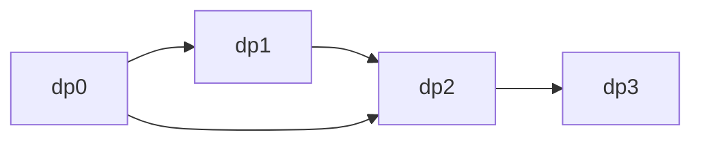

# 1-D Dynamic Programming

## What You Will Learn

You will learn the core model behind 1-d dynamic programming, the operations it supports, the patterns that interviewers commonly test, and the recognition signals that tell you this topic is being tested.

## Why This Topic Matters

1-D Dynamic Programming problems test whether you can turn a prompt into a precise state model. The best solutions are usually short once the invariant is clear.

## Real World Usage

Used in pricing, scoring, string segmentation, scheduling, resource allocation, caching repeated computations, and sequential optimization.

## Intuition

Ask what information must be remembered after each step. If you can name that state and explain why it is enough, the implementation becomes much safer.

## Formal Definition

1-D dynamic programming stores subproblem answers along one main index, amount, target, or state coordinate.

## Core Data Structure Or Algorithm

Define dp[i], seed base cases, choose a transition, and iterate in an order where dependencies are already known.

## Time Complexity

| Operation or Pattern | Complexity |
|---|---:|
| Linear recurrence | O(n) |
| Nested transition | O(n^2) |
| Target DP | O(n times target) |
| Memoized recursion | O(states times transition cost) |

## Space Complexity

| Case | Complexity |
|---|---:|
| Full array | O(n) |
| Rolling variables | O(1) |
| Target table | O(target) |

## Common Operations

| Operation | What It Means |
|---|---|
| Define state | Say exactly what dp[i] means. |
| Transition | Combine previous states. |
| Initialize | Seed empty or first cases. |
| Compress | Keep only recent states when safe. |

## Visual Explanation

## Mathematical Foundations

DP correctness is induction over states. Every transition must cover a valid way to build the current answer from smaller answers.

## Common Interview Patterns

- **Memoization**: Cache recursive state results so repeated subproblems are solved once.
- **Tabulation**: Fill a DP table from base cases toward larger states.
- **Rolling State**: Keep only the last few states required by the recurrence.
- **House Robber Choice**: At each position, choose between taking current plus a non-adjacent state or skipping it.
- **Coin Change**: Build answers for amounts by trying coin transitions.
- **Longest Increasing Subsequence**: Track the best increasing sequence ending at each value, or maintain patience-sorting tails.

## Pattern Recognition

Look for the operation the prompt asks you to optimize. If brute force repeats the same lookup, traversal, choice, or state calculation, one of the patterns in this folder is probably intended.

## Common Mistakes

- Coding before defining what the state means.
- Forgetting edge cases such as empty input, one item, duplicates, and boundary endpoints.
- Choosing a familiar pattern even when the constraints do not support its invariant.
- Reporting time complexity without auxiliary memory.

## Interview Tips

- Start with brute force and name the repeated work.
- State the invariant before coding.
- Keep the implementation small and testable.
- Explain why the pattern is correct, not only why it is fast.
- Test one normal case, one edge case, and one adversarial case.

## Mini Exercises

- Write the template for each pattern from memory.
- Solve two Easy problems and explain the invariant aloud.
- Solve one Medium problem with pseudocode before coding.
- Re-solve one missed problem after 24 hours.

## Recommended Learning Order

1. Study Memoization in [PATTERNS.md](PATTERNS.md).
2. Study Tabulation in [PATTERNS.md](PATTERNS.md).
3. Study Rolling State in [PATTERNS.md](PATTERNS.md).
4. Study House Robber Choice in [PATTERNS.md](PATTERNS.md).
5. Study Coin Change in [PATTERNS.md](PATTERNS.md).
6. Study Longest Increasing Subsequence in [PATTERNS.md](PATTERNS.md).
7. Review [CHEATSHEET.md](CHEATSHEET.md).
8. Solve [easy.md](easy.md), then [medium.md](medium.md), then selected [hard.md](hard.md).

## Practice Sets

[Cheatsheet](CHEATSHEET.md) | [Patterns](PATTERNS.md) | [Easy](easy.md) | [Medium](medium.md) | [Hard](hard.md)

---

## Navigation

[Previous](../advanced-graphs/README.md) | [Home](../README.md) | [Next](../1d-dp/CHEATSHEET.md)
