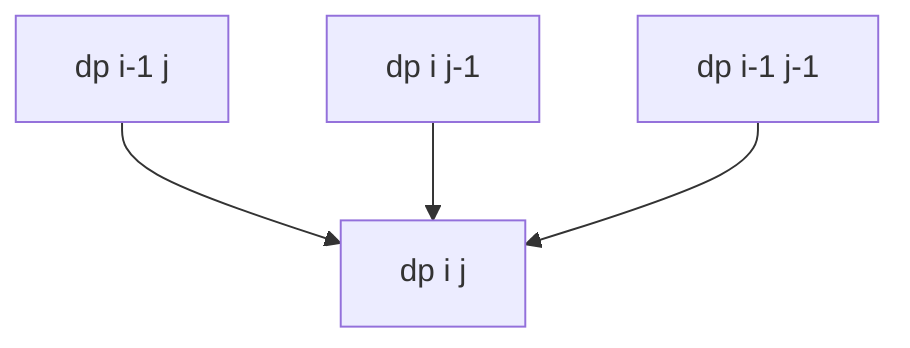

# 2-D Dynamic Programming

## What You Will Learn

You will learn the core model behind 2-d dynamic programming, the operations it supports, the patterns that interviewers commonly test, and the recognition signals that tell you this topic is being tested.

## Why This Topic Matters

2-D Dynamic Programming problems test whether you can turn a prompt into a precise state model. The best solutions are usually short once the invariant is clear.

## Real World Usage

Used in text diffing, sequence alignment, grid routing, inventory planning, image grids, and language processing.

## Intuition

Ask what information must be remembered after each step. If you can name that state and explain why it is enough, the implementation becomes much safer.

## Formal Definition

2-D dynamic programming stores answers by two coordinates such as two string positions, grid cells, item and capacity, or interval endpoints.

## Core Data Structure Or Algorithm

Define table meaning, initialize borders, fill cells in dependency order, and compress only after the recurrence is clear.

## Time Complexity

| Operation or Pattern | Complexity |
|---|---:|
| Grid DP | O(rows times cols) |
| Two-string DP | O(n times m) |
| Knapsack | O(items times capacity) |
| Interval DP | O(n^3) common |

## Space Complexity

| Case | Complexity |
|---|---:|
| Full table | O(n times m) |
| Rolling rows | O(min(n,m)) |
| Interval table | O(n^2) |

## Common Operations

| Operation | What It Means |
|---|---|
| Initialize borders | Handle empty prefixes or first row and column. |
| Fill cells | Use smaller solved states. |
| Choose transition | Min, max, count, or boolean. |
| Compress rows | Keep only rows that future cells need. |

## Visual Explanation

## Mathematical Foundations

A 2-D table creates a partial order of dependencies. Fill order is correct only when every needed neighbor or subrange is already solved.

## Common Interview Patterns

- **Grid Paths**: Compute each cell from previously reachable neighbor cells.
- **Two String DP**: Use prefixes of two strings as the two state dimensions.
- **Knapsack Table**: Track item progress and remaining capacity or target.
- **Interval DP**: Solve ranges by splitting each interval into smaller intervals.
- **Palindrome DP**: Use inner substrings to decide whether larger substrings are palindromes or how costly they are.
- **State Compression**: Reduce table dimensions when only recent rows, columns, or masks are needed.

## Pattern Recognition

Look for the operation the prompt asks you to optimize. If brute force repeats the same lookup, traversal, choice, or state calculation, one of the patterns in this folder is probably intended.

## Common Mistakes

- Coding before defining what the state means.
- Forgetting edge cases such as empty input, one item, duplicates, and boundary endpoints.
- Choosing a familiar pattern even when the constraints do not support its invariant.
- Reporting time complexity without auxiliary memory.

## Interview Tips

- Start with brute force and name the repeated work.
- State the invariant before coding.
- Keep the implementation small and testable.
- Explain why the pattern is correct, not only why it is fast.
- Test one normal case, one edge case, and one adversarial case.

## Mini Exercises

- Write the template for each pattern from memory.
- Solve two Easy problems and explain the invariant aloud.
- Solve one Medium problem with pseudocode before coding.
- Re-solve one missed problem after 24 hours.

## Recommended Learning Order

1. Study Grid Paths in [PATTERNS.md](PATTERNS.md).
2. Study Two String DP in [PATTERNS.md](PATTERNS.md).
3. Study Knapsack Table in [PATTERNS.md](PATTERNS.md).
4. Study Interval DP in [PATTERNS.md](PATTERNS.md).
5. Study Palindrome DP in [PATTERNS.md](PATTERNS.md).
6. Study State Compression in [PATTERNS.md](PATTERNS.md).
7. Review [CHEATSHEET.md](CHEATSHEET.md).
8. Solve [easy.md](easy.md), then [medium.md](medium.md), then selected [hard.md](hard.md).

## Practice Sets

[Cheatsheet](CHEATSHEET.md) | [Patterns](PATTERNS.md) | [Easy](easy.md) | [Medium](medium.md) | [Hard](hard.md)

---

## Navigation

[Previous](../1d-dp/README.md) | [Home](../README.md) | [Next](../2d-dp/CHEATSHEET.md)
