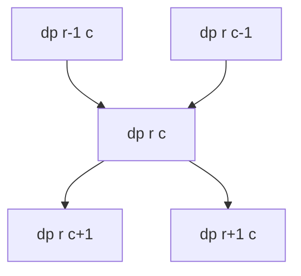
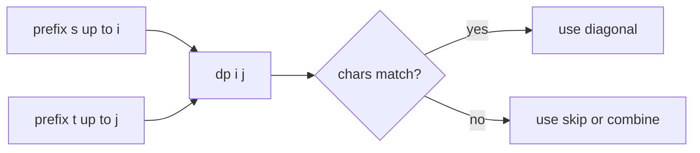

# 2-D Dynamic Programming

## What This Topic Is

Use a table whose state depends on two indices, dimensions, strings, or interval boundaries.

This topic is a reusable mental model, not a bag of isolated tricks. You should finish it able to identify the problem shape, state the invariant, choose the right pattern, and explain the complexity without guessing.

## Why It Matters

2-D DP is where many candidates fail because base cases, fill order, and state meaning become visible in the table.

In interviews, the story usually hides the structure. Translate the story into operations: lookup, move a boundary, traverse, choose, relax, split, merge, or remember a state.

## Interviewer Lens

- Google: prove the recurrence and fill order for each dimension.
- Meta: recognize grid, string, knapsack, and interval DP forms quickly.
- Amazon: handle obstacles, empty strings, and boundary rows explicitly.
- Beginner: label dp[i][j] in words before drawing the table.

## Real-World Use

Used in diff tools, spell check, bioinformatics alignment, grid routing, parsing, resource planning, and sequence comparison.

The same ideas show up in production systems when constraints demand predictable lookup, bounded memory, fast traversal, or correct ordering.

## Beginner Intuition

Each cell answers a precise subproblem. If you can explain what row and column mean, the recurrence usually becomes a small local choice.

Beginner rule: before coding, write one sentence that says what information your algorithm keeps and why that information is enough for the next decision.

## Formal Explanation

A 2-D DP table stores solutions for pairs of positions, capacities, or interval endpoints. Transitions refer to already computed neighboring or smaller interval states.

The formal model matters because it tells you which operations are cheap, which are expensive, and which assumptions are required for correctness.

## Core Operations

| Operation | Meaning |
|---|---|
| Grid move | Combine top and left states. |
| String compare | Use previous prefixes. |
| Knapsack table | Decide take or skip. |
| Interval split | Try a middle point between boundaries. |
| Compress row | Keep prior row when dependencies allow. |

## Time Complexity

| Operation or Pattern | Complexity |
|---|---:|
| m by n table | O(mn) |
| Interval DP | O(n^3) common |
| Two-string DP | O(mn) |
| Compressed row | Same time, lower space |

## Space Complexity

| Case | Complexity |
|---|---:|
| Full table | O(mn) |
| Two rows | O(n) |
| Interval table | O(n^2) |

## Visual Explanation

```mermaid
flowchart TD
    A[dp[i-1][j]] --> C[dp[i][j]]
    B[dp[i][j-1]] --> C
    D[dp[i-1][j-1]] --> C
    C --> E[future cells]
    F[Base row and column] --> A
```

## Additional Visuals

### Grid DP Fill Order



### Two-String DP Cell



## Foundations And Invariants

Fill order must respect dependencies. Grid DP often fills top-left to bottom-right, while interval DP often fills by increasing interval length.

When explaining a solution, name the invariant before writing code. A good invariant is short enough to repeat while coding and precise enough to catch edge cases.

## Pattern Recognition

Look for two strings, grid paths, edit distance, subsequences, palindromes, matrix costs, intervals, or choices involving two moving indices.

Ask these questions:

- What do the two dimensions represent: indices, coordinates, capacity, interval bounds, or players?
- Which neighboring states feed the current cell?
- Does fill order move by rows, columns, diagonals, length, or compressed dimension?
- Is the answer a table value, a path, a count, or an optimized score?

## Common Interview Patterns

- **Grid DP**: recognition signals, mistakes, and templates in [PATTERNS.md](PATTERNS.md).
- **Two String DP**: recognition signals, mistakes, and templates in [PATTERNS.md](PATTERNS.md).
- **Knapsack Table**: recognition signals, mistakes, and templates in [PATTERNS.md](PATTERNS.md).
- **Interval DP**: recognition signals, mistakes, and templates in [PATTERNS.md](PATTERNS.md).
- **Path Counting With Obstacles**: recognition signals, mistakes, and templates in [PATTERNS.md](PATTERNS.md).
- **State Compression**: recognition signals, mistakes, and templates in [PATTERNS.md](PATTERNS.md).
- **Game DP**: recognition signals, mistakes, and templates in [PATTERNS.md](PATTERNS.md).

## Common Mistakes

- Leaving base row or column undefined.
- Overwriting a row before it is no longer needed.
- Using substring DP when subsequence DP is required.
- Filling interval DP in the wrong length order.

## Interview Tips

- Define both dimensions and the meaning of one cell.
- Initialize boundary row and boundary column before the main transition.
- Use diagonal or length order for interval-style dependencies.
- Mention table size and transition cost separately.
- Only compress space when the previous-row dependency is unambiguous.

## Mini Exercises

- Explain `Grid DP` aloud, then write its invariant and template from memory.
- Explain `Two String DP` aloud, then write its invariant and template from memory.
- Explain `Knapsack Table` aloud, then write its invariant and template from memory.
- Explain `Interval DP` aloud, then write its invariant and template from memory.
- Pick two Easy problems from [easy.md](easy.md) and identify the pattern before coding.
- Pick one Medium problem from [medium.md](medium.md) and write pseudocode before implementation.
- For one missed problem, write the failed invariant and the corrected invariant.

## Recommended Learning Order

1. Read `Grid DP` in [PATTERNS.md](PATTERNS.md).
2. Read `Two String DP` in [PATTERNS.md](PATTERNS.md).
3. Read `Knapsack Table` in [PATTERNS.md](PATTERNS.md).
4. Read `Interval DP` in [PATTERNS.md](PATTERNS.md).
5. Read `Path Counting With Obstacles` in [PATTERNS.md](PATTERNS.md).
6. Read `State Compression` in [PATTERNS.md](PATTERNS.md).
7. Read `Game DP` in [PATTERNS.md](PATTERNS.md).
8. Review [CHEATSHEET.md](CHEATSHEET.md) before timed practice.
9. Solve [easy.md](easy.md), then [medium.md](medium.md), then selected [hard.md](hard.md).

## Practice Navigation

- [Easy problems](easy.md): build fundamentals.
- [Medium problems](medium.md): build interview fluency.
- [Hard problems](hard.md): build advanced pattern recognition.

---

## Navigation

[Previous](../1d-dp/README.md) | [Home](../README.md) | [Next](CHEATSHEET.md)
