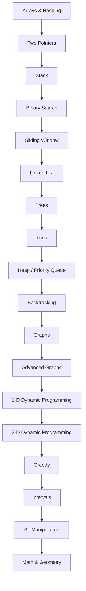

# Data Structures and Algorithms

A structured learning and interview preparation repository for data structures, algorithms, and high-signal LeetCode practice.

This repository assumes you are starting from scratch. It is designed to help you learn theory, recognize patterns, practice deliberately, and prepare for interviews at companies such as Google, Meta, Amazon, Netflix, LinkedIn, OpenAI, Anthropic, Mistral, Databricks, Uber, Airbnb, Stripe, and other top-tier software and AI companies.

## Table of Contents

- [Purpose](#purpose)
- [Who This Is For](#who-this-is-for)
- [Learning Philosophy](#learning-philosophy)
- [Interview Preparation Philosophy](#interview-preparation-philosophy)
- [Recommended Study Order](#recommended-study-order)
- [Roadmap](#roadmap)
- [Topic Navigation](#topic-navigation)
- [Beginner Learning Path](#beginner-learning-path)
- [Interview Sprint Path](#interview-sprint-path)
- [Progress Checklist](#progress-checklist)
- [Estimated Study Timeline](#estimated-study-timeline)

## Purpose

The goal is not to memorize solutions. The goal is to build a mental library of data structures, algorithmic patterns, invariants, and tradeoffs so you can reason through unfamiliar problems under interview constraints.

Each topic folder contains:

- `README.md` for beginner-first theory and intuition.
- `CHEATSHEET.md` for fast pre-interview revision.
- `PATTERNS.md` for reusable recognition and solution templates.
- `easy.md`, `medium.md`, and `hard.md` with curated practice problems and no solutions.

## Who This Is For

Use this repository if you:

- Are new to data structures and algorithms.
- Want a clear path from fundamentals to interview readiness.
- Need pattern recognition practice, not only problem volume.
- Want curated LeetCode practice without random problem dumping.
- Are preparing for high-bar interviews at software and AI companies.

## Learning Philosophy

Learn each topic in four passes:

1. Understand the model: what the structure or algorithm represents.
2. Learn the operations: what can be done efficiently and why.
3. Practice the patterns: recognize the shape of problems before coding.
4. Review mistakes: convert failed attempts into reusable rules.

A solved problem only counts when you can explain the invariant, complexity, edge cases, and why the chosen pattern fits.

## Interview Preparation Philosophy

Interview readiness comes from repeatable thinking:

- Clarify the problem before coding.
- State brute force first to expose the search space.
- Identify the data structure or pattern that removes wasted work.
- Explain the invariant while coding.
- Test with edge cases before claiming completion.
- Analyze time and space complexity precisely.

## Recommended Study Order

Follow the topic order below unless you already have strong fundamentals. Dynamic programming, advanced graphs, and hard greedy questions become much easier after arrays, pointers, recursion, trees, and basic graphs are comfortable.

## Roadmap

## Topic Navigation

| Order | Topic | Focus | Folder |
|---:|---|---|---|
| 1 | Arrays & Hashing | Frequency Counting, Hash Lookup, Prefix Sum | [arrays-hashing/](arrays-hashing/README.md) |
| 2 | Two Pointers | Opposite Ends, Fast and Slow, Sorted Pair Search | [two-pointers/](two-pointers/README.md) |
| 3 | Stack | Balanced Delimiters, Expression Evaluation, Monotonic Increasing Stack | [stack/](stack/README.md) |
| 4 | Binary Search | Classic Target Search, Lower Bound, Upper Bound | [binary-search/](binary-search/README.md) |
| 5 | Sliding Window | Fixed Size Window, Variable Size Window, At Most K | [sliding-window/](sliding-window/README.md) |
| 6 | Linked List | Dummy Head, Fast and Slow Pointers, In-place Reversal | [linked-list/](linked-list/README.md) |
| 7 | Trees | Recursive DFS, Iterative DFS, Level Order BFS | [trees/](trees/README.md) |
| 8 | Tries | Prefix Tree, Wildcard Trie DFS, Autocomplete Suggestions | [tries/](tries/README.md) |
| 9 | Heap / Priority Queue | Top K, K-way Merge, Two Heaps | [heap-priority-queue/](heap-priority-queue/README.md) |
| 10 | Backtracking | Subsets, Combinations, Permutations | [backtracking/](backtracking/README.md) |
| 11 | Graphs | BFS Traversal, DFS Traversal, Connected Components | [graphs/](graphs/README.md) |
| 12 | Advanced Graphs | Dijkstra Shortest Path, Bellman-Ford, Floyd-Warshall | [advanced-graphs/](advanced-graphs/README.md) |
| 13 | 1-D Dynamic Programming | Memoization, Tabulation, Rolling State | [1d-dp/](1d-dp/README.md) |
| 14 | 2-D Dynamic Programming | Grid Paths, Two String DP, Knapsack Table | [2d-dp/](2d-dp/README.md) |
| 15 | Greedy | Sort and Scan, Interval Greedy, Jump Greedy | [greedy/](greedy/README.md) |
| 16 | Intervals | Merge Intervals, Insert Interval, Meeting Rooms | [intervals/](intervals/README.md) |
| 17 | Bit Manipulation | XOR Cancellation, Bit Counting, Masks for Sets | [bit-manipulation/](bit-manipulation/README.md) |
| 18 | Math & Geometry | Modulo Arithmetic, GCD and Number Theory, Matrix Traversal | [math-geometry/](math-geometry/README.md) |

## Beginner Learning Path

1. Read the root [ROADMAP.md](ROADMAP.md).
2. Start with [Arrays & Hashing](arrays-hashing/README.md).
3. For each topic, read `README.md`, then `PATTERNS.md`, then `CHEATSHEET.md`.
4. Solve 5 to 10 Easy problems without looking at solutions.
5. Move to Medium only after you can explain the patterns from memory.
6. Revisit mistakes weekly using the problem notes you create outside this repository.

## Interview Sprint Path

Use this path when interviews are within 8 weeks:

1. Prioritize Arrays & Hashing, Two Pointers, Sliding Window, Stack, Binary Search, Trees, Graphs, and 1-D DP.
2. Solve Medium problems daily, with Easy problems as warm-ups.
3. Add Hard problems only after the pattern is familiar.
4. Do two mock interviews per week after week 3.
5. Keep a mistake log with pattern, missed invariant, bug type, and retry date.

See [STUDY_PLAN.md](STUDY_PLAN.md) for complete 8-week, 12-week, and 24-week plans.

## Progress Checklist

- [ ] Arrays & Hashing: read, implement templates, solve Easy, solve Medium, revisit Hard
- [ ] Two Pointers: read, implement templates, solve Easy, solve Medium, revisit Hard
- [ ] Stack: read, implement templates, solve Easy, solve Medium, revisit Hard
- [ ] Binary Search: read, implement templates, solve Easy, solve Medium, revisit Hard
- [ ] Sliding Window: read, implement templates, solve Easy, solve Medium, revisit Hard
- [ ] Linked List: read, implement templates, solve Easy, solve Medium, revisit Hard
- [ ] Trees: read, implement templates, solve Easy, solve Medium, revisit Hard
- [ ] Tries: read, implement templates, solve Easy, solve Medium, revisit Hard
- [ ] Heap / Priority Queue: read, implement templates, solve Easy, solve Medium, revisit Hard
- [ ] Backtracking: read, implement templates, solve Easy, solve Medium, revisit Hard
- [ ] Graphs: read, implement templates, solve Easy, solve Medium, revisit Hard
- [ ] Advanced Graphs: read, implement templates, solve Easy, solve Medium, revisit Hard
- [ ] 1-D Dynamic Programming: read, implement templates, solve Easy, solve Medium, revisit Hard
- [ ] 2-D Dynamic Programming: read, implement templates, solve Easy, solve Medium, revisit Hard
- [ ] Greedy: read, implement templates, solve Easy, solve Medium, revisit Hard
- [ ] Intervals: read, implement templates, solve Easy, solve Medium, revisit Hard
- [ ] Bit Manipulation: read, implement templates, solve Easy, solve Medium, revisit Hard
- [ ] Math & Geometry: read, implement templates, solve Easy, solve Medium, revisit Hard

## Estimated Study Timeline

| Track | Time | Expected Outcome |
|---|---:|---|
| Interview sprint | 8 weeks | Pattern familiarity, medium-problem fluency, mock interview readiness. |
| Balanced plan | 12 weeks | Strong coverage of theory, curated practice, and revision cycles. |
| Deep mastery | 24 weeks | Durable fundamentals, hard-problem exposure, and stronger transfer to unfamiliar problems. |

## Repository Maps

- [ROADMAP.md](ROADMAP.md): topic-by-topic learning roadmap.
- [STUDY_PLAN.md](STUDY_PLAN.md): 8, 12, and 24 week plans.
- [INTERVIEW_GUIDE.md](INTERVIEW_GUIDE.md): interview communication and execution strategy.
- [REPO_INDEX.md](REPO_INDEX.md): generated index of topics, files, patterns, and problem counts.

---

## Navigation

Previous | [Home](README.md) | [Next](ROADMAP.md)
