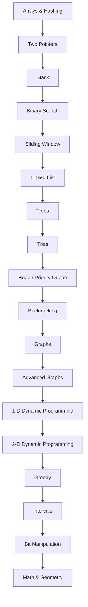

# Data Structures and Algorithms

A structured repository for learning data structures, algorithms, interview patterns, and high-signal LeetCode practice from first principles.

## Purpose

This repository is designed to help a beginner become interview-ready without memorizing solution dumps. The goal is to build durable intuition, pattern recognition, edge-case discipline, and precise complexity analysis.

Each topic folder contains:

- `README.md`: beginner-first theory, visual explanation, operations, mistakes, exercises, and navigation.
- `PATTERNS.md`: the main interview pattern guide for that topic.
- `CHEATSHEET.md`: fast revision before timed practice.
- `easy.md`, `medium.md`, and `hard.md`: curated LeetCode practice with problem intent, skills tested, and follow-ups.

## How To Use This Repository

1. Read the topic `README.md` before solving.
2. Read `PATTERNS.md` and write each invariant in your own words.
3. Use `CHEATSHEET.md` for quick recall.
4. Solve Easy problems to learn mechanics.
5. Solve Medium problems to build interview fluency.
6. Use Hard problems selectively for advanced recognition and follow-up depth.
7. Keep a separate mistake log with pattern, missed invariant, edge case, and retry date.

## Mermaid Roadmap

## Topic Navigation

| Order | Topic | First Patterns | Folder |
|---:|---|---|---|
| 1 | Arrays & Hashing | Frequency Counting, Hash Lookup, Prefix Sum | [arrays-hashing/](./arrays-hashing/README.md) |
| 2 | Two Pointers | Opposite Direction Pointers, Same Direction Pointers, Fast And Slow Pointers | [two-pointers/](./two-pointers/README.md) |
| 3 | Stack | LIFO Simulation, Balanced Delimiters, Monotonic Increasing Stack | [stack/](./stack/README.md) |
| 4 | Binary Search | Classic Target Search, Lower Bound, Upper Bound | [binary-search/](./binary-search/README.md) |
| 5 | Sliding Window | Fixed Window, Variable Window, Frequency Window | [sliding-window/](./sliding-window/README.md) |
| 6 | Linked List | Dummy Head, Two Pointer Gap, Fast And Slow Pointers | [linked-list/](./linked-list/README.md) |
| 7 | Trees | Recursive DFS, Iterative DFS, BFS Level Order | [trees/](./trees/README.md) |
| 8 | Tries | Prefix Insert And Search, Wildcard Trie DFS, Board Search Trie Pruning | [tries/](./tries/README.md) |
| 9 | Heap / Priority Queue | Top K Heap, K-way Merge, Two Heaps | [heap-priority-queue/](./heap-priority-queue/README.md) |
| 10 | Backtracking | Subsets, Combinations, Permutations | [backtracking/](./backtracking/README.md) |
| 11 | Graphs | DFS Traversal, BFS Traversal, Connected Components | [graphs/](./graphs/README.md) |
| 12 | Advanced Graphs | Dijkstra, Bellman-Ford, Floyd-Warshall | [advanced-graphs/](./advanced-graphs/README.md) |
| 13 | 1-D Dynamic Programming | State Definition, Memoization, Tabulation | [1d-dp/](./1d-dp/README.md) |
| 14 | 2-D Dynamic Programming | Grid DP, Two String DP, Knapsack Table | [2d-dp/](./2d-dp/README.md) |
| 15 | Greedy | Sort And Scan, Greedy With Proof, Interval Greedy | [greedy/](./greedy/README.md) |
| 16 | Intervals | Merge Intervals, Insert Interval, Sweep Line | [intervals/](./intervals/README.md) |
| 17 | Bit Manipulation | XOR Cancellation, Bit Counting, Masks For Sets | [bit-manipulation/](./bit-manipulation/README.md) |
| 18 | Math & Geometry | Modulo Arithmetic, GCD And LCM, Prime Sieve | [math-geometry/](./math-geometry/README.md) |

## Beginner Path

Start with arrays, hashing, two pointers, stack, binary search, and sliding window. These topics teach the basic loop invariants used everywhere else. Then move to linked lists, trees, heaps, backtracking, graphs, and dynamic programming.

Beginner rule: do not start Medium practice in a topic until you can explain the Easy solutions without looking at notes.

## Interview Sprint Path

When interviews are within 8 weeks, prioritize:

1. Arrays & Hashing
2. Two Pointers
3. Sliding Window
4. Stack
5. Binary Search
6. Trees
7. Graphs
8. Heap / Priority Queue
9. 1-D Dynamic Programming
10. Backtracking

Add Advanced Graphs, 2-D DP, Greedy, Intervals, Bit Manipulation, and Math after the core patterns are stable.

## Progress Checklist

- [ ] Arrays & Hashing: README, patterns, cheatsheet, Easy, Medium, selected Hard
- [ ] Two Pointers: README, patterns, cheatsheet, Easy, Medium, selected Hard
- [ ] Stack: README, patterns, cheatsheet, Easy, Medium, selected Hard
- [ ] Binary Search: README, patterns, cheatsheet, Easy, Medium, selected Hard
- [ ] Sliding Window: README, patterns, cheatsheet, Easy, Medium, selected Hard
- [ ] Linked List: README, patterns, cheatsheet, Easy, Medium, selected Hard
- [ ] Trees: README, patterns, cheatsheet, Easy, Medium, selected Hard
- [ ] Tries: README, patterns, cheatsheet, Easy, Medium, selected Hard
- [ ] Heap / Priority Queue: README, patterns, cheatsheet, Easy, Medium, selected Hard
- [ ] Backtracking: README, patterns, cheatsheet, Easy, Medium, selected Hard
- [ ] Graphs: README, patterns, cheatsheet, Easy, Medium, selected Hard
- [ ] Advanced Graphs: README, patterns, cheatsheet, Easy, Medium, selected Hard
- [ ] 1-D Dynamic Programming: README, patterns, cheatsheet, Easy, Medium, selected Hard
- [ ] 2-D Dynamic Programming: README, patterns, cheatsheet, Easy, Medium, selected Hard
- [ ] Greedy: README, patterns, cheatsheet, Easy, Medium, selected Hard
- [ ] Intervals: README, patterns, cheatsheet, Easy, Medium, selected Hard
- [ ] Bit Manipulation: README, patterns, cheatsheet, Easy, Medium, selected Hard
- [ ] Math & Geometry: README, patterns, cheatsheet, Easy, Medium, selected Hard

## Repository Maps

- [ROADMAP.md](ROADMAP.md): learning order, prerequisites, and outcomes.
- [STUDY_PLAN.md](STUDY_PLAN.md): 8-week, 12-week, and 24-week plans.
- [INTERVIEW_GUIDE.md](INTERVIEW_GUIDE.md): interview communication and execution strategy.
- [REPO_INDEX.md](REPO_INDEX.md): generated index of topics, patterns, and problem counts.

---

## Navigation

Previous | [Home](README.md) | [Next](ROADMAP.md)
