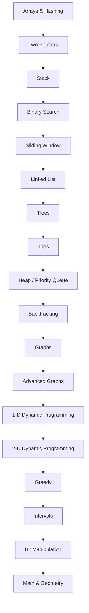

# Roadmap

This roadmap follows a beginner-to-interview-ready progression. Each topic builds vocabulary, invariants, implementation templates, and problem recognition skills needed for the next stage.

## Roadmap Diagram

## 1. Arrays & Hashing

### Why It Matters

Most interview problems start with indexed data, strings, counts, membership checks, or grouped values. Arrays and hash maps are the first tools for turning a slow scan into direct access.

### Prerequisite Topics

None. This is a starting topic.

### Interview Frequency

Very high. Expect this topic to appear directly or as a sub-pattern inside larger problems.

### Common Patterns

Frequency Counting, Hash Lookup, Prefix Sum, Grouping by Canonical Key, Bucket Counting, In-place Marking

### Recommended Study Sequence

- Learn Frequency Counting.
- Learn Hash Lookup.
- Learn Prefix Sum.
- Learn Grouping by Canonical Key.
- Learn Bucket Counting.
- Learn In-place Marking.

### Expected Outcomes

- Recognize when frequency counting is the intended direction.
- Recognize when hash lookup is the intended direction.
- Recognize when prefix sum is the intended direction.
- Explain the time and space tradeoffs without guessing.
- Solve the Easy set confidently and most Medium problems with limited hints.
## 2. Two Pointers

### Why It Matters

Two pointers reduce many pair, palindrome, sorted-array, and partition problems from quadratic time to linear time.

### Prerequisite Topics

Arrays & Hashing

### Interview Frequency

Very high. Expect this topic to appear directly or as a sub-pattern inside larger problems.

### Common Patterns

Opposite Ends, Fast and Slow, Sorted Pair Search, Merge Pointers, Partition Pointers, Cycle Detection

### Recommended Study Sequence

- Learn Opposite Ends.
- Learn Fast and Slow.
- Learn Sorted Pair Search.
- Learn Merge Pointers.
- Learn Partition Pointers.
- Learn Cycle Detection.

### Expected Outcomes

- Recognize when opposite ends is the intended direction.
- Recognize when fast and slow is the intended direction.
- Recognize when sorted pair search is the intended direction.
- Explain the time and space tradeoffs without guessing.
- Solve the Easy set confidently and most Medium problems with limited hints.
## 3. Stack

### Why It Matters

Stacks model last-in-first-out decisions. They are the natural fit for parsing, undo behavior, nested structures, and nearest-greater style questions.

### Prerequisite Topics

Arrays & Hashing, Two Pointers

### Interview Frequency

High. Expect this topic to appear directly or as a sub-pattern inside larger problems.

### Common Patterns

Balanced Delimiters, Expression Evaluation, Monotonic Increasing Stack, Monotonic Decreasing Stack, Simulation Stack, Auxiliary Stack

### Recommended Study Sequence

- Learn Balanced Delimiters.
- Learn Expression Evaluation.
- Learn Monotonic Increasing Stack.
- Learn Monotonic Decreasing Stack.
- Learn Simulation Stack.
- Learn Auxiliary Stack.

### Expected Outcomes

- Recognize when balanced delimiters is the intended direction.
- Recognize when expression evaluation is the intended direction.
- Recognize when monotonic increasing stack is the intended direction.
- Explain the time and space tradeoffs without guessing.
- Solve the Easy set confidently and most Medium problems with limited hints.
## 4. Binary Search

### Why It Matters

Binary search turns ordered decision spaces into logarithmic solutions. It is common in direct sorted lookup and in optimization problems with a yes/no predicate.

### Prerequisite Topics

Two Pointers, Stack

### Interview Frequency

Very high. Expect this topic to appear directly or as a sub-pattern inside larger problems.

### Common Patterns

Classic Target Search, Lower Bound, Upper Bound, Search Rotated Array, Binary Search on Answer, Matrix Search

### Recommended Study Sequence

- Learn Classic Target Search.
- Learn Lower Bound.
- Learn Upper Bound.
- Learn Search Rotated Array.
- Learn Binary Search on Answer.
- Learn Matrix Search.

### Expected Outcomes

- Recognize when classic target search is the intended direction.
- Recognize when lower bound is the intended direction.
- Recognize when upper bound is the intended direction.
- Explain the time and space tradeoffs without guessing.
- Solve the Easy set confidently and most Medium problems with limited hints.
## 5. Sliding Window

### Why It Matters

Sliding windows solve contiguous subarray and substring problems by updating state incrementally instead of recomputing each range.

### Prerequisite Topics

Stack, Binary Search

### Interview Frequency

Very high. Expect this topic to appear directly or as a sub-pattern inside larger problems.

### Common Patterns

Fixed Size Window, Variable Size Window, At Most K, Exactly K via At Most, Minimum Valid Window, Monotonic Deque Window

### Recommended Study Sequence

- Learn Fixed Size Window.
- Learn Variable Size Window.
- Learn At Most K.
- Learn Exactly K via At Most.
- Learn Minimum Valid Window.
- Learn Monotonic Deque Window.

### Expected Outcomes

- Recognize when fixed size window is the intended direction.
- Recognize when variable size window is the intended direction.
- Recognize when at most k is the intended direction.
- Explain the time and space tradeoffs without guessing.
- Solve the Easy set confidently and most Medium problems with limited hints.
## 6. Linked List

### Why It Matters

Linked lists test pointer reasoning, mutation safety, and edge-case discipline more than raw algorithm theory.

### Prerequisite Topics

Binary Search, Sliding Window

### Interview Frequency

High. Expect this topic to appear directly or as a sub-pattern inside larger problems.

### Common Patterns

Dummy Head, Fast and Slow Pointers, In-place Reversal, Merge Lists, Cycle Detection, Copy with Random Pointer

### Recommended Study Sequence

- Learn Dummy Head.
- Learn Fast and Slow Pointers.
- Learn In-place Reversal.
- Learn Merge Lists.
- Learn Cycle Detection.
- Learn Copy with Random Pointer.

### Expected Outcomes

- Recognize when dummy head is the intended direction.
- Recognize when fast and slow pointers is the intended direction.
- Recognize when in-place reversal is the intended direction.
- Explain the time and space tradeoffs without guessing.
- Solve the Easy set confidently and most Medium problems with limited hints.
## 7. Trees

### Why It Matters

Trees appear in hierarchical data, search structures, recursion, and many interview problems that combine traversal with local decisions.

### Prerequisite Topics

Sliding Window, Linked List

### Interview Frequency

Very high. Expect this topic to appear directly or as a sub-pattern inside larger problems.

### Common Patterns

Recursive DFS, Iterative DFS, Level Order BFS, BST Invariant, Lowest Common Ancestor, Tree DP

### Recommended Study Sequence

- Learn Recursive DFS.
- Learn Iterative DFS.
- Learn Level Order BFS.
- Learn BST Invariant.
- Learn Lowest Common Ancestor.
- Learn Tree DP.

### Expected Outcomes

- Recognize when recursive dfs is the intended direction.
- Recognize when iterative dfs is the intended direction.
- Recognize when level order bfs is the intended direction.
- Explain the time and space tradeoffs without guessing.
- Solve the Easy set confidently and most Medium problems with limited hints.
## 8. Tries

### Why It Matters

Tries make prefix operations direct. They are common when words, bit strings, dictionaries, or autocomplete-like searches are involved.

### Prerequisite Topics

Linked List, Trees

### Interview Frequency

Medium to high. Expect this topic to appear directly or as a sub-pattern inside larger problems.

### Common Patterns

Prefix Tree, Wildcard Trie DFS, Autocomplete Suggestions, Word Search Trie Pruning, Bitwise Trie, Compressed Trie Awareness

### Recommended Study Sequence

- Learn Prefix Tree.
- Learn Wildcard Trie DFS.
- Learn Autocomplete Suggestions.
- Learn Word Search Trie Pruning.
- Learn Bitwise Trie.
- Learn Compressed Trie Awareness.

### Expected Outcomes

- Recognize when prefix tree is the intended direction.
- Recognize when wildcard trie dfs is the intended direction.
- Recognize when autocomplete suggestions is the intended direction.
- Explain the time and space tradeoffs without guessing.
- Solve the Easy set confidently and most Medium problems with limited hints.
## 9. Heap / Priority Queue

### Why It Matters

Heaps solve repeated best-item selection without sorting the entire data set after every update.

### Prerequisite Topics

Trees, Tries

### Interview Frequency

High. Expect this topic to appear directly or as a sub-pattern inside larger problems.

### Common Patterns

Top K, K-way Merge, Two Heaps, Scheduling by Priority, Greedy Heap, Lazy Deletion

### Recommended Study Sequence

- Learn Top K.
- Learn K-way Merge.
- Learn Two Heaps.
- Learn Scheduling by Priority.
- Learn Greedy Heap.
- Learn Lazy Deletion.

### Expected Outcomes

- Recognize when top k is the intended direction.
- Recognize when k-way merge is the intended direction.
- Recognize when two heaps is the intended direction.
- Explain the time and space tradeoffs without guessing.
- Solve the Easy set confidently and most Medium problems with limited hints.
## 10. Backtracking

### Why It Matters

Backtracking teaches exhaustive search with pruning. It is essential for permutations, combinations, constraints, and board search problems.

### Prerequisite Topics

Tries, Heap / Priority Queue

### Interview Frequency

High. Expect this topic to appear directly or as a sub-pattern inside larger problems.

### Common Patterns

Subsets, Combinations, Permutations, Constraint Search, Board DFS, Partitioning

### Recommended Study Sequence

- Learn Subsets.
- Learn Combinations.
- Learn Permutations.
- Learn Constraint Search.
- Learn Board DFS.
- Learn Partitioning.

### Expected Outcomes

- Recognize when subsets is the intended direction.
- Recognize when combinations is the intended direction.
- Recognize when permutations is the intended direction.
- Explain the time and space tradeoffs without guessing.
- Solve the Easy set confidently and most Medium problems with limited hints.
## 11. Graphs

### Why It Matters

Graphs model relationships. Many real interview problems are graph problems disguised as grids, dependencies, accounts, networks, or transformations.

### Prerequisite Topics

Heap / Priority Queue, Backtracking

### Interview Frequency

Very high. Expect this topic to appear directly or as a sub-pattern inside larger problems.

### Common Patterns

BFS Traversal, DFS Traversal, Connected Components, Grid Graphs, Union Find, Topological Sort

### Recommended Study Sequence

- Learn BFS Traversal.
- Learn DFS Traversal.
- Learn Connected Components.
- Learn Grid Graphs.
- Learn Union Find.
- Learn Topological Sort.

### Expected Outcomes

- Recognize when bfs traversal is the intended direction.
- Recognize when dfs traversal is the intended direction.
- Recognize when connected components is the intended direction.
- Explain the time and space tradeoffs without guessing.
- Solve the Easy set confidently and most Medium problems with limited hints.
## 12. Advanced Graphs

### Why It Matters

Advanced graph algorithms cover weighted paths, spanning trees, directed dependency structure, and optimization over networks.

### Prerequisite Topics

Backtracking, Graphs

### Interview Frequency

Medium to high. Expect this topic to appear directly or as a sub-pattern inside larger problems.

### Common Patterns

Dijkstra Shortest Path, Bellman-Ford, Floyd-Warshall, Minimum Spanning Tree, Tarjan Bridges, Topological DP

### Recommended Study Sequence

- Learn Dijkstra Shortest Path.
- Learn Bellman-Ford.
- Learn Floyd-Warshall.
- Learn Minimum Spanning Tree.
- Learn Tarjan Bridges.
- Learn Topological DP.

### Expected Outcomes

- Recognize when dijkstra shortest path is the intended direction.
- Recognize when bellman-ford is the intended direction.
- Recognize when floyd-warshall is the intended direction.
- Explain the time and space tradeoffs without guessing.
- Solve the Easy set confidently and most Medium problems with limited hints.
## 13. 1-D Dynamic Programming

### Why It Matters

1-D dynamic programming builds the habit of defining states, transitions, base cases, and iteration order before moving to harder DP.

### Prerequisite Topics

Graphs, Advanced Graphs

### Interview Frequency

Very high. Expect this topic to appear directly or as a sub-pattern inside larger problems.

### Common Patterns

Memoization, Tabulation, Rolling State, House Robber Choice, Coin Change, Longest Increasing Subsequence

### Recommended Study Sequence

- Learn Memoization.
- Learn Tabulation.
- Learn Rolling State.
- Learn House Robber Choice.
- Learn Coin Change.
- Learn Longest Increasing Subsequence.

### Expected Outcomes

- Recognize when memoization is the intended direction.
- Recognize when tabulation is the intended direction.
- Recognize when rolling state is the intended direction.
- Explain the time and space tradeoffs without guessing.
- Solve the Easy set confidently and most Medium problems with limited hints.
## 14. 2-D Dynamic Programming

### Why It Matters

2-D DP handles problems with two changing dimensions, such as two strings, grid coordinates, intervals, or item and capacity.

### Prerequisite Topics

Advanced Graphs, 1-D Dynamic Programming

### Interview Frequency

Medium to high. Expect this topic to appear directly or as a sub-pattern inside larger problems.

### Common Patterns

Grid Paths, Two String DP, Knapsack Table, Interval DP, Palindrome DP, State Compression

### Recommended Study Sequence

- Learn Grid Paths.
- Learn Two String DP.
- Learn Knapsack Table.
- Learn Interval DP.
- Learn Palindrome DP.
- Learn State Compression.

### Expected Outcomes

- Recognize when grid paths is the intended direction.
- Recognize when two string dp is the intended direction.
- Recognize when knapsack table is the intended direction.
- Explain the time and space tradeoffs without guessing.
- Solve the Easy set confidently and most Medium problems with limited hints.
## 15. Greedy

### Why It Matters

Greedy algorithms are fast and elegant, but only when a local choice can be proven globally safe.

### Prerequisite Topics

1-D Dynamic Programming, 2-D Dynamic Programming

### Interview Frequency

High. Expect this topic to appear directly or as a sub-pattern inside larger problems.

### Common Patterns

Sort and Scan, Interval Greedy, Jump Greedy, Heap Greedy, Exchange Argument, Greedy with Counts

### Recommended Study Sequence

- Learn Sort and Scan.
- Learn Interval Greedy.
- Learn Jump Greedy.
- Learn Heap Greedy.
- Learn Exchange Argument.
- Learn Greedy with Counts.

### Expected Outcomes

- Recognize when sort and scan is the intended direction.
- Recognize when interval greedy is the intended direction.
- Recognize when jump greedy is the intended direction.
- Explain the time and space tradeoffs without guessing.
- Solve the Easy set confidently and most Medium problems with limited hints.
## 16. Intervals

### Why It Matters

Interval problems test sorting, overlap reasoning, sweep lines, and greedy decisions in a compact form.

### Prerequisite Topics

2-D Dynamic Programming, Greedy

### Interview Frequency

High. Expect this topic to appear directly or as a sub-pattern inside larger problems.

### Common Patterns

Merge Intervals, Insert Interval, Meeting Rooms, Sweep Line, Interval Scheduling, Range Query with Heap

### Recommended Study Sequence

- Learn Merge Intervals.
- Learn Insert Interval.
- Learn Meeting Rooms.
- Learn Sweep Line.
- Learn Interval Scheduling.
- Learn Range Query with Heap.

### Expected Outcomes

- Recognize when merge intervals is the intended direction.
- Recognize when insert interval is the intended direction.
- Recognize when meeting rooms is the intended direction.
- Explain the time and space tradeoffs without guessing.
- Solve the Easy set confidently and most Medium problems with limited hints.
## 17. Bit Manipulation

### Why It Matters

Bit manipulation gives compact representations and constant-time tricks for parity, masks, subsets, XOR differences, and low-level arithmetic.

### Prerequisite Topics

Greedy, Intervals

### Interview Frequency

Medium to high. Expect this topic to appear directly or as a sub-pattern inside larger problems.

### Common Patterns

XOR Cancellation, Bit Counting, Masks for Sets, Subset Enumeration, Bitwise Trie, Bitmask DP

### Recommended Study Sequence

- Learn XOR Cancellation.
- Learn Bit Counting.
- Learn Masks for Sets.
- Learn Subset Enumeration.
- Learn Bitwise Trie.
- Learn Bitmask DP.

### Expected Outcomes

- Recognize when xor cancellation is the intended direction.
- Recognize when bit counting is the intended direction.
- Recognize when masks for sets is the intended direction.
- Explain the time and space tradeoffs without guessing.
- Solve the Easy set confidently and most Medium problems with limited hints.
## 18. Math & Geometry

### Why It Matters

Math and geometry problems test precision, invariants, formulas, and edge cases that are easy to miss under interview pressure.

### Prerequisite Topics

Intervals, Bit Manipulation

### Interview Frequency

Medium to high. Expect this topic to appear directly or as a sub-pattern inside larger problems.

### Common Patterns

Modulo Arithmetic, GCD and Number Theory, Matrix Traversal, Coordinate Hashing, Line and Slope, Geometry Simulation

### Recommended Study Sequence

- Learn Modulo Arithmetic.
- Learn GCD and Number Theory.
- Learn Matrix Traversal.
- Learn Coordinate Hashing.
- Learn Line and Slope.
- Learn Geometry Simulation.

### Expected Outcomes

- Recognize when modulo arithmetic is the intended direction.
- Recognize when gcd and number theory is the intended direction.
- Recognize when matrix traversal is the intended direction.
- Explain the time and space tradeoffs without guessing.
- Solve the Easy set confidently and most Medium problems with limited hints.

## How To Use This Roadmap

Read one topic at a time. Do not rush to Hard problems before the Medium patterns feel familiar. If a later topic feels opaque, return to the prerequisite topics and redo three representative problems without notes.

---

## Navigation

[Previous](README.md) | [Home](README.md) | [Next](STUDY_PLAN.md)
