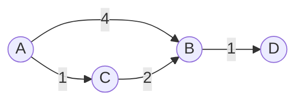

# Advanced Graphs

## What You Will Learn

You will learn the core model behind advanced graphs, the operations it supports, the patterns that interviewers commonly test, and the recognition signals that tell you this topic is being tested.

## Why This Topic Matters

Advanced Graphs problems test whether you can turn a prompt into a precise state model. The best solutions are usually short once the invariant is clear.

## Real World Usage

Used in routing, cloud infrastructure, network design, delivery systems, dependency optimization, fraud graphs, and graph analytics.

## Intuition

Ask what information must be remembered after each step. If you can name that state and explain why it is enough, the implementation becomes much safer.

## Formal Definition

Advanced graph problems add weights, directed dependencies, critical edges, all-pairs relationships, or minimum-cost connectivity.

## Core Data Structure Or Algorithm

Use relaxation for shortest paths, cut and cycle properties for MST, low-link values for bridges, and topological order for DAG DP.

## Time Complexity

| Operation or Pattern | Complexity |
|---|---:|
| Dijkstra with heap | O((V + E) log V) |
| Bellman-Ford | O(VE) |
| Floyd-Warshall | O(V^3) |
| Kruskal MST | O(E log E) |

## Space Complexity

| Case | Complexity |
|---|---:|
| Weighted adjacency | O(V + E) |
| Distance table | O(V) |
| All-pairs table | O(V^2) |

## Common Operations

| Operation | What It Means |
|---|---|
| Relax | Improve a distance through an edge. |
| Extract minimum | Process the closest unsettled node. |
| Union components | Accept safe MST edges. |
| Low-link update | Track whether a subtree can reach an ancestor. |

## Visual Explanation

## Mathematical Foundations

Relaxation drives shortest paths, cut properties drive MST, and low-link values identify critical connectivity structure.

## Common Interview Patterns

- **Dijkstra Shortest Path**: Expand the unsettled node with the smallest known distance and relax its outgoing edges.
- **Bellman-Ford**: Relax every edge repeatedly so paths with more edges can improve distances.
- **Floyd-Warshall**: Allow each node as an intermediate and improve all-pairs distances.
- **Minimum Spanning Tree**: Choose edges that connect components with minimum total cost and no cycles.
- **Tarjan Bridges**: Use discovery time and low-link values to find edges whose removal disconnects the graph.
- **Topological DP**: Process DAG nodes in prerequisite order and push best values to outgoing edges.

## Pattern Recognition

Look for the operation the prompt asks you to optimize. If brute force repeats the same lookup, traversal, choice, or state calculation, one of the patterns in this folder is probably intended.

## Common Mistakes

- Coding before defining what the state means.
- Forgetting edge cases such as empty input, one item, duplicates, and boundary endpoints.
- Choosing a familiar pattern even when the constraints do not support its invariant.
- Reporting time complexity without auxiliary memory.

## Interview Tips

- Start with brute force and name the repeated work.
- State the invariant before coding.
- Keep the implementation small and testable.
- Explain why the pattern is correct, not only why it is fast.
- Test one normal case, one edge case, and one adversarial case.

## Mini Exercises

- Write the template for each pattern from memory.
- Solve two Easy problems and explain the invariant aloud.
- Solve one Medium problem with pseudocode before coding.
- Re-solve one missed problem after 24 hours.

## Recommended Learning Order

1. Study Dijkstra Shortest Path in [PATTERNS.md](PATTERNS.md).
2. Study Bellman-Ford in [PATTERNS.md](PATTERNS.md).
3. Study Floyd-Warshall in [PATTERNS.md](PATTERNS.md).
4. Study Minimum Spanning Tree in [PATTERNS.md](PATTERNS.md).
5. Study Tarjan Bridges in [PATTERNS.md](PATTERNS.md).
6. Study Topological DP in [PATTERNS.md](PATTERNS.md).
7. Review [CHEATSHEET.md](CHEATSHEET.md).
8. Solve [easy.md](easy.md), then [medium.md](medium.md), then selected [hard.md](hard.md).

## Practice Sets

[Cheatsheet](CHEATSHEET.md) | [Patterns](PATTERNS.md) | [Easy](easy.md) | [Medium](medium.md) | [Hard](hard.md)

---

## Navigation

[Previous](../graphs/README.md) | [Home](../README.md) | [Next](../advanced-graphs/CHEATSHEET.md)
