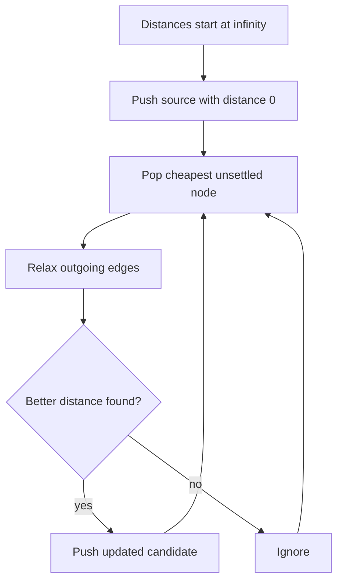
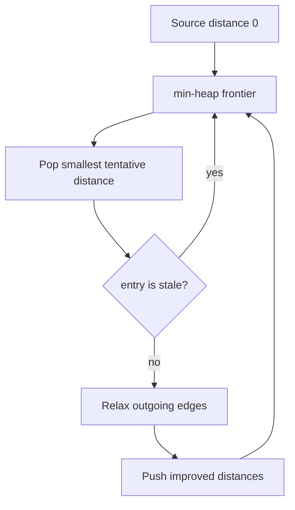
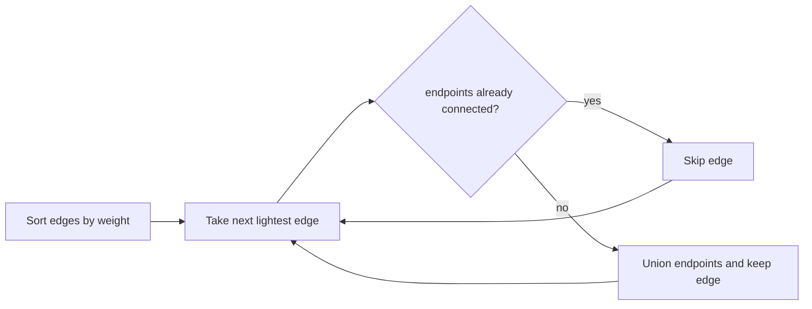

# Advanced Graphs

## What This Topic Is

Choose specialized graph algorithms for weighted paths, all-pairs paths, connectivity structure, and spanning trees.

This topic is a reusable mental model, not a bag of isolated tricks. You should finish it able to identify the problem shape, state the invariant, choose the right pattern, and explain the complexity without guessing.

## Why It Matters

Advanced graph interviews test algorithm selection. The same input shape can require Dijkstra, Bellman-Ford, Floyd-Warshall, MST, SCC, or topological DP depending on constraints.

In interviews, the story usually hides the structure. Translate the story into operations: lookup, move a boundary, traverse, choose, relax, split, merge, or remember a state.

## Interviewer Lens

- Google: justify the exact graph algorithm from edge-weight and graph-structure assumptions.
- Meta: know when Dijkstra, Bellman-Ford, topo DP, and Union Find apply without debate.
- Amazon: explain failure modes such as negative edges, disconnected graphs, and stale heap entries.
- Beginner: classify weighted, negative, DAG, dense, sparse, and connectivity questions first.

## Real-World Use

Used in routing, dependency analysis, arbitrage detection, network reliability, infrastructure planning, compiler optimization, maps, and ranking systems.

The same ideas show up in production systems when constraints demand predictable lookup, bounded memory, fast traversal, or correct ordering.

## Beginner Intuition

Basic traversal only counts steps. Advanced graphs add weights, global structure, or stronger guarantees, so the algorithm must match what the edge weights and constraints allow.

Beginner rule: before coding, write one sentence that says what information your algorithm keeps and why that information is enough for the next decision.

## Formal Explanation

Weighted graph algorithms optimize path or connection cost under assumptions about weights, cycles, and directedness. Violating assumptions changes correctness.

The formal model matters because it tells you which operations are cheap, which are expensive, and which assumptions are required for correctness.

## Core Operations

| Operation | Meaning |
|---|---|
| Relax edge | Improve a known distance through an edge. |
| Priority frontier | Expand the cheapest unsettled node. |
| All-pairs update | Allow an intermediate node and improve every pair. |
| Union components | Add cheapest safe edges for MST. |
| Finish order | Use DFS order to find SCCs. |

## Time Complexity

| Operation or Pattern | Complexity |
|---|---:|
| Dijkstra with heap | O((V + E) log V) |
| Bellman-Ford | O(VE) |
| Floyd-Warshall | O(V^3) |
| Kruskal MST | O(E log E) |
| Tarjan SCC | O(V + E) |

## Space Complexity

| Case | Complexity |
|---|---:|
| Distances | O(V) or O(V^2) |
| Heap frontier | O(E) worst case |
| DSU | O(V) |
| DFS stacks | O(V) |

## Visual Explanation

## Additional Visuals

### Dijkstra Frontier

### Minimum Spanning Tree With Kruskal

## Foundations And Invariants

Dijkstra relies on non-negative weights. Bellman-Ford tolerates negative edges and detects negative cycles. MST connects all nodes cheaply but does not solve shortest paths.

When explaining a solution, name the invariant before writing code. A good invariant is short enough to repeat while coding and precise enough to catch edge cases.

## Pattern Recognition

Look for weighted shortest path, negative edge, all-pairs distance, connect all points with minimum cost, critical edge, strongly connected, or network delay.

Ask these questions:

- Are edge weights non-negative, negative, or irrelevant?
- Do you need one-source shortest path, all-pairs shortest path, MST, bridges, or SCCs?
- Is the graph sparse enough for adjacency-list algorithms?
- What invariant makes a node, edge, or component final?

## Common Interview Patterns

- **Dijkstra**: recognition signals, mistakes, and templates in [PATTERNS.md](PATTERNS.md).
- **Bellman-Ford**: recognition signals, mistakes, and templates in [PATTERNS.md](PATTERNS.md).
- **Floyd-Warshall**: recognition signals, mistakes, and templates in [PATTERNS.md](PATTERNS.md).
- **Minimum Spanning Tree**: recognition signals, mistakes, and templates in [PATTERNS.md](PATTERNS.md).
- **Strongly Connected Components**: recognition signals, mistakes, and templates in [PATTERNS.md](PATTERNS.md).
- **Bridges And Articulation Points**: recognition signals, mistakes, and templates in [PATTERNS.md](PATTERNS.md).
- **DAG Shortest Or Longest Path**: recognition signals, mistakes, and templates in [PATTERNS.md](PATTERNS.md).

## Common Mistakes

- Using Dijkstra with negative weights.
- Confusing MST with shortest path.
- Forgetting stale heap entries.
- Ignoring disconnected graphs or unreachable nodes.

## Interview Tips

- Choose the algorithm from graph properties, not from problem wording alone.
- Reject Dijkstra when negative edges can improve an already-settled distance.
- For MST, say whether Kruskal or Prim is simpler for the input representation.
- For low-link algorithms, define discovery time and low value before coding.
- Compare O(E log V), O(VE), and O(V^3) honestly against constraints.

## Mini Exercises

- Explain `Dijkstra` aloud, then write its invariant and template from memory.
- Explain `Bellman-Ford` aloud, then write its invariant and template from memory.
- Explain `Floyd-Warshall` aloud, then write its invariant and template from memory.
- Explain `Minimum Spanning Tree` aloud, then write its invariant and template from memory.
- Pick two Easy problems from [easy.md](easy.md) and identify the pattern before coding.
- Pick one Medium problem from [medium.md](medium.md) and write pseudocode before implementation.
- For one missed problem, write the failed invariant and the corrected invariant.

## Recommended Learning Order

1. Read `Dijkstra` in [PATTERNS.md](PATTERNS.md).
2. Read `Bellman-Ford` in [PATTERNS.md](PATTERNS.md).
3. Read `Floyd-Warshall` in [PATTERNS.md](PATTERNS.md).
4. Read `Minimum Spanning Tree` in [PATTERNS.md](PATTERNS.md).
5. Read `Strongly Connected Components` in [PATTERNS.md](PATTERNS.md).
6. Read `Bridges And Articulation Points` in [PATTERNS.md](PATTERNS.md).
7. Read `DAG Shortest Or Longest Path` in [PATTERNS.md](PATTERNS.md).
8. Review [CHEATSHEET.md](CHEATSHEET.md) before timed practice.
9. Solve [easy.md](easy.md), then [medium.md](medium.md), then selected [hard.md](hard.md).

## Practice Navigation

- [Easy problems](easy.md): build fundamentals.
- [Medium problems](medium.md): build interview fluency.
- [Hard problems](hard.md): build advanced pattern recognition.

---

## Navigation

[Previous](../graphs/README.md) | [Home](../README.md) | [Next](CHEATSHEET.md)
