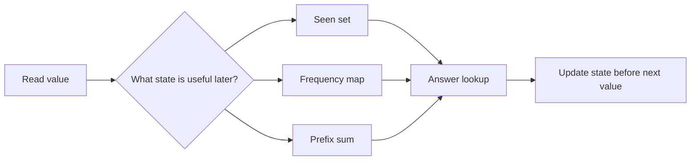

# Arrays & Hashing

## What This Topic Is

Build direct lookup, counting, grouping, and prefix summaries over indexed data.

This topic is a reusable mental model, not a bag of isolated tricks. You should finish it able to identify the problem shape, state the invariant, choose the right pattern, and explain the complexity without guessing.

## Why It Matters

Most interview problems begin as a slow nested scan over an array or string. Hashing teaches you to store exactly the information that makes the next lookup constant time.

In interviews, the story usually hides the structure. Translate the story into operations: lookup, move a boundary, traverse, choose, relax, split, merge, or remember a state.

## Interviewer Lens

- Google: state the stored-map invariant and prove each element is processed once.
- Meta: recognize complement lookup, anagram counting, prefix sums, and bucket selection quickly.
- Amazon: call out duplicate keys, missing keys, and whether input order must be preserved.
- Beginner: choose between set, map, counter, prefix, and bucket before coding.

## Real-World Use

Used in caches, analytics counters, de-duplication pipelines, indexes, log aggregation, rate-limit buckets, feature flag maps, and request routing tables.

The same ideas show up in production systems when constraints demand predictable lookup, bounded memory, fast traversal, or correct ordering.

## Beginner Intuition

An array gives position. A hash table gives a name to a value or state. The interview move is to ask what must be remembered from the left side of the scan so the current item can be decided immediately.

Beginner rule: before coding, write one sentence that says what information your algorithm keeps and why that information is enough for the next decision.

## Formal Explanation

An array is an indexed sequence with O(1) random access. A hash table maps keys to values with expected O(1) insert, lookup, and delete through hashing and collision handling.

The formal model matters because it tells you which operations are cheap, which are expensive, and which assumptions are required for correctness.

## Core Operations

| Operation | Meaning |
|---|---|
| Index access | Read or write a known position. |
| Scan | Visit every value once and update state. |
| Set membership | Ask whether a value has appeared. |
| Map count | Track frequency, first index, last index, or grouped records. |
| Prefix summary | Store cumulative state so range questions become differences. |

## Time Complexity

| Operation or Pattern | Complexity |
|---|---:|
| Index access | O(1) |
| Full scan | O(n) |
| Hash lookup average | O(1) |
| Hash lookup worst case | O(n) |
| Sort then scan | O(n log n) |

## Space Complexity

| Case | Complexity |
|---|---:|
| In-place scan | O(1) |
| Hash set or map | O(k) distinct keys |
| Prefix array | O(n) |
| Bucket array | O(n) when indexed by frequency |

## Visual Explanation

## Foundations And Invariants

The key invariant is that the stored summary is sufficient for the next decision. Counting, set membership, modular arithmetic, and prefix differences are the most common tools.

When explaining a solution, name the invariant before writing code. A good invariant is short enough to repeat while coding and precise enough to catch edge cases.

## Pattern Recognition

Look for duplicates, pairs, anagrams, grouping, subarray sums, longest consecutive runs, first occurrence, or a brute force loop that repeatedly asks whether a previous value exists.

Ask these questions:

- Can a set, map, counter, bucket, or prefix summary remove a repeated scan?
- Does multiplicity matter, or is membership alone enough?
- Do negative values break a sliding-window assumption and point to prefix sums instead?
- Would sorting destroy required indices, ordering, or stable grouping information?

## Common Interview Patterns

- **Frequency Counting**: recognition signals, mistakes, and templates in [PATTERNS.md](PATTERNS.md).
- **Hash Lookup**: recognition signals, mistakes, and templates in [PATTERNS.md](PATTERNS.md).
- **Prefix Sum**: recognition signals, mistakes, and templates in [PATTERNS.md](PATTERNS.md).
- **Bucket Counting**: recognition signals, mistakes, and templates in [PATTERNS.md](PATTERNS.md).
- **Sorting Plus Hashing**: recognition signals, mistakes, and templates in [PATTERNS.md](PATTERNS.md).
- **Grouping by Canonical Key**: recognition signals, mistakes, and templates in [PATTERNS.md](PATTERNS.md).
- **In-place Index Marking**: recognition signals, mistakes, and templates in [PATTERNS.md](PATTERNS.md).

## Common Mistakes

- Using a list membership scan when a set is required.
- Overwriting first-index information too early.
- Forgetting prefix zero for subarray counts.
- Ignoring negative values when choosing sliding window instead of prefix sums.

## Interview Tips

- Name exactly what the hash structure stores before writing the loop.
- Say whether the lookup is expected O(1) and what drives auxiliary space.
- Test duplicates, empty input, and negative values when prefix sums or windows are involved.
- Explain why sorting is optional, required, or harmful for the current problem.
- When a follow-up asks for less memory, discuss sorting, in-place marking, or two pointers.

## Mini Exercises

- Explain `Frequency Counting` aloud, then write its invariant and template from memory.
- Explain `Hash Lookup` aloud, then write its invariant and template from memory.
- Explain `Prefix Sum` aloud, then write its invariant and template from memory.
- Explain `Bucket Counting` aloud, then write its invariant and template from memory.
- Pick two Easy problems from [easy.md](easy.md) and identify the pattern before coding.
- Pick one Medium problem from [medium.md](medium.md) and write pseudocode before implementation.
- For one missed problem, write the failed invariant and the corrected invariant.

## Recommended Learning Order

1. Read `Frequency Counting` in [PATTERNS.md](PATTERNS.md).
2. Read `Hash Lookup` in [PATTERNS.md](PATTERNS.md).
3. Read `Prefix Sum` in [PATTERNS.md](PATTERNS.md).
4. Read `Bucket Counting` in [PATTERNS.md](PATTERNS.md).
5. Read `Sorting Plus Hashing` in [PATTERNS.md](PATTERNS.md).
6. Read `Grouping by Canonical Key` in [PATTERNS.md](PATTERNS.md).
7. Read `In-place Index Marking` in [PATTERNS.md](PATTERNS.md).
8. Review [CHEATSHEET.md](CHEATSHEET.md) before timed practice.
9. Solve [easy.md](easy.md), then [medium.md](medium.md), then selected [hard.md](hard.md).

## Practice Navigation

- [Easy problems](easy.md): build fundamentals.
- [Medium problems](medium.md): build interview fluency.
- [Hard problems](hard.md): build advanced pattern recognition.

---

## Navigation

[Previous](../README.md) | [Home](../README.md) | [Next](CHEATSHEET.md)
