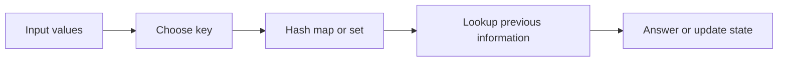

# Arrays & Hashing

## What You Will Learn

You will learn what arrays and hashing means, when it is useful, what operations it supports, and how it appears in coding interviews. By the end of this topic, you should be able to explain the core idea, select the right pattern, implement the usual template, and analyze time and space complexity.

## Why This Topic Matters

Most interview problems start with indexed data, strings, counts, membership checks, or grouped values. Arrays and hash maps are the first tools for turning a slow scan into direct access.

Interview problems often hide the topic behind a story. Your job is to translate the story into operations: lookup, scan, traverse, split, merge, choose, or optimize.

## Real World Usage

Used in caches, indexes, de-duplication, analytics counters, feature flags, log aggregation, and request routing tables.

Real systems rarely announce the data structure by name. They expose constraints such as fast lookup, ordered traversal, prefix search, shortest route, or bounded memory. Those constraints point to the right tool.

## Intuition

An array gives position. A hash table gives names for things. Together they let you remember what has been seen, count it, and jump directly to useful information.

A beginner-friendly way to approach this topic is to ask: what information do I need to remember, and what information can I safely discard?

## Formal Definition

An array is a contiguous indexed sequence. A hash table maps keys to values through a hash function and resolves collisions so lookup, insert, and delete are expected constant time.

The formal definition matters because it tells you which operations are cheap, which operations are expensive, and which invariants cannot be broken.

## Core Data Structure Or Algorithm

Use arrays when order and index matter. Use hash sets for membership. Use hash maps for counts, first positions, last positions, and grouped records.

In interviews, the core algorithm is usually small. The difficulty is choosing it, naming the invariant, and handling edge cases cleanly.

## Time Complexity

| Operation or Pattern | Complexity |
|---|---:|
| Array index access | O(1) |
| Array scan | O(n) |
| Hash lookup average | O(1) |
| Hash lookup worst case | O(n) |
| Sorting before scan | O(n log n) |

## Space Complexity

| Case | Complexity |
|---|---:|
| In-place scan | O(1) |
| Frequency map | O(k) |
| Prefix table | O(n) |
| Bucket array | O(n) |

## Common Operations

| Operation | What It Means |
|---|---|
| Append | Add to the end when capacity allows. |
| Scan | Visit every element once. |
| Count | Map each value to a frequency. |
| Group | Map a normalized key to a list. |
| Prefix | Store cumulative information for fast range queries. |

## Visual Explanation

## Mathematical Foundations

Counting arguments, set membership, modular arithmetic, and prefix sums are the main mathematical ideas. The key invariant is that the stored summary must be enough to answer the next step without re-reading all previous values.

## Common Interview Patterns

- **Frequency Counting**: see [arrays-hashing/PATTERNS.md](PATTERNS.md) for recognition signals and templates.
- **Hash Lookup**: see [arrays-hashing/PATTERNS.md](PATTERNS.md) for recognition signals and templates.
- **Prefix Sum**: see [arrays-hashing/PATTERNS.md](PATTERNS.md) for recognition signals and templates.
- **Grouping by Canonical Key**: see [arrays-hashing/PATTERNS.md](PATTERNS.md) for recognition signals and templates.
- **Bucket Counting**: see [arrays-hashing/PATTERNS.md](PATTERNS.md) for recognition signals and templates.
- **In-place Marking**: see [arrays-hashing/PATTERNS.md](PATTERNS.md) for recognition signals and templates.

## Pattern Recognition

Look for duplicates, pairs with a target, anagrams, subarray sums, longest consecutive ranges, or repeated work caused by nested loops.

When you read a problem, underline the constraint words first. Words like "sorted", "contiguous", "prefix", "shortest", "k", "all possible", "minimum", or "dependencies" usually reveal the intended pattern.

## Common Mistakes

- Forgetting that hash-table worst cases exist.
- Using a list membership scan where a set is intended.
- Losing first-index information by overwriting too early.

## Interview Tips

- Start with brute force and name the repeated work.
- State the invariant before coding.
- Keep edge cases visible: empty input, one item, duplicates, negative values, and boundary indices.
- Explain why your data structure supports the needed operation efficiently.
- Give time and space complexity after testing the code mentally.

## Mini Exercises

- Implement and explain frequency counting without looking at notes.
- Implement and explain hash lookup without looking at notes.
- Implement and explain prefix sum without looking at notes.
- Implement and explain grouping by canonical key without looking at notes.
- Pick two Easy problems from [easy.md](easy.md) and explain the pattern before coding.
- Pick one Medium problem from [medium.md](medium.md) and write only pseudocode first.

## Recommended Learning Order

1. Read the section on Frequency Counting in [PATTERNS.md](PATTERNS.md).
2. Read the section on Hash Lookup in [PATTERNS.md](PATTERNS.md).
3. Read the section on Prefix Sum in [PATTERNS.md](PATTERNS.md).
4. Read the section on Grouping by Canonical Key in [PATTERNS.md](PATTERNS.md).
5. Read the section on Bucket Counting in [PATTERNS.md](PATTERNS.md).
6. Read the section on In-place Marking in [PATTERNS.md](PATTERNS.md).
7. Review [CHEATSHEET.md](CHEATSHEET.md) before timed practice.
8. Solve Easy, then Medium, then selected Hard problems.

## Practice Sets

- [Easy problems](easy.md)
- [Medium problems](medium.md)
- [Hard problems](hard.md)

---

## Navigation

[Previous](../README.md) | [Home](../README.md) | [Next](../arrays-hashing/CHEATSHEET.md)
