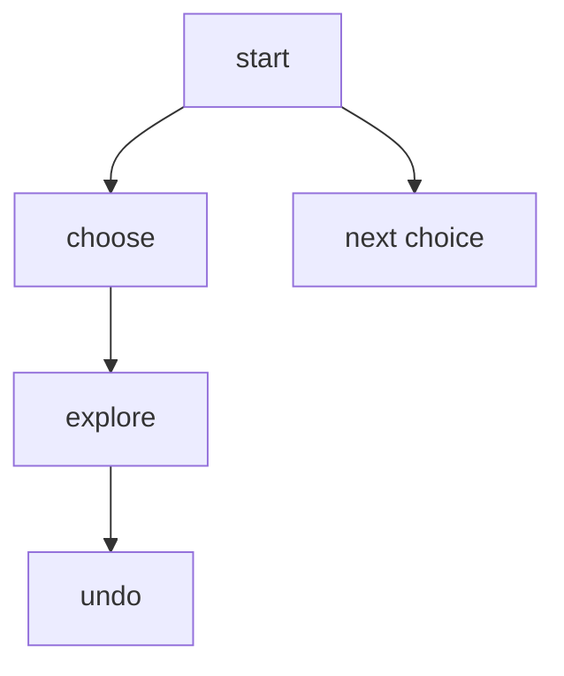

# Backtracking

## What You Will Learn

You will learn the core model behind backtracking, the operations it supports, the patterns that interviewers commonly test, and the recognition signals that tell you this topic is being tested.

## Why This Topic Matters

Backtracking problems test whether you can turn a prompt into a precise state model. The best solutions are usually short once the invariant is clear.

## Real World Usage

Used in puzzle solvers, constraint satisfaction, scheduling, combinatorial generation, test-case generation, and search-based planning.

## Intuition

Ask what information must be remembered after each step. If you can name that state and explain why it is enough, the implementation becomes much safer.

## Formal Definition

Backtracking is depth-first search over a decision tree where each recursive call extends a partial candidate and then restores state.

## Core Data Structure Or Algorithm

Use choose, explore, unchoose. Add pruning only when you can prove skipped branches cannot help.

## Time Complexity

| Operation or Pattern | Complexity |
|---|---:|
| Subsets | O(2^n) |
| Permutations | O(n!) |
| Combinations | O(C(n,k)) |
| Board search | O(branch^depth) before pruning |

## Space Complexity

| Case | Complexity |
|---|---:|
| Recursion stack | O(depth) |
| Current path | O(depth) |
| Output | Often exponential |

## Common Operations

| Operation | What It Means |
|---|---|
| Choose | Add one candidate to the path. |
| Validate | Reject impossible partial states early. |
| Explore | Recurse to the next decision. |
| Undo | Restore state before trying the next candidate. |

## Visual Explanation

## Mathematical Foundations

The search tree size is usually exponential. Pruning is correct only when skipped branches cannot produce a valid or better answer.

## Common Interview Patterns

- **Subsets**: For each element, branch into include and exclude choices.
- **Combinations**: Choose elements in increasing index order to avoid duplicate orderings.
- **Permutations**: At each position, try every unused element.
- **Constraint Search**: Carry constraint sets so invalid partial assignments are rejected immediately.
- **Board DFS**: Move through neighboring cells while marking the current cell visited.
- **Partitioning**: Choose a valid prefix, recurse on the suffix, and record complete decompositions.

## Pattern Recognition

Look for the operation the prompt asks you to optimize. If brute force repeats the same lookup, traversal, choice, or state calculation, one of the patterns in this folder is probably intended.

## Common Mistakes

- Coding before defining what the state means.
- Forgetting edge cases such as empty input, one item, duplicates, and boundary endpoints.
- Choosing a familiar pattern even when the constraints do not support its invariant.
- Reporting time complexity without auxiliary memory.

## Interview Tips

- Start with brute force and name the repeated work.
- State the invariant before coding.
- Keep the implementation small and testable.
- Explain why the pattern is correct, not only why it is fast.
- Test one normal case, one edge case, and one adversarial case.

## Mini Exercises

- Write the template for each pattern from memory.
- Solve two Easy problems and explain the invariant aloud.
- Solve one Medium problem with pseudocode before coding.
- Re-solve one missed problem after 24 hours.

## Recommended Learning Order

1. Study Subsets in [PATTERNS.md](PATTERNS.md).
2. Study Combinations in [PATTERNS.md](PATTERNS.md).
3. Study Permutations in [PATTERNS.md](PATTERNS.md).
4. Study Constraint Search in [PATTERNS.md](PATTERNS.md).
5. Study Board DFS in [PATTERNS.md](PATTERNS.md).
6. Study Partitioning in [PATTERNS.md](PATTERNS.md).
7. Review [CHEATSHEET.md](CHEATSHEET.md).
8. Solve [easy.md](easy.md), then [medium.md](medium.md), then selected [hard.md](hard.md).

## Practice Sets

[Cheatsheet](CHEATSHEET.md) | [Patterns](PATTERNS.md) | [Easy](easy.md) | [Medium](medium.md) | [Hard](hard.md)

---

## Navigation

[Previous](../heap-priority-queue/README.md) | [Home](../README.md) | [Next](../backtracking/CHEATSHEET.md)
