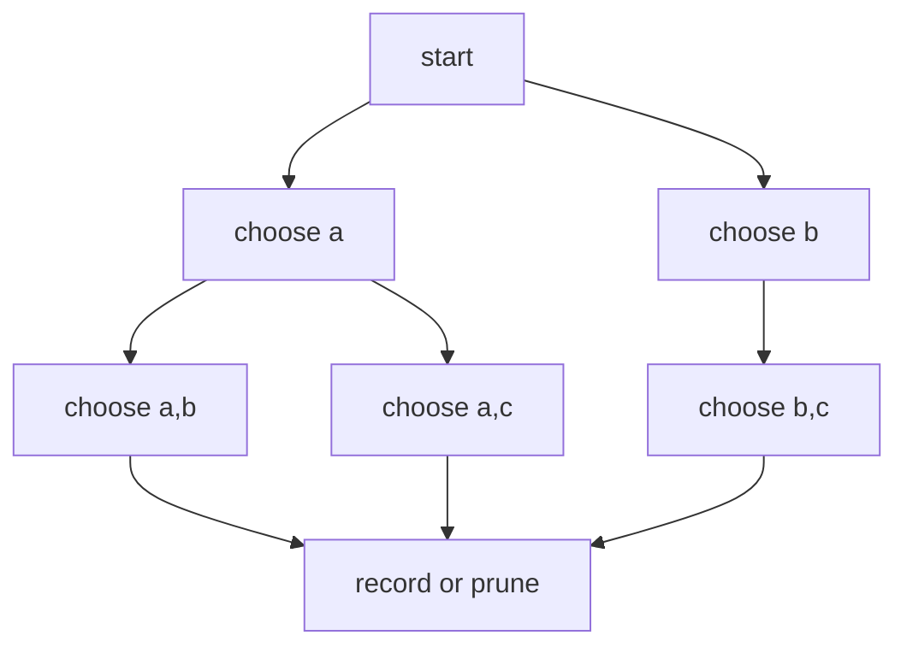
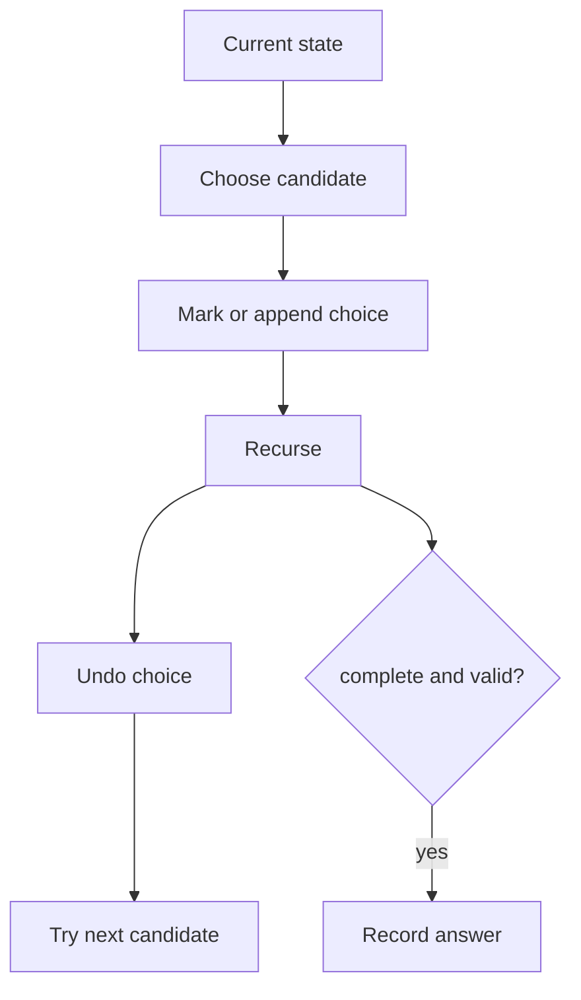

# Backtracking

## What This Topic Is

Explore a decision tree by choosing, recursing, and undoing choices under constraints.

This topic is a reusable mental model, not a bag of isolated tricks. You should finish it able to identify the problem shape, state the invariant, choose the right pattern, and explain the complexity without guessing.

## Why It Matters

Backtracking is the clean way to enumerate combinations, permutations, partitions, and constraint satisfaction problems without mixing branches.

In interviews, the story usually hides the structure. Translate the story into operations: lookup, move a boundary, traverse, choose, relax, split, merge, or remember a state.

## Interviewer Lens

- Google: state the search tree and the pruning proof.
- Meta: code choose, recurse, undo without leaking state across branches.
- Amazon: explain duplicate handling and constraint checks before recursion.
- Beginner: write one recursion frame as a stack of choices.

## Real-World Use

Used in schedulers, puzzle solvers, search engines, configuration generation, parsers, and constraint optimization.

The same ideas show up in production systems when constraints demand predictable lookup, bounded memory, fast traversal, or correct ordering.

## Beginner Intuition

Imagine walking down a decision tree. At each node, make one legal choice, explore the consequences, then return to try the next choice with state restored.

Beginner rule: before coding, write one sentence that says what information your algorithm keeps and why that information is enough for the next decision.

## Formal Explanation

Backtracking is depth-first search over a state space with pruning. Correctness depends on complete candidate generation and precise state restoration.

The formal model matters because it tells you which operations are cheap, which are expensive, and which assumptions are required for correctness.

## Core Operations

| Operation | Meaning |
|---|---|
| Choose | Add one candidate to the partial state. |
| Explore | Recurse to the next decision. |
| Unchoose | Restore state before trying another branch. |
| Prune | Stop branches that cannot lead to a valid answer. |
| Record | Copy a completed result at the base case. |

## Time Complexity

| Operation or Pattern | Complexity |
|---|---:|
| Subsets | O(2^n) |
| Permutations | O(n!) |
| Combinations | O(C(n, k)) |
| Board search | O(cells * branching^depth) before pruning |

## Space Complexity

| Case | Complexity |
|---|---:|
| Recursion depth | O(depth) |
| Visited set or board marks | O(depth) or O(cells) |
| Output | Often exponential and counted separately |

## Visual Explanation

## Additional Visuals

### Choose, Explore, Undo

## Foundations And Invariants

The invariant is the meaning of the partial path. If path contains chosen values in increasing index order, duplicate branches can be avoided systematically.

When explaining a solution, name the invariant before writing code. A good invariant is short enough to repeat while coding and precise enough to catch edge cases.

## Pattern Recognition

Look for all possible, generate, combinations, permutations, subsets, valid arrangements, board search, partition, or constraints that require trying choices.

Ask these questions:

- Is the problem asking for all valid choices, not only one best value?
- What are the choice, constraint, recursion depth, and undo operation?
- Can sorting, counts, or bounds prune duplicate or impossible branches?
- Does the output size itself force exponential time?

## Common Interview Patterns

- **Subsets**: recognition signals, mistakes, and templates in [PATTERNS.md](PATTERNS.md).
- **Combinations**: recognition signals, mistakes, and templates in [PATTERNS.md](PATTERNS.md).
- **Permutations**: recognition signals, mistakes, and templates in [PATTERNS.md](PATTERNS.md).
- **Constraint Grid Search**: recognition signals, mistakes, and templates in [PATTERNS.md](PATTERNS.md).
- **Partition Backtracking**: recognition signals, mistakes, and templates in [PATTERNS.md](PATTERNS.md).
- **Pruned Search**: recognition signals, mistakes, and templates in [PATTERNS.md](PATTERNS.md).

## Common Mistakes

- Appending the live path instead of a copy.
- Forgetting to undo mutable state.
- Skipping duplicate logic after sorting.
- Pruning a branch that could still become valid.

## Interview Tips

- Define the recursion state with index, path, remaining constraint, and output.
- Undo every mutation before the next branch.
- Sort when it enables duplicate skipping or early stopping.
- Explain exponential complexity in terms of branching and depth.
- Test empty choices, duplicate inputs, and impossible constraints.

## Mini Exercises

- Explain `Subsets` aloud, then write its invariant and template from memory.
- Explain `Combinations` aloud, then write its invariant and template from memory.
- Explain `Permutations` aloud, then write its invariant and template from memory.
- Explain `Constraint Grid Search` aloud, then write its invariant and template from memory.
- Pick two Easy problems from [easy.md](easy.md) and identify the pattern before coding.
- Pick one Medium problem from [medium.md](medium.md) and write pseudocode before implementation.
- For one missed problem, write the failed invariant and the corrected invariant.

## Recommended Learning Order

1. Read `Subsets` in [PATTERNS.md](PATTERNS.md).
2. Read `Combinations` in [PATTERNS.md](PATTERNS.md).
3. Read `Permutations` in [PATTERNS.md](PATTERNS.md).
4. Read `Constraint Grid Search` in [PATTERNS.md](PATTERNS.md).
5. Read `Partition Backtracking` in [PATTERNS.md](PATTERNS.md).
6. Read `Pruned Search` in [PATTERNS.md](PATTERNS.md).
7. Review [CHEATSHEET.md](CHEATSHEET.md) before timed practice.
8. Solve [easy.md](easy.md), then [medium.md](medium.md), then selected [hard.md](hard.md).

## Practice Navigation

- [Easy problems](easy.md): build fundamentals.
- [Medium problems](medium.md): build interview fluency.
- [Hard problems](hard.md): build advanced pattern recognition.

---

## Navigation

[Previous](../heap-priority-queue/README.md) | [Home](../README.md) | [Next](CHEATSHEET.md)
