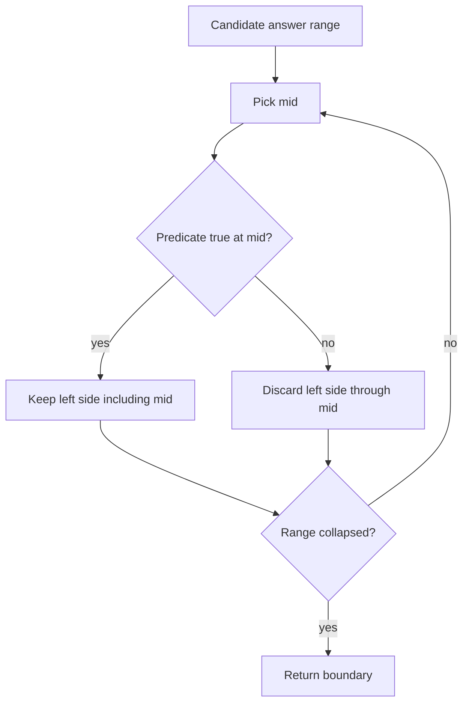
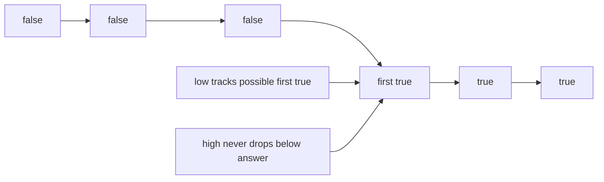
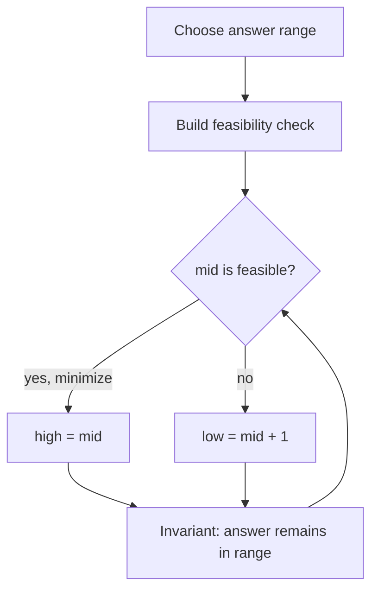

# Binary Search

## What This Topic Is

Halve a sorted or monotonic search space until the target or boundary is isolated.

This topic is a reusable mental model, not a bag of isolated tricks. You should finish it able to identify the problem shape, state the invariant, choose the right pattern, and explain the complexity without guessing.

## Why It Matters

Binary search is the standard way to convert linear trial into logarithmic reasoning when a yes/no predicate splits the answer space.

In interviews, the story usually hides the structure. Translate the story into operations: lookup, move a boundary, traverse, choose, relax, split, merge, or remember a state.

## Interviewer Lens

- Google: prove the predicate is monotonic before discussing code.
- Meta: use one lower-bound template consistently and avoid equality loops.
- Amazon: clarify inclusive and exclusive bounds out loud before implementation.
- Beginner: write what low and high mean after every loop iteration.

## Real-World Use

Used in database indexes, version search, capacity planning, ranking, distributed storage ranges, numeric approximation, and feature rollout boundaries.

The same ideas show up in production systems when constraints demand predictable lookup, bounded memory, fast traversal, or correct ordering.

## Beginner Intuition

You are not guessing randomly. You are asking a question whose answer proves that half of the candidates can no longer contain the result.

Beginner rule: before coding, write one sentence that says what information your algorithm keeps and why that information is enough for the next decision.

## Formal Explanation

Binary search repeatedly narrows a monotonic range while preserving an invariant that the answer remains inside the current bounds.

The formal model matters because it tells you which operations are cheap, which are expensive, and which assumptions are required for correctness.

## Core Operations

| Operation | Meaning |
|---|---|
| Choose middle | Split the candidate range. |
| Evaluate predicate | Decide which side can still contain the answer. |
| Move boundary | Discard impossible candidates. |
| Return boundary | Return first true, last false, exact target, or insertion point. |

## Time Complexity

| Operation or Pattern | Complexity |
|---|---:|
| Array search | O(log n) |
| Answer search | O(log R * check_cost) |
| Matrix flattened search | O(log(mn)) |
| Rotated search without duplicate ambiguity | O(log n) |

## Space Complexity

| Case | Complexity |
|---|---:|
| Iterative | O(1) |
| Recursive | O(log n) call stack |

## Visual Explanation

## Additional Visuals

### Lower Bound Boundary

### Binary Search On Answer

## Foundations And Invariants

The predicate must be monotonic. If true and false values alternate, halving is unsound no matter how clean the code looks.

When explaining a solution, name the invariant before writing code. A good invariant is short enough to repeat while coding and precise enough to catch edge cases.

## Pattern Recognition

Look for sorted data, first or last valid value, minimum feasible capacity, maximum allowed minimum, rotated arrays, peaks, or the phrase smallest possible maximum.

Ask these questions:

- What is the monotonic predicate, and where does false change to true or true change to false?
- Are you searching an index, a value, an answer range, or a rotated segment?
- Does equality return immediately, keep the left boundary, or keep the right boundary?
- Do duplicates break the side-order proof?

## Common Interview Patterns

- **Classic Target Search**: recognition signals, mistakes, and templates in [PATTERNS.md](PATTERNS.md).
- **Lower Bound**: recognition signals, mistakes, and templates in [PATTERNS.md](PATTERNS.md).
- **Upper Bound**: recognition signals, mistakes, and templates in [PATTERNS.md](PATTERNS.md).
- **Rotated Sorted Search**: recognition signals, mistakes, and templates in [PATTERNS.md](PATTERNS.md).
- **Binary Search On Answer**: recognition signals, mistakes, and templates in [PATTERNS.md](PATTERNS.md).
- **Matrix Binary Search**: recognition signals, mistakes, and templates in [PATTERNS.md](PATTERNS.md).
- **Peak Search**: recognition signals, mistakes, and templates in [PATTERNS.md](PATTERNS.md).

## Common Mistakes

- Using binary search without a monotonic predicate.
- Changing neither bound on equality.
- Returning mid instead of the converged boundary.
- Choosing low and high bounds that exclude the real answer.

## Interview Tips

- Name the search domain and the predicate separately.
- State whether the template returns first true, last false, exact target, or insertion point.
- Choose initial bounds that cannot exclude the real answer.
- Use midpoint arithmetic that avoids overflow in fixed-width languages.
- Test the smallest range and the case where the answer is at each boundary.

## Mini Exercises

- Explain `Classic Target Search` aloud, then write its invariant and template from memory.
- Explain `Lower Bound` aloud, then write its invariant and template from memory.
- Explain `Upper Bound` aloud, then write its invariant and template from memory.
- Explain `Rotated Sorted Search` aloud, then write its invariant and template from memory.
- Pick two Easy problems from [easy.md](easy.md) and identify the pattern before coding.
- Pick one Medium problem from [medium.md](medium.md) and write pseudocode before implementation.
- For one missed problem, write the failed invariant and the corrected invariant.

## Recommended Learning Order

1. Read `Classic Target Search` in [PATTERNS.md](PATTERNS.md).
2. Read `Lower Bound` in [PATTERNS.md](PATTERNS.md).
3. Read `Upper Bound` in [PATTERNS.md](PATTERNS.md).
4. Read `Rotated Sorted Search` in [PATTERNS.md](PATTERNS.md).
5. Read `Binary Search On Answer` in [PATTERNS.md](PATTERNS.md).
6. Read `Matrix Binary Search` in [PATTERNS.md](PATTERNS.md).
7. Read `Peak Search` in [PATTERNS.md](PATTERNS.md).
8. Review [CHEATSHEET.md](CHEATSHEET.md) before timed practice.
9. Solve [easy.md](easy.md), then [medium.md](medium.md), then selected [hard.md](hard.md).

## Practice Navigation

- [Easy problems](easy.md): build fundamentals.
- [Medium problems](medium.md): build interview fluency.
- [Hard problems](hard.md): build advanced pattern recognition.

---

## Navigation

[Previous](../stack/README.md) | [Home](../README.md) | [Next](CHEATSHEET.md)
