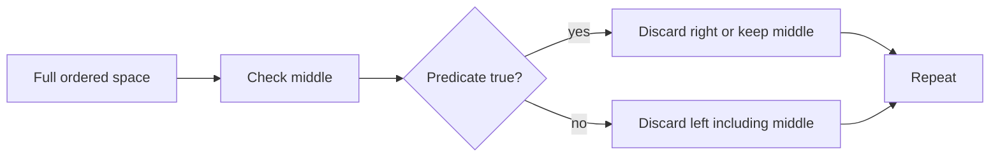

# Binary Search

## What You Will Learn

You will learn what binary search means, when it is useful, what operations it supports, and how it appears in coding interviews. By the end of this topic, you should be able to explain the core idea, select the right pattern, implement the usual template, and analyze time and space complexity.

## Why This Topic Matters

Binary search turns ordered decision spaces into logarithmic solutions. It is common in direct sorted lookup and in optimization problems with a yes/no predicate.

Interview problems often hide the topic behind a story. Your job is to translate the story into operations: lookup, scan, traverse, split, merge, choose, or optimize.

## Real World Usage

Used in database indexes, version search, capacity planning, rate limits, ranking, distributed storage boundaries, and numeric approximation.

Real systems rarely announce the data structure by name. They expose constraints such as fast lookup, ordered traversal, prefix search, shortest route, or bounded memory. Those constraints point to the right tool.

## Intuition

If the answer space is ordered, ask a question that eliminates half of it. The hard part is defining the predicate and boundaries correctly.

A beginner-friendly way to approach this topic is to ask: what information do I need to remember, and what information can I safely discard?

## Formal Definition

Binary search repeatedly halves a monotonic search space until it finds an exact target or the first value satisfying a predicate.

The formal definition matters because it tells you which operations are cheap, which operations are expensive, and which invariants cannot be broken.

## Core Data Structure Or Algorithm

There are two main forms: search for a target in sorted data, and search for the minimum or maximum feasible answer.

In interviews, the core algorithm is usually small. The difficulty is choosing it, naming the invariant, and handling edge cases cleanly.

## Time Complexity

| Operation or Pattern | Complexity |
|---|---:|
| Search array | O(log n) |
| Binary search over answer | O(log R * check) |
| Matrix binary search | O(log(mn)) |
| Rotated array search | O(log n) when duplicates do not break order |

## Space Complexity

| Case | Complexity |
|---|---:|
| Iterative search | O(1) |
| Recursive search | O(log n) stack |

## Common Operations

| Operation | What It Means |
|---|---|
| Choose middle | Compute mid without overflow in fixed-width languages. |
| Compare | Decide which half can still contain the answer. |
| Shrink bounds | Move left or right without losing candidates. |
| Return boundary | Return the first true or last false value. |

## Visual Explanation

## Mathematical Foundations

Binary search relies on monotonic predicates. A predicate is monotonic when answers look like false false false true true, or the reverse. The proof is by maintaining that the answer always remains inside the current interval.

## Common Interview Patterns

- **Classic Target Search**: see [binary-search/PATTERNS.md](PATTERNS.md) for recognition signals and templates.
- **Lower Bound**: see [binary-search/PATTERNS.md](PATTERNS.md) for recognition signals and templates.
- **Upper Bound**: see [binary-search/PATTERNS.md](PATTERNS.md) for recognition signals and templates.
- **Search Rotated Array**: see [binary-search/PATTERNS.md](PATTERNS.md) for recognition signals and templates.
- **Binary Search on Answer**: see [binary-search/PATTERNS.md](PATTERNS.md) for recognition signals and templates.
- **Matrix Search**: see [binary-search/PATTERNS.md](PATTERNS.md) for recognition signals and templates.

## Pattern Recognition

Look for sorted data, minimum feasible capacity, maximum allowed value, first bad version, peak, rotation, or any phrase like smallest possible maximum.

When you read a problem, underline the constraint words first. Words like "sorted", "contiguous", "prefix", "shortest", "k", "all possible", "minimum", or "dependencies" usually reveal the intended pattern.

## Common Mistakes

- Infinite loops from unchanged boundaries.
- Returning mid instead of the boundary.
- Using binary search without a monotonic predicate.

## Interview Tips

- Start with brute force and name the repeated work.
- State the invariant before coding.
- Keep edge cases visible: empty input, one item, duplicates, negative values, and boundary indices.
- Explain why your data structure supports the needed operation efficiently.
- Give time and space complexity after testing the code mentally.

## Mini Exercises

- Implement and explain classic target search without looking at notes.
- Implement and explain lower bound without looking at notes.
- Implement and explain upper bound without looking at notes.
- Implement and explain search rotated array without looking at notes.
- Pick two Easy problems from [easy.md](easy.md) and explain the pattern before coding.
- Pick one Medium problem from [medium.md](medium.md) and write only pseudocode first.

## Recommended Learning Order

1. Read the section on Classic Target Search in [PATTERNS.md](PATTERNS.md).
2. Read the section on Lower Bound in [PATTERNS.md](PATTERNS.md).
3. Read the section on Upper Bound in [PATTERNS.md](PATTERNS.md).
4. Read the section on Search Rotated Array in [PATTERNS.md](PATTERNS.md).
5. Read the section on Binary Search on Answer in [PATTERNS.md](PATTERNS.md).
6. Read the section on Matrix Search in [PATTERNS.md](PATTERNS.md).
7. Review [CHEATSHEET.md](CHEATSHEET.md) before timed practice.
8. Solve Easy, then Medium, then selected Hard problems.

## Practice Sets

- [Easy problems](easy.md)
- [Medium problems](medium.md)
- [Hard problems](hard.md)

---

## Navigation

[Previous](../stack/README.md) | [Home](../README.md) | [Next](../binary-search/CHEATSHEET.md)
