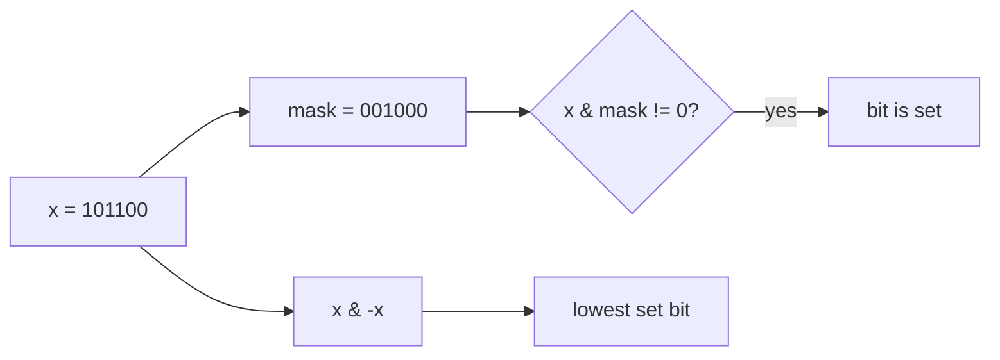

# Bit Manipulation

## What This Topic Is

Use binary representation directly for sets, parity, masks, and low-level arithmetic.

This topic is a reusable mental model, not a bag of isolated tricks. You should finish it able to identify the problem shape, state the invariant, choose the right pattern, and explain the complexity without guessing.

## Why It Matters

Bit problems test fundamentals: XOR cancellation, shifts, masks, two's complement, and whether you can reason without decimal intuition.

In interviews, the story usually hides the structure. Translate the story into operations: lookup, move a boundary, traverse, choose, relax, split, merge, or remember a state.

## Real-World Use

Used in permissions, compression, cryptography primitives, networking flags, embedded systems, bitmap indexes, and performance-sensitive state sets.

The same ideas show up in production systems when constraints demand predictable lookup, bounded memory, fast traversal, or correct ordering.

## Beginner Intuition

A bit is a yes/no slot. A mask lets one integer store many yes/no facts, and bitwise operations update many slots at once.

Beginner rule: before coding, write one sentence that says what information your algorithm keeps and why that information is enough for the next decision.

## Formal Explanation

Bit manipulation operates on the binary representation of integers using AND, OR, XOR, NOT, shifts, and masks.

The formal model matters because it tells you which operations are cheap, which are expensive, and which assumptions are required for correctness.

## Core Operations

| Operation | Meaning |
|---|---|
| Set bit | OR with a mask. |
| Clear bit | AND with inverse mask. |
| Toggle bit | XOR with a mask. |
| Test bit | AND and compare with zero. |
| Extract low bit | x & -x. |
| Count bits | Repeatedly clear low set bit or use DP. |

## Time Complexity

| Operation or Pattern | Complexity |
|---|---:|
| Single bit operation | O(1) |
| Scan word bits | O(word_size) |
| Submask enumeration | O(3^n) across all masks |
| Bitmask DP | O(n * 2^n) common |

## Space Complexity

| Case | Complexity |
|---|---:|
| Single mask | O(1) |
| Mask DP table | O(2^n) |
| Bit count table | O(n) |

## Visual Explanation

## Foundations And Invariants

XOR cancels equal values because a xor a is 0 and a xor 0 is a. Two's complement makes x & -x isolate the lowest set bit.

When explaining a solution, name the invariant before writing code. A good invariant is short enough to repeat while coding and precise enough to catch edge cases.

## Pattern Recognition

Look for single number, parity, powers of two, subset masks, permissions, turn bits on or off, XOR ranges, or constraints with n <= 20.

Ask these questions:

- What is the smallest state that makes the next decision easy?
- Does the problem require order, membership, connectivity, optimal choice, or all possibilities?
- Does any boundary move monotonically?
- Are constraints small enough for exponential search or DP state?

## Common Interview Patterns

- **XOR Cancellation**: recognition signals, mistakes, and templates in [PATTERNS.md](PATTERNS.md).
- **Bit Counting**: recognition signals, mistakes, and templates in [PATTERNS.md](PATTERNS.md).
- **Masks For Sets**: recognition signals, mistakes, and templates in [PATTERNS.md](PATTERNS.md).
- **Single Bit Checks**: recognition signals, mistakes, and templates in [PATTERNS.md](PATTERNS.md).
- **Submask Enumeration**: recognition signals, mistakes, and templates in [PATTERNS.md](PATTERNS.md).
- **Arithmetic Bit Tricks**: recognition signals, mistakes, and templates in [PATTERNS.md](PATTERNS.md).

## Common Mistakes

- Confusing bit index with bit value.
- Forgetting signed integer behavior in fixed-width languages.
- Using addition where XOR without carry is intended.
- Missing parentheses around shifts and masks.

## Interview Tips

- Start with brute force and name the repeated work or missing invariant.
- State why the chosen pattern removes that waste.
- Keep edge cases visible while coding.
- Give both time and auxiliary space complexity.
- If the interviewer changes constraints, re-check the pattern assumptions before modifying code.

## Mini Exercises

- Explain `XOR Cancellation` aloud, then write its invariant and template from memory.
- Explain `Bit Counting` aloud, then write its invariant and template from memory.
- Explain `Masks For Sets` aloud, then write its invariant and template from memory.
- Explain `Single Bit Checks` aloud, then write its invariant and template from memory.
- Pick two Easy problems from [easy.md](easy.md) and identify the pattern before coding.
- Pick one Medium problem from [medium.md](medium.md) and write pseudocode before implementation.
- For one missed problem, write the failed invariant and the corrected invariant.

## Recommended Learning Order

1. Read `XOR Cancellation` in [PATTERNS.md](PATTERNS.md).
2. Read `Bit Counting` in [PATTERNS.md](PATTERNS.md).
3. Read `Masks For Sets` in [PATTERNS.md](PATTERNS.md).
4. Read `Single Bit Checks` in [PATTERNS.md](PATTERNS.md).
5. Read `Submask Enumeration` in [PATTERNS.md](PATTERNS.md).
6. Read `Arithmetic Bit Tricks` in [PATTERNS.md](PATTERNS.md).
7. Review [CHEATSHEET.md](CHEATSHEET.md) before timed practice.
8. Solve [easy.md](easy.md), then [medium.md](medium.md), then selected [hard.md](hard.md).

## Practice Navigation

- [Easy problems](easy.md): build fundamentals.
- [Medium problems](medium.md): build interview fluency.
- [Hard problems](hard.md): build advanced pattern recognition.

---

## Navigation

[Previous](../intervals/README.md) | [Home](../README.md) | [Next](CHEATSHEET.md)
