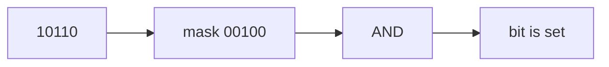

# Bit Manipulation

## What You Will Learn

You will learn the core model behind bit manipulation, the operations it supports, the patterns that interviewers commonly test, and the recognition signals that tell you this topic is being tested.

## Why This Topic Matters

Bit Manipulation problems test whether you can turn a prompt into a precise state model. The best solutions are usually short once the invariant is clear.

## Real World Usage

Used in permissions, compression, networking, graphics, embedded systems, bloom filters, and compact feature flags.

## Intuition

Ask what information must be remembered after each step. If you can name that state and explain why it is enough, the implementation becomes much safer.

## Formal Definition

Bit manipulation operates on the binary representation of integers using AND, OR, XOR, NOT, shifts, and masks.

## Core Data Structure Or Algorithm

Use masks to represent sets, XOR to cancel pairs, shifts to inspect positions, and bit DP when the chosen set is part of state.

## Time Complexity

| Operation or Pattern | Complexity |
|---|---:|
| Single bit op | O(1) |
| Scan word bits | O(word size) |
| Enumerate subsets | O(2^n) |
| Bitmask DP | O(2^n times n) common |

## Space Complexity

| Case | Complexity |
|---|---:|
| Single mask | O(1) |
| Mask DP | O(2^n) |
| Count array | O(n) |

## Common Operations

| Operation | What It Means |
|---|---|
| Check bit | Use mask & (1 << i). |
| Set bit | Use mask | (1 << i). |
| Clear bit | Use mask & ~(1 << i). |
| Toggle bit | Use mask ^ (1 << i). |

## Visual Explanation

## Mathematical Foundations

XOR cancellation, binary place value, and set masks are the central mathematical tools.

## Common Interview Patterns

- **XOR Cancellation**: Equal values cancel under XOR, leaving the value that appears odd or differs.
- **Bit Counting**: Count set bits directly or use recurrence over smaller numbers.
- **Masks for Sets**: Represent a small set as bits in an integer.
- **Subset Enumeration**: Iterate masks or submasks to cover all subsets.
- **Bitwise Trie**: Store numbers by bits and greedily follow opposite bits to maximize XOR.
- **Bitmask DP**: Use mask plus optional position as a state that records chosen or visited elements.

## Pattern Recognition

Look for the operation the prompt asks you to optimize. If brute force repeats the same lookup, traversal, choice, or state calculation, one of the patterns in this folder is probably intended.

## Common Mistakes

- Coding before defining what the state means.
- Forgetting edge cases such as empty input, one item, duplicates, and boundary endpoints.
- Choosing a familiar pattern even when the constraints do not support its invariant.
- Reporting time complexity without auxiliary memory.

## Interview Tips

- Start with brute force and name the repeated work.
- State the invariant before coding.
- Keep the implementation small and testable.
- Explain why the pattern is correct, not only why it is fast.
- Test one normal case, one edge case, and one adversarial case.

## Mini Exercises

- Write the template for each pattern from memory.
- Solve two Easy problems and explain the invariant aloud.
- Solve one Medium problem with pseudocode before coding.
- Re-solve one missed problem after 24 hours.

## Recommended Learning Order

1. Study XOR Cancellation in [PATTERNS.md](PATTERNS.md).
2. Study Bit Counting in [PATTERNS.md](PATTERNS.md).
3. Study Masks for Sets in [PATTERNS.md](PATTERNS.md).
4. Study Subset Enumeration in [PATTERNS.md](PATTERNS.md).
5. Study Bitwise Trie in [PATTERNS.md](PATTERNS.md).
6. Study Bitmask DP in [PATTERNS.md](PATTERNS.md).
7. Review [CHEATSHEET.md](CHEATSHEET.md).
8. Solve [easy.md](easy.md), then [medium.md](medium.md), then selected [hard.md](hard.md).

## Practice Sets

[Cheatsheet](CHEATSHEET.md) | [Patterns](PATTERNS.md) | [Easy](easy.md) | [Medium](medium.md) | [Hard](hard.md)

---

## Navigation

[Previous](../intervals/README.md) | [Home](../README.md) | [Next](../bit-manipulation/CHEATSHEET.md)
