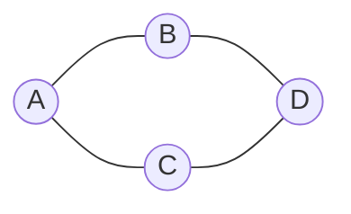

# Graphs

## What You Will Learn

You will learn the core model behind graphs, the operations it supports, the patterns that interviewers commonly test, and the recognition signals that tell you this topic is being tested.

## Why This Topic Matters

Graphs problems test whether you can turn a prompt into a precise state model. The best solutions are usually short once the invariant is clear.

## Real World Usage

Used in social networks, maps, dependency systems, distributed services, recommendation systems, compilers, and knowledge graphs.

## Intuition

Ask what information must be remembered after each step. If you can name that state and explain why it is enough, the implementation becomes much safer.

## Formal Definition

A graph is a set of vertices connected by edges. Edges may be directed or undirected and weighted or unweighted.

## Core Data Structure Or Algorithm

Build an adjacency representation, track visited nodes, and choose BFS, DFS, Union Find, or topological sort based on the question.

## Time Complexity

| Operation or Pattern | Complexity |
|---|---:|
| Build graph | O(V + E) |
| BFS or DFS | O(V + E) |
| Union Find | Almost O(1) amortized per operation |
| Grid traversal | O(rows times cols) |

## Space Complexity

| Case | Complexity |
|---|---:|
| Adjacency list | O(V + E) |
| Visited set | O(V) |
| Queue or stack | O(V) |

## Common Operations

| Operation | What It Means |
|---|---|
| Build adjacency | Convert raw edges or grids into neighbors. |
| BFS | Explore by layers. |
| DFS | Explore depth first. |
| Union | Merge connectivity components. |

## Visual Explanation

## Mathematical Foundations

Reachability, connectivity, and shortest-path layers are the central ideas. BFS layer number equals shortest distance in an unweighted graph.

## Common Interview Patterns

- **BFS Traversal**: Explore by distance layers from a starting node or set of sources.
- **DFS Traversal**: Explore one branch fully before returning to other branches.
- **Connected Components**: Start traversal from every unvisited node and count or label each independent region.
- **Grid Graphs**: Treat each cell as a node and neighboring cells as edges.
- **Union Find**: Maintain component parents and merge sets as edges arrive.
- **Topological Sort**: Process nodes only after all prerequisites have been removed.

## Pattern Recognition

Look for the operation the prompt asks you to optimize. If brute force repeats the same lookup, traversal, choice, or state calculation, one of the patterns in this folder is probably intended.

## Common Mistakes

- Coding before defining what the state means.
- Forgetting edge cases such as empty input, one item, duplicates, and boundary endpoints.
- Choosing a familiar pattern even when the constraints do not support its invariant.
- Reporting time complexity without auxiliary memory.

## Interview Tips

- Start with brute force and name the repeated work.
- State the invariant before coding.
- Keep the implementation small and testable.
- Explain why the pattern is correct, not only why it is fast.
- Test one normal case, one edge case, and one adversarial case.

## Mini Exercises

- Write the template for each pattern from memory.
- Solve two Easy problems and explain the invariant aloud.
- Solve one Medium problem with pseudocode before coding.
- Re-solve one missed problem after 24 hours.

## Recommended Learning Order

1. Study BFS Traversal in [PATTERNS.md](PATTERNS.md).
2. Study DFS Traversal in [PATTERNS.md](PATTERNS.md).
3. Study Connected Components in [PATTERNS.md](PATTERNS.md).
4. Study Grid Graphs in [PATTERNS.md](PATTERNS.md).
5. Study Union Find in [PATTERNS.md](PATTERNS.md).
6. Study Topological Sort in [PATTERNS.md](PATTERNS.md).
7. Review [CHEATSHEET.md](CHEATSHEET.md).
8. Solve [easy.md](easy.md), then [medium.md](medium.md), then selected [hard.md](hard.md).

## Practice Sets

[Cheatsheet](CHEATSHEET.md) | [Patterns](PATTERNS.md) | [Easy](easy.md) | [Medium](medium.md) | [Hard](hard.md)

---

## Navigation

[Previous](../backtracking/README.md) | [Home](../README.md) | [Next](../graphs/CHEATSHEET.md)
