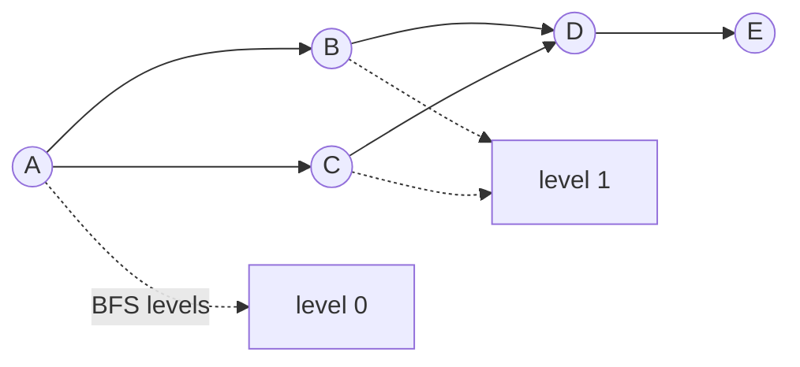
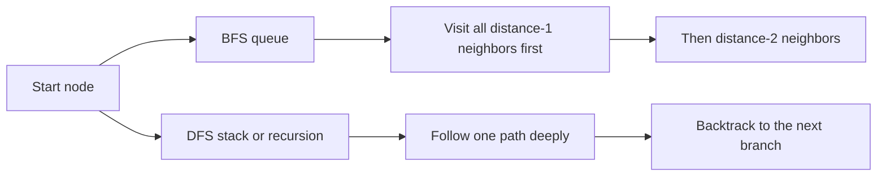
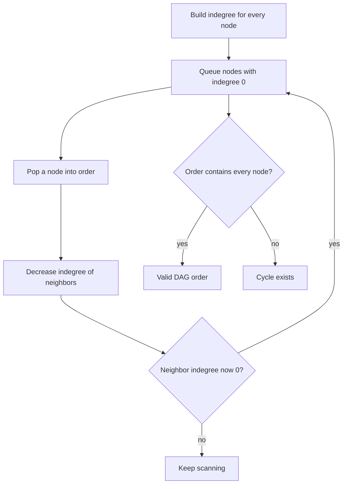

# Graphs

## What This Topic Is

Model relationships as nodes and edges, then traverse or group them safely.

This topic is a reusable mental model, not a bag of isolated tricks. You should finish it able to identify the problem shape, state the invariant, choose the right pattern, and explain the complexity without guessing.

## Why It Matters

Graph fluency is required for dependencies, connectivity, shortest unweighted paths, grids, cycles, and reachability.

In interviews, the story usually hides the structure. Translate the story into operations: lookup, move a boundary, traverse, choose, relax, split, merge, or remember a state.

## Real-World Use

Used in social networks, package managers, routing, service dependencies, compilers, build systems, fraud rings, maps, and workflow engines.

The same ideas show up in production systems when constraints demand predictable lookup, bounded memory, fast traversal, or correct ordering.

## Beginner Intuition

A graph problem is about movement between states. The first question is what a node represents, then which edges are legal.

Beginner rule: before coding, write one sentence that says what information your algorithm keeps and why that information is enough for the next decision.

## Formal Explanation

A graph is a set of vertices and edges. Edges may be directed or undirected, weighted or unweighted, explicit or implicit.

The formal model matters because it tells you which operations are cheap, which are expensive, and which assumptions are required for correctness.

## Core Operations

| Operation | Meaning |
|---|---|
| Build adjacency | Convert input into neighbors. |
| DFS | Explore deeply and mark visited. |
| BFS | Explore by distance layers. |
| Components | Restart traversal from unvisited nodes. |
| Topological sort | Order a DAG by dependencies. |
| Union Find | Maintain dynamic connectivity. |

## Time Complexity

| Operation or Pattern | Complexity |
|---|---:|
| Adjacency traversal | O(V + E) |
| Grid traversal | O(rows * cols) |
| Topological sort | O(V + E) |
| Union Find operations | Almost O(1) amortized |

## Space Complexity

| Case | Complexity |
|---|---:|
| Adjacency list | O(V + E) |
| Visited set | O(V) |
| BFS queue | O(V) |
| DFS stack | O(V) |

## Visual Explanation

## Additional Visuals

### BFS And DFS Traversal

### Topological Sort

## Foundations And Invariants

Visited state is part of correctness, not only performance. Without it, cycles can cause infinite traversal or duplicate counting.

When explaining a solution, name the invariant before writing code. A good invariant is short enough to repeat while coding and precise enough to catch edge cases.

## Pattern Recognition

Look for connected, reachable, shortest path in unweighted graph, dependencies, courses, islands, components, cycles, clone, or transformation steps.

Ask these questions:

- What is the smallest state that makes the next decision easy?
- Does the problem require order, membership, connectivity, optimal choice, or all possibilities?
- Does any boundary move monotonically?
- Are constraints small enough for exponential search or DP state?

## Common Interview Patterns

- **DFS Traversal**: recognition signals, mistakes, and templates in [PATTERNS.md](PATTERNS.md).
- **BFS Traversal**: recognition signals, mistakes, and templates in [PATTERNS.md](PATTERNS.md).
- **Connected Components**: recognition signals, mistakes, and templates in [PATTERNS.md](PATTERNS.md).
- **Cycle Detection**: recognition signals, mistakes, and templates in [PATTERNS.md](PATTERNS.md).
- **Topological Sort**: recognition signals, mistakes, and templates in [PATTERNS.md](PATTERNS.md).
- **Union Find**: recognition signals, mistakes, and templates in [PATTERNS.md](PATTERNS.md).
- **Grid Graph BFS**: recognition signals, mistakes, and templates in [PATTERNS.md](PATTERNS.md).

## Common Mistakes

- Mixing directed and undirected edge handling.
- Marking visited too late in BFS.
- Forgetting disconnected components.
- Using DFS for shortest path in an unweighted graph when BFS is required.

## Interview Tips

- Start with brute force and name the repeated work or missing invariant.
- State why the chosen pattern removes that waste.
- Keep edge cases visible while coding.
- Give both time and auxiliary space complexity.
- If the interviewer changes constraints, re-check the pattern assumptions before modifying code.

## Mini Exercises

- Explain `DFS Traversal` aloud, then write its invariant and template from memory.
- Explain `BFS Traversal` aloud, then write its invariant and template from memory.
- Explain `Connected Components` aloud, then write its invariant and template from memory.
- Explain `Cycle Detection` aloud, then write its invariant and template from memory.
- Pick two Easy problems from [easy.md](easy.md) and identify the pattern before coding.
- Pick one Medium problem from [medium.md](medium.md) and write pseudocode before implementation.
- For one missed problem, write the failed invariant and the corrected invariant.

## Recommended Learning Order

1. Read `DFS Traversal` in [PATTERNS.md](PATTERNS.md).
2. Read `BFS Traversal` in [PATTERNS.md](PATTERNS.md).
3. Read `Connected Components` in [PATTERNS.md](PATTERNS.md).
4. Read `Cycle Detection` in [PATTERNS.md](PATTERNS.md).
5. Read `Topological Sort` in [PATTERNS.md](PATTERNS.md).
6. Read `Union Find` in [PATTERNS.md](PATTERNS.md).
7. Read `Grid Graph BFS` in [PATTERNS.md](PATTERNS.md).
8. Review [CHEATSHEET.md](CHEATSHEET.md) before timed practice.
9. Solve [easy.md](easy.md), then [medium.md](medium.md), then selected [hard.md](hard.md).

## Practice Navigation

- [Easy problems](easy.md): build fundamentals.
- [Medium problems](medium.md): build interview fluency.
- [Hard problems](hard.md): build advanced pattern recognition.

---

## Navigation

[Previous](../backtracking/README.md) | [Home](../README.md) | [Next](CHEATSHEET.md)
