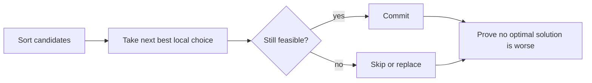

# Greedy

## What This Topic Is

Make locally optimal choices only when an exchange argument or invariant proves they remain globally safe.

This topic is a reusable mental model, not a bag of isolated tricks. You should finish it able to identify the problem shape, state the invariant, choose the right pattern, and explain the complexity without guessing.

## Why It Matters

Greedy problems look simple but demand proof. Interviewers use them to separate pattern memorization from correctness reasoning.

In interviews, the story usually hides the structure. Translate the story into operations: lookup, move a boundary, traverse, choose, relax, split, merge, or remember a state.

## Real-World Use

Used in scheduling, caching, compression, resource allocation, routing heuristics, interval selection, and load balancing.

The same ideas show up in production systems when constraints demand predictable lookup, bounded memory, fast traversal, or correct ordering.

## Beginner Intuition

A greedy choice is safe when any optimal solution can be rearranged to include it without becoming worse.

Beginner rule: before coding, write one sentence that says what information your algorithm keeps and why that information is enough for the next decision.

## Formal Explanation

A greedy algorithm builds a solution step by step using a locally optimal rule. Correctness usually follows from an exchange argument, staying-ahead proof, or cut property.

The formal model matters because it tells you which operations are cheap, which are expensive, and which assumptions are required for correctness.

## Core Operations

| Operation | Meaning |
|---|---|
| Sort by key | Expose the choice order. |
| Select if safe | Add the next candidate only when it preserves feasibility. |
| Maintain best frontier | Track farthest reach, earliest finish, or cheapest active option. |
| Prove exchange | Explain why replacing another choice with yours does not hurt. |

## Time Complexity

| Operation or Pattern | Complexity |
|---|---:|
| Sort and scan | O(n log n) |
| Single pass greedy | O(n) |
| Heap-assisted greedy | O(n log n) |

## Space Complexity

| Case | Complexity |
|---|---:|
| In-place scan | O(1) |
| Sorted copy | O(n) |
| Heap support | O(n) |

## Visual Explanation

## Foundations And Invariants

Greedy correctness is not intuition. Be ready to explain the exchange: if an optimal solution picked another compatible candidate, swapping in the greedy candidate preserves or improves the result.

When explaining a solution, name the invariant before writing code. A good invariant is short enough to repeat while coding and precise enough to catch edge cases.

## Pattern Recognition

Look for earliest finish, minimum removals, maximum reach, choose once, local replacement, intervals, scheduling, or problems asking for fewest resources.

Ask these questions:

- What is the smallest state that makes the next decision easy?
- Does the problem require order, membership, connectivity, optimal choice, or all possibilities?
- Does any boundary move monotonically?
- Are constraints small enough for exponential search or DP state?

## Common Interview Patterns

- **Sort And Scan**: recognition signals, mistakes, and templates in [PATTERNS.md](PATTERNS.md).
- **Greedy With Proof**: recognition signals, mistakes, and templates in [PATTERNS.md](PATTERNS.md).
- **Interval Greedy**: recognition signals, mistakes, and templates in [PATTERNS.md](PATTERNS.md).
- **Jump Greedy**: recognition signals, mistakes, and templates in [PATTERNS.md](PATTERNS.md).
- **Heap-Assisted Greedy**: recognition signals, mistakes, and templates in [PATTERNS.md](PATTERNS.md).
- **Monotonic Greedy**: recognition signals, mistakes, and templates in [PATTERNS.md](PATTERNS.md).

## Common Mistakes

- Using greedy where future choices can invalidate local choice.
- Skipping the proof in interviews.
- Sorting by the wrong key.
- Confusing DP choose-or-skip with greedy safe choice.

## Interview Tips

- Start with brute force and name the repeated work or missing invariant.
- State why the chosen pattern removes that waste.
- Keep edge cases visible while coding.
- Give both time and auxiliary space complexity.
- If the interviewer changes constraints, re-check the pattern assumptions before modifying code.

## Mini Exercises

- Explain `Sort And Scan` aloud, then write its invariant and template from memory.
- Explain `Greedy With Proof` aloud, then write its invariant and template from memory.
- Explain `Interval Greedy` aloud, then write its invariant and template from memory.
- Explain `Jump Greedy` aloud, then write its invariant and template from memory.
- Pick two Easy problems from [easy.md](easy.md) and identify the pattern before coding.
- Pick one Medium problem from [medium.md](medium.md) and write pseudocode before implementation.
- For one missed problem, write the failed invariant and the corrected invariant.

## Recommended Learning Order

1. Read `Sort And Scan` in [PATTERNS.md](PATTERNS.md).
2. Read `Greedy With Proof` in [PATTERNS.md](PATTERNS.md).
3. Read `Interval Greedy` in [PATTERNS.md](PATTERNS.md).
4. Read `Jump Greedy` in [PATTERNS.md](PATTERNS.md).
5. Read `Heap-Assisted Greedy` in [PATTERNS.md](PATTERNS.md).
6. Read `Monotonic Greedy` in [PATTERNS.md](PATTERNS.md).
7. Review [CHEATSHEET.md](CHEATSHEET.md) before timed practice.
8. Solve [easy.md](easy.md), then [medium.md](medium.md), then selected [hard.md](hard.md).

## Practice Navigation

- [Easy problems](easy.md): build fundamentals.
- [Medium problems](medium.md): build interview fluency.
- [Hard problems](hard.md): build advanced pattern recognition.

---

## Navigation

[Previous](../2d-dp/README.md) | [Home](../README.md) | [Next](CHEATSHEET.md)
