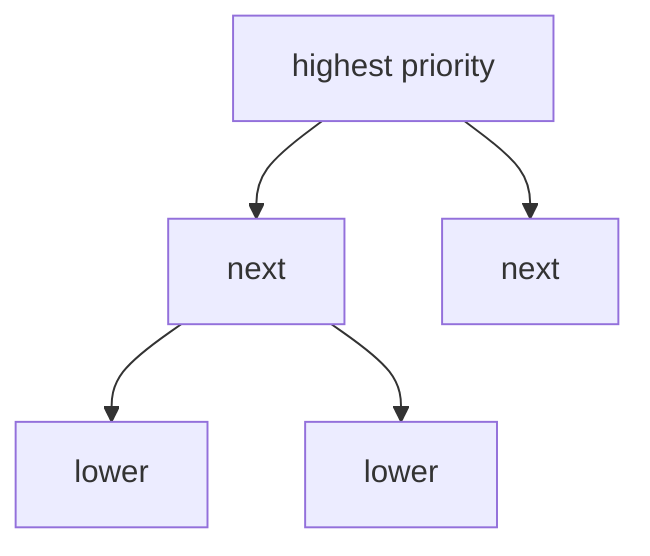

# Heap / Priority Queue

## What You Will Learn

You will learn the core model behind heap / priority queue, the operations it supports, the patterns that interviewers commonly test, and the recognition signals that tell you this topic is being tested.

## Why This Topic Matters

Heap / Priority Queue problems test whether you can turn a prompt into a precise state model. The best solutions are usually short once the invariant is clear.

## Real World Usage

Used in job schedulers, event simulation, timers, stream ranking, median tracking, shortest paths, and k-way merge pipelines.

## Intuition

Ask what information must be remembered after each step. If you can name that state and explain why it is enough, the implementation becomes much safer.

## Formal Definition

A heap is a complete tree usually stored in an array where each parent has priority no worse than its children.

## Core Data Structure Or Algorithm

Push candidates as they become available, pop the current best candidate, and rebalance when two priority views are needed.

## Time Complexity

| Operation or Pattern | Complexity |
|---|---:|
| Peek | O(1) |
| Push or pop | O(log n) |
| Heapify | O(n) |
| K-way merge | O(n log k) |

## Space Complexity

| Case | Complexity |
|---|---:|
| Heap of k items | O(k) |
| Heap of all items | O(n) |
| Two heaps | O(n) |

## Common Operations

| Operation | What It Means |
|---|---|
| Push | Insert an item and restore heap order. |
| Pop | Remove the best item and restore heap order. |
| Peek | Inspect best item without removing. |
| Heapify | Build a heap from existing values. |

## Visual Explanation

## Mathematical Foundations

A complete binary heap has logarithmic height. Heapify is linear because most nodes are close to leaves and require little movement.

## Common Interview Patterns

- **Top K**: Keep only the best k candidates in a heap or bucket structure.
- **K-way Merge**: Use a heap of current heads from sorted sources and push the successor from the source you popped.
- **Two Heaps**: Keep lower and upper halves balanced so the median or middle boundary is available.
- **Scheduling by Priority**: Use one priority for availability and another for which job should run next.
- **Greedy Heap**: Use a heap to repeatedly choose the best available candidate as constraints evolve.
- **Lazy Deletion**: Mark entries as deleted and remove them only when they reach the heap top.

## Pattern Recognition

Look for the operation the prompt asks you to optimize. If brute force repeats the same lookup, traversal, choice, or state calculation, one of the patterns in this folder is probably intended.

## Common Mistakes

- Coding before defining what the state means.
- Forgetting edge cases such as empty input, one item, duplicates, and boundary endpoints.
- Choosing a familiar pattern even when the constraints do not support its invariant.
- Reporting time complexity without auxiliary memory.

## Interview Tips

- Start with brute force and name the repeated work.
- State the invariant before coding.
- Keep the implementation small and testable.
- Explain why the pattern is correct, not only why it is fast.
- Test one normal case, one edge case, and one adversarial case.

## Mini Exercises

- Write the template for each pattern from memory.
- Solve two Easy problems and explain the invariant aloud.
- Solve one Medium problem with pseudocode before coding.
- Re-solve one missed problem after 24 hours.

## Recommended Learning Order

1. Study Top K in [PATTERNS.md](PATTERNS.md).
2. Study K-way Merge in [PATTERNS.md](PATTERNS.md).
3. Study Two Heaps in [PATTERNS.md](PATTERNS.md).
4. Study Scheduling by Priority in [PATTERNS.md](PATTERNS.md).
5. Study Greedy Heap in [PATTERNS.md](PATTERNS.md).
6. Study Lazy Deletion in [PATTERNS.md](PATTERNS.md).
7. Review [CHEATSHEET.md](CHEATSHEET.md).
8. Solve [easy.md](easy.md), then [medium.md](medium.md), then selected [hard.md](hard.md).

## Practice Sets

[Cheatsheet](CHEATSHEET.md) | [Patterns](PATTERNS.md) | [Easy](easy.md) | [Medium](medium.md) | [Hard](hard.md)

---

## Navigation

[Previous](../tries/README.md) | [Home](../README.md) | [Next](../heap-priority-queue/CHEATSHEET.md)
