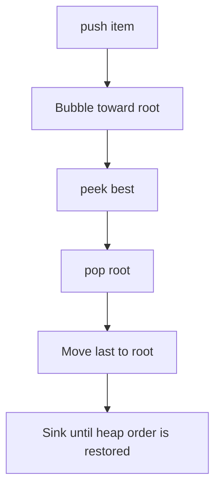
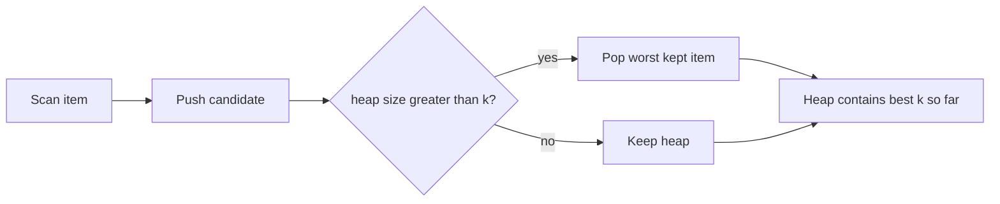
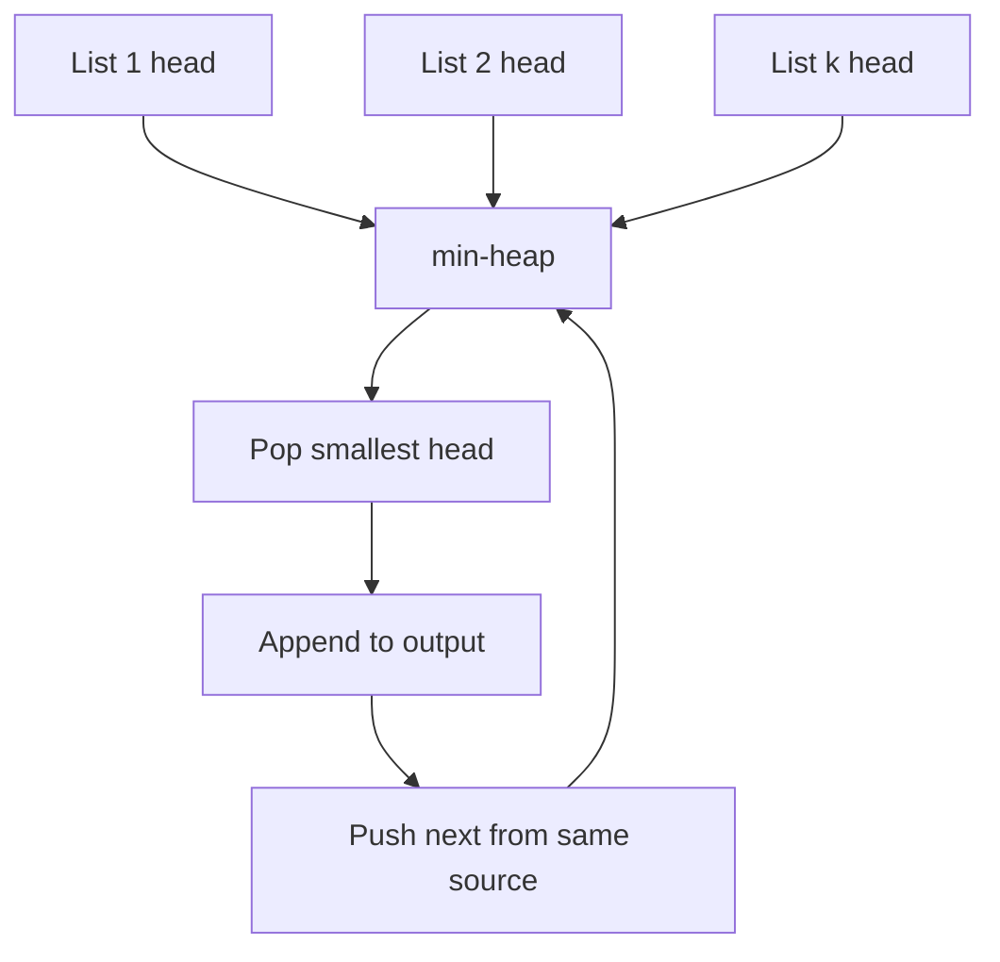

# Heap / Priority Queue

## What This Topic Is

Repeatedly retrieve the smallest or largest active item without fully sorting every time.

This topic is a reusable mental model, not a bag of isolated tricks. You should finish it able to identify the problem shape, state the invariant, choose the right pattern, and explain the complexity without guessing.

## Why It Matters

Heaps are the interview tool for top-k, streaming order statistics, k-way merge, scheduling, and frontier-based graph algorithms.

In interviews, the story usually hides the structure. Translate the story into operations: lookup, move a boundary, traverse, choose, relax, split, merge, or remember a state.

## Interviewer Lens

- Google: prove why the heap top is the next safe item to process.
- Meta: keep heap tuple ordering and tie-breakers deterministic.
- Amazon: explain memory cost, stale deletion, and streaming behavior.
- Beginner: write what priority each heap entry uses before pushing.

## Real-World Use

Used in schedulers, timers, event loops, search frontiers, merge pipelines, stream analytics, load balancers, and priority task queues.

The same ideas show up in production systems when constraints demand predictable lookup, bounded memory, fast traversal, or correct ordering.

## Beginner Intuition

A heap does not sort everything. It only guarantees the next best item is at the top, which is exactly enough for many repeated-choice problems.

Beginner rule: before coding, write one sentence that says what information your algorithm keeps and why that information is enough for the next decision.

## Formal Explanation

A binary heap is a complete tree stored in an array that satisfies parent-child priority order. Push and pop are O(log n), peek is O(1).

The formal model matters because it tells you which operations are cheap, which are expensive, and which assumptions are required for correctness.

## Core Operations

| Operation | Meaning |
|---|---|
| Push | Insert a candidate. |
| Pop | Remove the highest-priority candidate. |
| Peek | Inspect the current best item. |
| Heapify | Build a heap from an array. |
| Lazy delete | Ignore stale heap entries when popped. |

## Time Complexity

| Operation or Pattern | Complexity |
|---|---:|
| Peek | O(1) |
| Push | O(log n) |
| Pop | O(log n) |
| Heapify n items | O(n) |
| Keep top k | O(n log k) |

## Space Complexity

| Case | Complexity |
|---|---:|
| Heap of k items | O(k) |
| Heap of all candidates | O(n) |
| Lazy deletion map | O(n) worst case |

## Visual Explanation

## Additional Visuals

### Top K Heap

### K-way Merge Frontier

## Foundations And Invariants

The heap invariant is local parent-child order, not global sorted order. That is why extracting all values one by one sorts them but peeking at the array does not.

When explaining a solution, name the invariant before writing code. A good invariant is short enough to repeat while coding and precise enough to catch edge cases.

## Pattern Recognition

Look for top k, kth largest, smallest next item, streaming median, merge sorted lists, scheduling by priority, shortest path frontier, or repeated min or max selection.

Ask these questions:

- Do you repeatedly need the current best, smallest, largest, or next scheduled item?
- Is k much smaller than n, making a bounded heap better than sorting?
- Can stale heap entries exist, and how will they be skipped?
- Does the problem need one heap, two heaps, or a heap plus hash map?

## Common Interview Patterns

- **Top K Heap**: recognition signals, mistakes, and templates in [PATTERNS.md](PATTERNS.md).
- **K-way Merge**: recognition signals, mistakes, and templates in [PATTERNS.md](PATTERNS.md).
- **Two Heaps**: recognition signals, mistakes, and templates in [PATTERNS.md](PATTERNS.md).
- **Lazy Deletion Heap**: recognition signals, mistakes, and templates in [PATTERNS.md](PATTERNS.md).
- **Dijkstra Frontier**: recognition signals, mistakes, and templates in [PATTERNS.md](PATTERNS.md).

## Common Mistakes

- Sorting every iteration instead of using a heap.
- Using max-heap logic in a min-heap language without negating keys carefully.
- Forgetting tie-breakers for stable ordering.
- Leaving stale entries without validating them on pop.

## Interview Tips

- State whether the heap stores all candidates or only k active candidates.
- Use deterministic tie-breakers when values can compare equal.
- Explain stale-entry pruning before returning or expanding a heap top.
- For two heaps, rebalance after every update.
- Compare O(n log k) heap selection against O(n log n) sorting.

## Mini Exercises

- Explain `Top K Heap` aloud, then write its invariant and template from memory.
- Explain `K-way Merge` aloud, then write its invariant and template from memory.
- Explain `Two Heaps` aloud, then write its invariant and template from memory.
- Explain `Lazy Deletion Heap` aloud, then write its invariant and template from memory.
- Pick two Easy problems from [easy.md](easy.md) and identify the pattern before coding.
- Pick one Medium problem from [medium.md](medium.md) and write pseudocode before implementation.
- For one missed problem, write the failed invariant and the corrected invariant.

## Recommended Learning Order

1. Read `Top K Heap` in [PATTERNS.md](PATTERNS.md).
2. Read `K-way Merge` in [PATTERNS.md](PATTERNS.md).
3. Read `Two Heaps` in [PATTERNS.md](PATTERNS.md).
4. Read `Lazy Deletion Heap` in [PATTERNS.md](PATTERNS.md).
5. Read `Dijkstra Frontier` in [PATTERNS.md](PATTERNS.md).
6. Review [CHEATSHEET.md](CHEATSHEET.md) before timed practice.
7. Solve [easy.md](easy.md), then [medium.md](medium.md), then selected [hard.md](hard.md).

## Practice Navigation

- [Easy problems](easy.md): build fundamentals.
- [Medium problems](medium.md): build interview fluency.
- [Hard problems](hard.md): build advanced pattern recognition.

---

## Navigation

[Previous](../tries/README.md) | [Home](../README.md) | [Next](CHEATSHEET.md)
