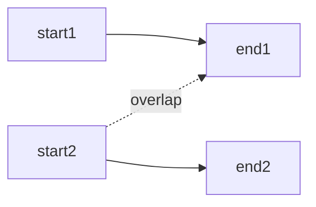

# Intervals

## What You Will Learn

You will learn the core model behind intervals, the operations it supports, the patterns that interviewers commonly test, and the recognition signals that tell you this topic is being tested.

## Why This Topic Matters

Intervals problems test whether you can turn a prompt into a precise state model. The best solutions are usually short once the invariant is clear.

## Real World Usage

Used in calendars, bookings, monitoring windows, timelines, memory ranges, rate limits, and version ranges.

## Intuition

Ask what information must be remembered after each step. If you can name that state and explain why it is enough, the implementation becomes much safer.

## Formal Definition

An interval is a pair of endpoints describing a continuous range. Problems must define whether endpoints are closed or half-open.

## Core Data Structure Or Algorithm

Sort by start or end, compare boundaries, and choose merge, scheduling, sweep line, or heap-based active interval tracking.

## Time Complexity

| Operation or Pattern | Complexity |
|---|---:|
| Sort intervals | O(n log n) |
| Merge scan | O(n) |
| Sweep events | O(n log n) |
| Room heap | O(n log n) |

## Space Complexity

| Case | Complexity |
|---|---:|
| Merged output | O(n) |
| Sweep events | O(n) |
| Heap | O(n) |

## Common Operations

| Operation | What It Means |
|---|---|
| Sort | Order by start for merging or end for scheduling. |
| Overlap check | Compare next start with current end. |
| Merge | Extend the active range. |
| Sweep | Convert endpoints into ordered events. |

## Visual Explanation

## Mathematical Foundations

Endpoint semantics matter. Closed intervals and half-open time intervals can produce different overlap behavior.

## Common Interview Patterns

- **Merge Intervals**: Sort by start and combine intervals that overlap the active interval.
- **Insert Interval**: Copy intervals before the new range, merge overlaps with the new range, then copy the rest.
- **Meeting Rooms**: Track active intervals by end time to know how many resources are needed.
- **Sweep Line**: Convert starts and ends into events, sort them, and scan active count or state.
- **Interval Scheduling**: Choose compatible intervals by a boundary that leaves maximum room for the future.
- **Range Query with Heap**: Sort queries and intervals, add intervals that can cover the query, and pop expired ones.

## Pattern Recognition

Look for the operation the prompt asks you to optimize. If brute force repeats the same lookup, traversal, choice, or state calculation, one of the patterns in this folder is probably intended.

## Common Mistakes

- Coding before defining what the state means.
- Forgetting edge cases such as empty input, one item, duplicates, and boundary endpoints.
- Choosing a familiar pattern even when the constraints do not support its invariant.
- Reporting time complexity without auxiliary memory.

## Interview Tips

- Start with brute force and name the repeated work.
- State the invariant before coding.
- Keep the implementation small and testable.
- Explain why the pattern is correct, not only why it is fast.
- Test one normal case, one edge case, and one adversarial case.

## Mini Exercises

- Write the template for each pattern from memory.
- Solve two Easy problems and explain the invariant aloud.
- Solve one Medium problem with pseudocode before coding.
- Re-solve one missed problem after 24 hours.

## Recommended Learning Order

1. Study Merge Intervals in [PATTERNS.md](PATTERNS.md).
2. Study Insert Interval in [PATTERNS.md](PATTERNS.md).
3. Study Meeting Rooms in [PATTERNS.md](PATTERNS.md).
4. Study Sweep Line in [PATTERNS.md](PATTERNS.md).
5. Study Interval Scheduling in [PATTERNS.md](PATTERNS.md).
6. Study Range Query with Heap in [PATTERNS.md](PATTERNS.md).
7. Review [CHEATSHEET.md](CHEATSHEET.md).
8. Solve [easy.md](easy.md), then [medium.md](medium.md), then selected [hard.md](hard.md).

## Practice Sets

[Cheatsheet](CHEATSHEET.md) | [Patterns](PATTERNS.md) | [Easy](easy.md) | [Medium](medium.md) | [Hard](hard.md)

---

## Navigation

[Previous](../greedy/README.md) | [Home](../README.md) | [Next](../intervals/CHEATSHEET.md)
