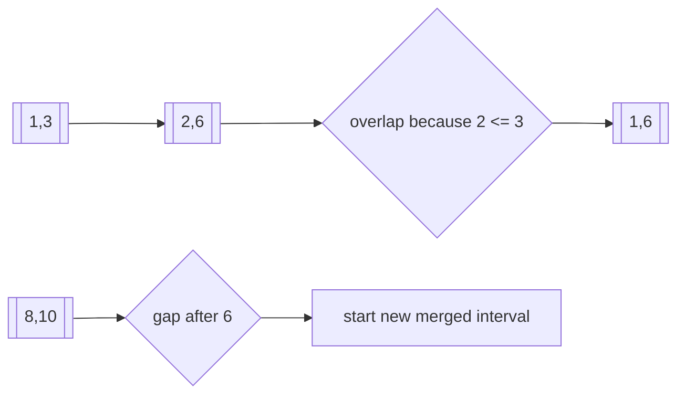

# Intervals

## What This Topic Is

Reason about ranges on a line by sorting endpoints, merging overlaps, or sweeping events.

This topic is a reusable mental model, not a bag of isolated tricks. You should finish it able to identify the problem shape, state the invariant, choose the right pattern, and explain the complexity without guessing.

## Why It Matters

Intervals appear in calendars, reservations, meeting rooms, network ranges, and timeline conflicts. They test boundary definitions and sorting choices.

In interviews, the story usually hides the structure. Translate the story into operations: lookup, move a boundary, traverse, choose, relax, split, merge, or remember a state.

## Interviewer Lens

- Google: state endpoint semantics and prove the sorted scan invariant.
- Meta: implement merge, insert, meeting rooms, and sweep-line templates quickly.
- Amazon: clarify inclusivity and equal-endpoint behavior before coding.
- Beginner: draw intervals on a number line before choosing a sort key.

## Real-World Use

Used in calendar systems, booking engines, CPU scheduling, log windows, IP ranges, genomic ranges, and resource allocation.

The same ideas show up in production systems when constraints demand predictable lookup, bounded memory, fast traversal, or correct ordering.

## Beginner Intuition

Intervals become easier after sorting. Once ordered by start or end, overlaps and gaps can be decided with the current active boundary.

Beginner rule: before coding, write one sentence that says what information your algorithm keeps and why that information is enough for the next decision.

## Formal Explanation

An interval represents a continuous range [start, end] or [start, end). Algorithms depend on whether touching endpoints overlap.

The formal model matters because it tells you which operations are cheap, which are expensive, and which assumptions are required for correctness.

## Core Operations

| Operation | Meaning |
|---|---|
| Sort by start | Group overlapping ranges. |
| Sort by end | Choose earliest finishing compatible interval. |
| Sweep endpoints | Track active intervals over time. |
| Merge | Extend current end while overlaps continue. |
| Insert | Place a new interval into sorted merged ranges. |

## Time Complexity

| Operation or Pattern | Complexity |
|---|---:|
| Sort intervals | O(n log n) |
| Merge after sort | O(n) scan |
| Sweep line | O(n log n) |
| Difference array with bounded coordinates | O(n + range) |

## Space Complexity

| Case | Complexity |
|---|---:|
| In-place merge | O(1) extra if output ignored |
| Output merged intervals | O(n) |
| Event list | O(n) |

## Visual Explanation

## Foundations And Invariants

Boundary convention matters. If intervals are half-open, [1,3) and [3,5) do not overlap. If closed, touching endpoints may overlap.

When explaining a solution, name the invariant before writing code. A good invariant is short enough to repeat while coding and precise enough to catch edge cases.

## Pattern Recognition

Look for merge, insert, overlap, meeting rooms, minimum removals, arrows, calendar, booking, timeline, or active count.

Ask these questions:

- Are intervals closed, open, half-open, or represented only by integer endpoints?
- Does sorting by start, end, or event time expose the invariant?
- Are you merging, inserting, counting overlaps, finding rooms, or deleting intervals?
- How should equal endpoints be handled for the problem definition?

## Common Interview Patterns

- **Merge Intervals**: recognition signals, mistakes, and templates in [PATTERNS.md](PATTERNS.md).
- **Insert Interval**: recognition signals, mistakes, and templates in [PATTERNS.md](PATTERNS.md).
- **Sweep Line**: recognition signals, mistakes, and templates in [PATTERNS.md](PATTERNS.md).
- **Meeting Rooms**: recognition signals, mistakes, and templates in [PATTERNS.md](PATTERNS.md).
- **Difference Array**: recognition signals, mistakes, and templates in [PATTERNS.md](PATTERNS.md).
- **Greedy Erase Overlap**: recognition signals, mistakes, and templates in [PATTERNS.md](PATTERNS.md).

## Common Mistakes

- Forgetting to sort before merging.
- Mixing closed and half-open endpoint rules.
- Updating the wrong endpoint after overlap.
- Using pairwise comparisons after sorting would give a linear scan.

## Interview Tips

- Clarify whether touching endpoints overlap.
- Choose sort key from the operation: start for merge, end for erase, event for sweep.
- Keep current interval state small and explicit.
- For sweep line, process tie events in the order required by endpoint semantics.
- Mention sorting cost before scan cost.

## Mini Exercises

- Explain `Merge Intervals` aloud, then write its invariant and template from memory.
- Explain `Insert Interval` aloud, then write its invariant and template from memory.
- Explain `Sweep Line` aloud, then write its invariant and template from memory.
- Explain `Meeting Rooms` aloud, then write its invariant and template from memory.
- Pick two Easy problems from [easy.md](easy.md) and identify the pattern before coding.
- Pick one Medium problem from [medium.md](medium.md) and write pseudocode before implementation.
- For one missed problem, write the failed invariant and the corrected invariant.

## Recommended Learning Order

1. Read `Merge Intervals` in [PATTERNS.md](PATTERNS.md).
2. Read `Insert Interval` in [PATTERNS.md](PATTERNS.md).
3. Read `Sweep Line` in [PATTERNS.md](PATTERNS.md).
4. Read `Meeting Rooms` in [PATTERNS.md](PATTERNS.md).
5. Read `Difference Array` in [PATTERNS.md](PATTERNS.md).
6. Read `Greedy Erase Overlap` in [PATTERNS.md](PATTERNS.md).
7. Review [CHEATSHEET.md](CHEATSHEET.md) before timed practice.
8. Solve [easy.md](easy.md), then [medium.md](medium.md), then selected [hard.md](hard.md).

## Practice Navigation

- [Easy problems](easy.md): build fundamentals.
- [Medium problems](medium.md): build interview fluency.
- [Hard problems](hard.md): build advanced pattern recognition.

---

## Navigation

[Previous](../greedy/README.md) | [Home](../README.md) | [Next](CHEATSHEET.md)
