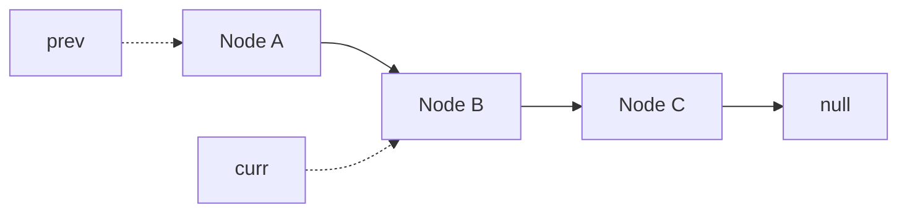

# Linked List

## What You Will Learn

You will learn what linked list means, when it is useful, what operations it supports, and how it appears in coding interviews. By the end of this topic, you should be able to explain the core idea, select the right pattern, implement the usual template, and analyze time and space complexity.

## Why This Topic Matters

Linked lists test pointer reasoning, mutation safety, and edge-case discipline more than raw algorithm theory.

Interview problems often hide the topic behind a story. Your job is to translate the story into operations: lookup, scan, traverse, split, merge, choose, or optimize.

## Real World Usage

Used in LRU caches, memory allocators, undo stacks, schedulers, adjacency lists, and low-level systems where cheap splicing matters.

Real systems rarely announce the data structure by name. They expose constraints such as fast lookup, ordered traversal, prefix search, shortest route, or bounded memory. Those constraints point to the right tool.

## Intuition

A linked list is a chain of nodes. You cannot jump to an index, so most work is about walking carefully and changing links without losing the rest of the chain.

A beginner-friendly way to approach this topic is to ask: what information do I need to remember, and what information can I safely discard?

## Formal Definition

A linked list is a sequence of nodes where each node stores a value and one or more references to neighboring nodes.

The formal definition matters because it tells you which operations are cheap, which operations are expensive, and which invariants cannot be broken.

## Core Data Structure Or Algorithm

Use dummy nodes to simplify head changes. Use fast and slow pointers for cycles, middle nodes, and nth-from-end problems.

In interviews, the core algorithm is usually small. The difficulty is choosing it, naming the invariant, and handling edge cases cleanly.

## Time Complexity

| Operation or Pattern | Complexity |
|---|---:|
| Access by index | O(n) |
| Search | O(n) |
| Insert after known node | O(1) |
| Delete after known node | O(1) |
| Reverse list | O(n) |

## Space Complexity

| Case | Complexity |
|---|---:|
| Iterative pointer rewiring | O(1) |
| Recursive traversal | O(n) stack |
| Copy with hash map | O(n) |

## Common Operations

| Operation | What It Means |
|---|---|
| Traverse | Move node by node. |
| Rewire | Change next pointers in a safe order. |
| Splice | Insert or remove a segment. |
| Detect cycle | Use fast and slow pointers. |

## Visual Explanation

## Mathematical Foundations

Fast and slow pointer proofs use relative speed. If one pointer moves two steps and another moves one, their distance changes by one each round, so a cycle forces a meeting.

## Common Interview Patterns

- **Dummy Head**: see [linked-list/PATTERNS.md](PATTERNS.md) for recognition signals and templates.
- **Fast and Slow Pointers**: see [linked-list/PATTERNS.md](PATTERNS.md) for recognition signals and templates.
- **In-place Reversal**: see [linked-list/PATTERNS.md](PATTERNS.md) for recognition signals and templates.
- **Merge Lists**: see [linked-list/PATTERNS.md](PATTERNS.md) for recognition signals and templates.
- **Cycle Detection**: see [linked-list/PATTERNS.md](PATTERNS.md) for recognition signals and templates.
- **Copy with Random Pointer**: see [linked-list/PATTERNS.md](PATTERNS.md) for recognition signals and templates.

## Pattern Recognition

Look for node references, head changes, kth from end, cycle, random pointer, merging chains, or operations that require O(1) deletion after a known node.

When you read a problem, underline the constraint words first. Words like "sorted", "contiguous", "prefix", "shortest", "k", "all possible", "minimum", or "dependencies" usually reveal the intended pattern.

## Common Mistakes

- Losing the next node during rewiring.
- Forgetting head changes.
- Not testing empty and single-node lists.

## Interview Tips

- Start with brute force and name the repeated work.
- State the invariant before coding.
- Keep edge cases visible: empty input, one item, duplicates, negative values, and boundary indices.
- Explain why your data structure supports the needed operation efficiently.
- Give time and space complexity after testing the code mentally.

## Mini Exercises

- Implement and explain dummy head without looking at notes.
- Implement and explain fast and slow pointers without looking at notes.
- Implement and explain in-place reversal without looking at notes.
- Implement and explain merge lists without looking at notes.
- Pick two Easy problems from [easy.md](easy.md) and explain the pattern before coding.
- Pick one Medium problem from [medium.md](medium.md) and write only pseudocode first.

## Recommended Learning Order

1. Read the section on Dummy Head in [PATTERNS.md](PATTERNS.md).
2. Read the section on Fast and Slow Pointers in [PATTERNS.md](PATTERNS.md).
3. Read the section on In-place Reversal in [PATTERNS.md](PATTERNS.md).
4. Read the section on Merge Lists in [PATTERNS.md](PATTERNS.md).
5. Read the section on Cycle Detection in [PATTERNS.md](PATTERNS.md).
6. Read the section on Copy with Random Pointer in [PATTERNS.md](PATTERNS.md).
7. Review [CHEATSHEET.md](CHEATSHEET.md) before timed practice.
8. Solve Easy, then Medium, then selected Hard problems.

## Practice Sets

- [Easy problems](easy.md)
- [Medium problems](medium.md)
- [Hard problems](hard.md)

---

## Navigation

[Previous](../sliding-window/README.md) | [Home](../README.md) | [Next](../linked-list/CHEATSHEET.md)
