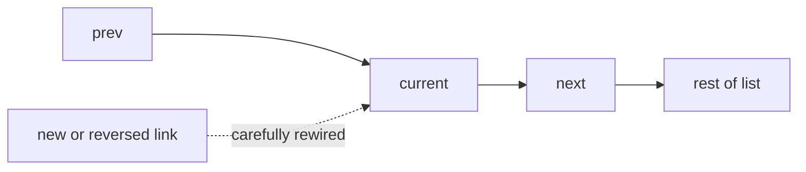

# Linked List

## What This Topic Is

Manipulate node references safely when random access is unavailable.

This topic is a reusable mental model, not a bag of isolated tricks. You should finish it able to identify the problem shape, state the invariant, choose the right pattern, and explain the complexity without guessing.

## Why It Matters

Linked lists test pointer discipline, mutation order, and ability to reason about head changes without array indexing.

In interviews, the story usually hides the structure. Translate the story into operations: lookup, move a boundary, traverse, choose, relax, split, merge, or remember a state.

## Interviewer Lens

- Google: prove every pointer rewire preserves the remaining list.
- Meta: avoid extra passes when a gap or fast-slow relation gives the answer.
- Amazon: call out whether nodes are mutated, copied, or reused.
- Beginner: draw prev, curr, next, and dummy before writing assignments.

## Real-World Use

Used in memory allocators, LRU caches, queues, adjacency lists, undo lists, and low-level systems where splicing is cheap.

The same ideas show up in production systems when constraints demand predictable lookup, bounded memory, fast traversal, or correct ordering.

## Beginner Intuition

Every operation is about links, not values. Before changing a link, know which node you still need to reach afterward.

Beginner rule: before coding, write one sentence that says what information your algorithm keeps and why that information is enough for the next decision.

## Formal Explanation

A linked list is a sequence of nodes where each node stores data and one or more references to neighboring nodes. Access by position is O(n).

The formal model matters because it tells you which operations are cheap, which are expensive, and which assumptions are required for correctness.

## Core Operations

| Operation | Meaning |
|---|---|
| Traverse | Move node by node. |
| Insert | Redirect references around a new node. |
| Delete | Bypass a node. |
| Reverse | Flip next pointers while preserving the rest of the list. |
| Detect cycle | Use relative pointer speed. |

## Time Complexity

| Operation or Pattern | Complexity |
|---|---:|
| Visit all nodes | O(n) |
| Insert after known node | O(1) |
| Delete after known node | O(1) |
| Find by index | O(n) |

## Space Complexity

| Case | Complexity |
|---|---:|
| Iterative mutation | O(1) |
| Recursive traversal | O(n) stack |
| Hash visited set | O(n) |

## Visual Explanation

## Foundations And Invariants

A dummy head removes special cases at the real head. Fast and slow pointers encode distance without computing length first.

When explaining a solution, name the invariant before writing code. A good invariant is short enough to repeat while coding and precise enough to catch edge cases.

## Pattern Recognition

Look for head deletion, nth from end, reverse in place, cycle, merge sorted lists, split list, random pointer, or cache eviction.

Ask these questions:

- Does the solution need node identity rather than value identity?
- Would a dummy head remove special cases at the front of the list?
- Which pointer must be saved before rewiring links?
- Can two pointers encode distance from the end without knowing length first?

## Common Interview Patterns

- **Dummy Head**: recognition signals, mistakes, and templates in [PATTERNS.md](PATTERNS.md).
- **Two Pointer Gap**: recognition signals, mistakes, and templates in [PATTERNS.md](PATTERNS.md).
- **Fast And Slow Pointers**: recognition signals, mistakes, and templates in [PATTERNS.md](PATTERNS.md).
- **In-place Reversal**: recognition signals, mistakes, and templates in [PATTERNS.md](PATTERNS.md).
- **Merge Lists**: recognition signals, mistakes, and templates in [PATTERNS.md](PATTERNS.md).

## Common Mistakes

- Losing the rest of the list before saving next.
- Forgetting that the head may change.
- Creating cycles accidentally during reversal.
- Using value swaps when node identity matters.

## Interview Tips

- Use a dummy head when deleting or inserting near the head.
- Save next before changing curr.next in reversal problems.
- Explain node identity versus node value when copying or detecting cycles.
- Use two-pass length logic only when one-pass gap logic is not clearer.
- Test empty, one-node, and head-removal cases.

## Mini Exercises

- Explain `Dummy Head` aloud, then write its invariant and template from memory.
- Explain `Two Pointer Gap` aloud, then write its invariant and template from memory.
- Explain `Fast And Slow Pointers` aloud, then write its invariant and template from memory.
- Explain `In-place Reversal` aloud, then write its invariant and template from memory.
- Pick two Easy problems from [easy.md](easy.md) and identify the pattern before coding.
- Pick one Medium problem from [medium.md](medium.md) and write pseudocode before implementation.
- For one missed problem, write the failed invariant and the corrected invariant.

## Recommended Learning Order

1. Read `Dummy Head` in [PATTERNS.md](PATTERNS.md).
2. Read `Two Pointer Gap` in [PATTERNS.md](PATTERNS.md).
3. Read `Fast And Slow Pointers` in [PATTERNS.md](PATTERNS.md).
4. Read `In-place Reversal` in [PATTERNS.md](PATTERNS.md).
5. Read `Merge Lists` in [PATTERNS.md](PATTERNS.md).
6. Review [CHEATSHEET.md](CHEATSHEET.md) before timed practice.
7. Solve [easy.md](easy.md), then [medium.md](medium.md), then selected [hard.md](hard.md).

## Practice Navigation

- [Easy problems](easy.md): build fundamentals.
- [Medium problems](medium.md): build interview fluency.
- [Hard problems](hard.md): build advanced pattern recognition.

---

## Navigation

[Previous](../sliding-window/README.md) | [Home](../README.md) | [Next](CHEATSHEET.md)
