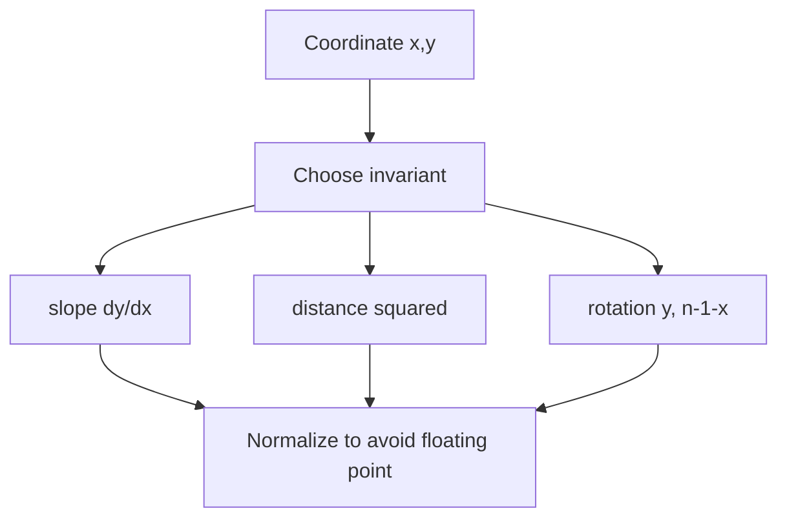

# Math & Geometry

## What This Topic Is

Apply arithmetic, number theory, coordinate reasoning, and matrix movement cleanly.

This topic is a reusable mental model, not a bag of isolated tricks. You should finish it able to identify the problem shape, state the invariant, choose the right pattern, and explain the complexity without guessing.

## Why It Matters

Math and geometry questions are less about memorizing formulas and more about turning constraints into invariants, coordinate transforms, and safe arithmetic.

In interviews, the story usually hides the structure. Translate the story into operations: lookup, move a boundary, traverse, choose, relax, split, merge, or remember a state.

## Interviewer Lens

- Google: derive the formula or invariant rather than memorizing it.
- Meta: implement matrix rotation, spiral traversal, powers, and number conversion cleanly.
- Amazon: call out overflow, precision, and input-domain assumptions.
- Beginner: work one numeric example by hand before coding.

## Real-World Use

Used in graphics, robotics, mapping, simulations, analytics, cryptography, pagination, hashing, randomized load balancing, and matrix processing.

The same ideas show up in production systems when constraints demand predictable lookup, bounded memory, fast traversal, or correct ordering.

## Beginner Intuition

When a problem looks nonstandard, reduce it to a formula, invariant, or coordinate relation. Then test the formula on small cases before coding.

Beginner rule: before coding, write one sentence that says what information your algorithm keeps and why that information is enough for the next decision.

## Formal Explanation

This topic covers modular arithmetic, divisibility, greatest common divisor, primes, coordinates, slopes, rotations, and matrix traversal.

The formal model matters because it tells you which operations are cheap, which are expensive, and which assumptions are required for correctness.

## Core Operations

| Operation | Meaning |
|---|---|
| Modulo normalize | Keep values inside a range. |
| GCD | Compute shared divisibility. |
| Sieve | Mark composite numbers. |
| Matrix rotate | Map coordinates. |
| Slope normalize | Represent lines without floating point. |
| Random prefix | Map random numbers to weighted buckets. |

## Time Complexity

| Operation or Pattern | Complexity |
|---|---:|
| Euclid GCD | O(log min(a,b)) |
| Sieve | O(n log log n) |
| Matrix traversal | O(mn) |
| Pairwise geometry | O(n^2) |

## Space Complexity

| Case | Complexity |
|---|---:|
| Formula only | O(1) |
| Sieve array | O(n) |
| Matrix output | O(mn) |
| Slope map | O(n) |

## Visual Explanation

## Foundations And Invariants

Avoid floating point when equality matters. Normalize signs and divide by GCD for slopes, use squared distances for comparisons, and reason about modulo with negative values.

When explaining a solution, name the invariant before writing code. A good invariant is short enough to repeat while coding and precise enough to catch edge cases.

## Pattern Recognition

Look for rotate matrix, spiral, lines, slopes, random weights, divisibility, primes, powers, palindrome numbers, or arithmetic overflow.

Ask these questions:

- Is the core operation arithmetic, modular reduction, coordinate transform, or matrix traversal?
- What invariant survives scaling, rotation, translation, or modulo wrapping?
- Can overflow, precision, or integer division change correctness?
- Is simulation necessary, or does a formula capture the process?

## Common Interview Patterns

- **Modulo Arithmetic**: recognition signals, mistakes, and templates in [PATTERNS.md](PATTERNS.md).
- **GCD And LCM**: recognition signals, mistakes, and templates in [PATTERNS.md](PATTERNS.md).
- **Prime Sieve**: recognition signals, mistakes, and templates in [PATTERNS.md](PATTERNS.md).
- **Matrix Traversal**: recognition signals, mistakes, and templates in [PATTERNS.md](PATTERNS.md).
- **Coordinate Geometry**: recognition signals, mistakes, and templates in [PATTERNS.md](PATTERNS.md).
- **Randomized Prefix**: recognition signals, mistakes, and templates in [PATTERNS.md](PATTERNS.md).

## Common Mistakes

- Comparing floating-point slopes directly.
- Ignoring negative modulo behavior.
- Using O(n^2) geometry without normalizing duplicates.
- Forgetting overflow in multiplication or exponentiation.

## Interview Tips

- State the numeric invariant or coordinate transform before coding.
- Handle zero, one, negative values, and maximum bounds explicitly.
- Use integer arithmetic when precision matters.
- For geometry, normalize slopes or vectors to avoid equivalent representations splitting apart.
- For matrix traversal, mark boundaries and update them in one consistent order.

## Mini Exercises

- Explain `Modulo Arithmetic` aloud, then write its invariant and template from memory.
- Explain `GCD And LCM` aloud, then write its invariant and template from memory.
- Explain `Prime Sieve` aloud, then write its invariant and template from memory.
- Explain `Matrix Traversal` aloud, then write its invariant and template from memory.
- Pick two Easy problems from [easy.md](easy.md) and identify the pattern before coding.
- Pick one Medium problem from [medium.md](medium.md) and write pseudocode before implementation.
- For one missed problem, write the failed invariant and the corrected invariant.

## Recommended Learning Order

1. Read `Modulo Arithmetic` in [PATTERNS.md](PATTERNS.md).
2. Read `GCD And LCM` in [PATTERNS.md](PATTERNS.md).
3. Read `Prime Sieve` in [PATTERNS.md](PATTERNS.md).
4. Read `Matrix Traversal` in [PATTERNS.md](PATTERNS.md).
5. Read `Coordinate Geometry` in [PATTERNS.md](PATTERNS.md).
6. Read `Randomized Prefix` in [PATTERNS.md](PATTERNS.md).
7. Review [CHEATSHEET.md](CHEATSHEET.md) before timed practice.
8. Solve [easy.md](easy.md), then [medium.md](medium.md), then selected [hard.md](hard.md).

## Practice Navigation

- [Easy problems](easy.md): build fundamentals.
- [Medium problems](medium.md): build interview fluency.
- [Hard problems](hard.md): build advanced pattern recognition.

---

## Navigation

[Previous](../bit-manipulation/README.md) | [Home](../README.md) | [Next](CHEATSHEET.md)
