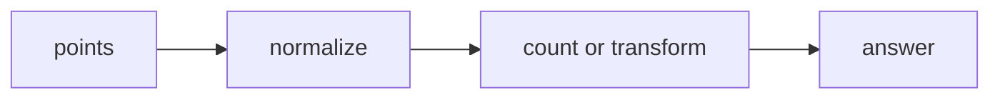

# Math & Geometry

## What You Will Learn

You will learn the core model behind math & geometry, the operations it supports, the patterns that interviewers commonly test, and the recognition signals that tell you this topic is being tested.

## Why This Topic Matters

Math & Geometry problems test whether you can turn a prompt into a precise state model. The best solutions are usually short once the invariant is clear.

## Real World Usage

Used in graphics, payments, maps, robotics, simulations, ranking formulas, ML feature geometry, and coordinate systems.

## Intuition

Ask what information must be remembered after each step. If you can name that state and explain why it is enough, the implementation becomes much safer.

## Formal Definition

Math and geometry problems use arithmetic, number theory, combinatorics, matrices, coordinates, vectors, lines, and areas.

## Core Data Structure Or Algorithm

Normalize numeric representations, avoid floating precision when possible, and handle zero, duplicate, overflow, and boundary cases deliberately.

## Time Complexity

| Operation or Pattern | Complexity |
|---|---:|
| GCD Euclid | O(log min(a,b)) |
| Prime sieve | O(n log log n) |
| Matrix traversal | O(rows times cols) |
| Pair geometry | O(n^2) |

## Space Complexity

| Case | Complexity |
|---|---:|
| Formula only | O(1) |
| Sieve | O(n) |
| Slope map | O(n) per anchor |

## Common Operations

| Operation | What It Means |
|---|---|
| Normalize | Reduce fractions, slopes, or directions. |
| Transform | Rotate, reflect, or translate coordinates. |
| Count | Use formulas or maps instead of repeated simulation. |
| Guard boundaries | Handle zero and duplicate cases. |

## Visual Explanation

## Mathematical Foundations

Use gcd, modular arithmetic, vectors, slopes, area, and orientation. Prefer exact integer normalization over floating-point comparisons.

## Common Interview Patterns

- **Modulo Arithmetic**: Use remainders to reason about divisibility, cycles, and large numbers.
- **GCD and Number Theory**: Use gcd, lcm, primes, and factors to normalize numeric relationships.
- **Matrix Traversal**: Move through matrix layers, rows, columns, or diagonals with explicit boundaries.
- **Coordinate Hashing**: Store points or normalized coordinate facts in sets and maps.
- **Line and Slope**: Normalize slope as an integer pair using gcd and count equal slopes from each anchor.
- **Geometry Simulation**: Update coordinates, direction, or area according to exact geometric rules.

## Pattern Recognition

Look for the operation the prompt asks you to optimize. If brute force repeats the same lookup, traversal, choice, or state calculation, one of the patterns in this folder is probably intended.

## Common Mistakes

- Coding before defining what the state means.
- Forgetting edge cases such as empty input, one item, duplicates, and boundary endpoints.
- Choosing a familiar pattern even when the constraints do not support its invariant.
- Reporting time complexity without auxiliary memory.

## Interview Tips

- Start with brute force and name the repeated work.
- State the invariant before coding.
- Keep the implementation small and testable.
- Explain why the pattern is correct, not only why it is fast.
- Test one normal case, one edge case, and one adversarial case.

## Mini Exercises

- Write the template for each pattern from memory.
- Solve two Easy problems and explain the invariant aloud.
- Solve one Medium problem with pseudocode before coding.
- Re-solve one missed problem after 24 hours.

## Recommended Learning Order

1. Study Modulo Arithmetic in [PATTERNS.md](PATTERNS.md).
2. Study GCD and Number Theory in [PATTERNS.md](PATTERNS.md).
3. Study Matrix Traversal in [PATTERNS.md](PATTERNS.md).
4. Study Coordinate Hashing in [PATTERNS.md](PATTERNS.md).
5. Study Line and Slope in [PATTERNS.md](PATTERNS.md).
6. Study Geometry Simulation in [PATTERNS.md](PATTERNS.md).
7. Review [CHEATSHEET.md](CHEATSHEET.md).
8. Solve [easy.md](easy.md), then [medium.md](medium.md), then selected [hard.md](hard.md).

## Practice Sets

[Cheatsheet](CHEATSHEET.md) | [Patterns](PATTERNS.md) | [Easy](easy.md) | [Medium](medium.md) | [Hard](hard.md)

---

## Navigation

[Previous](../bit-manipulation/README.md) | [Home](../README.md) | [Next](../math-geometry/CHEATSHEET.md)
