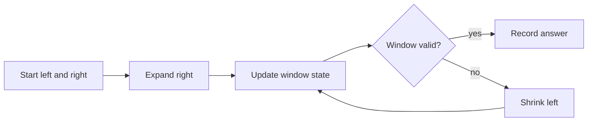

# Sliding Window

## What You Will Learn

You will learn what sliding window means, when it is useful, what operations it supports, and how it appears in coding interviews. By the end of this topic, you should be able to explain the core idea, select the right pattern, implement the usual template, and analyze time and space complexity.

## Why This Topic Matters

Sliding windows solve contiguous subarray and substring problems by updating state incrementally instead of recomputing each range.

Interview problems often hide the topic behind a story. Your job is to translate the story into operations: lookup, scan, traverse, split, merge, choose, or optimize.

## Real World Usage

Used in streaming metrics, rate limiting, anomaly detection, rolling averages, session windows, and text analytics.

Real systems rarely announce the data structure by name. They expose constraints such as fast lookup, ordered traversal, prefix search, shortest route, or bounded memory. Those constraints point to the right tool.

## Intuition

Keep a current interval. Expand to include new data. Shrink when the interval becomes invalid or when a smaller valid interval may be better.

A beginner-friendly way to approach this topic is to ask: what information do I need to remember, and what information can I safely discard?

## Formal Definition

A sliding window algorithm maintains a contiguous segment with left and right boundaries plus summary state for that segment.

The formal definition matters because it tells you which operations are cheap, which operations are expensive, and which invariants cannot be broken.

## Core Data Structure Or Algorithm

Fixed windows handle exact length. Variable windows handle constraints such as at most k distinct values or sum at least target.

In interviews, the core algorithm is usually small. The difficulty is choosing it, naming the invariant, and handling edge cases cleanly.

## Time Complexity

| Operation or Pattern | Complexity |
|---|---:|
| Fixed window | O(n) |
| Variable window | O(n) when each pointer moves forward |
| Window with balanced tree | O(n log k) |
| Deque maximum | O(n) |

## Space Complexity

| Case | Complexity |
|---|---:|
| Counter map | O(k) |
| Deque | O(k) |
| Constant summaries | O(1) |

## Common Operations

| Operation | What It Means |
|---|---|
| Expand | Move right and add one element. |
| Shrink | Move left and remove one element. |
| Validate | Check whether the current window satisfies the rule. |
| Record | Update best length, count, or value. |

## Visual Explanation

## Mathematical Foundations

The key invariant is contiguity. For many positive-number problems, sums are monotonic as the window expands, which makes shrinking safe. For negative numbers, prefix sums may be needed instead.

## Common Interview Patterns

- **Fixed Size Window**: see [sliding-window/PATTERNS.md](PATTERNS.md) for recognition signals and templates.
- **Variable Size Window**: see [sliding-window/PATTERNS.md](PATTERNS.md) for recognition signals and templates.
- **At Most K**: see [sliding-window/PATTERNS.md](PATTERNS.md) for recognition signals and templates.
- **Exactly K via At Most**: see [sliding-window/PATTERNS.md](PATTERNS.md) for recognition signals and templates.
- **Minimum Valid Window**: see [sliding-window/PATTERNS.md](PATTERNS.md) for recognition signals and templates.
- **Monotonic Deque Window**: see [sliding-window/PATTERNS.md](PATTERNS.md) for recognition signals and templates.

## Pattern Recognition

Look for contiguous subarray, substring, longest, shortest, fixed length k, at most k, exactly k, or streaming range wording.

When you read a problem, underline the constraint words first. Words like "sorted", "contiguous", "prefix", "shortest", "k", "all possible", "minimum", or "dependencies" usually reveal the intended pattern.

## Common Mistakes

- Using sliding window with negative sums when monotonicity is required.
- Not removing left-side state when shrinking.
- Confusing at most k with exactly k.

## Interview Tips

- Start with brute force and name the repeated work.
- State the invariant before coding.
- Keep edge cases visible: empty input, one item, duplicates, negative values, and boundary indices.
- Explain why your data structure supports the needed operation efficiently.
- Give time and space complexity after testing the code mentally.

## Mini Exercises

- Implement and explain fixed size window without looking at notes.
- Implement and explain variable size window without looking at notes.
- Implement and explain at most k without looking at notes.
- Implement and explain exactly k via at most without looking at notes.
- Pick two Easy problems from [easy.md](easy.md) and explain the pattern before coding.
- Pick one Medium problem from [medium.md](medium.md) and write only pseudocode first.

## Recommended Learning Order

1. Read the section on Fixed Size Window in [PATTERNS.md](PATTERNS.md).
2. Read the section on Variable Size Window in [PATTERNS.md](PATTERNS.md).
3. Read the section on At Most K in [PATTERNS.md](PATTERNS.md).
4. Read the section on Exactly K via At Most in [PATTERNS.md](PATTERNS.md).
5. Read the section on Minimum Valid Window in [PATTERNS.md](PATTERNS.md).
6. Read the section on Monotonic Deque Window in [PATTERNS.md](PATTERNS.md).
7. Review [CHEATSHEET.md](CHEATSHEET.md) before timed practice.
8. Solve Easy, then Medium, then selected Hard problems.

## Practice Sets

- [Easy problems](easy.md)
- [Medium problems](medium.md)
- [Hard problems](hard.md)

---

## Navigation

[Previous](../binary-search/README.md) | [Home](../README.md) | [Next](../sliding-window/CHEATSHEET.md)
