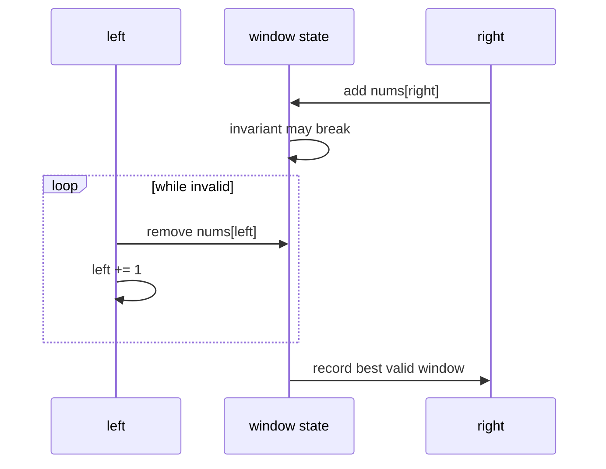

# Sliding Window

## What This Topic Is

Maintain a contiguous range while expanding and shrinking it under an invariant.

This topic is a reusable mental model, not a bag of isolated tricks. You should finish it able to identify the problem shape, state the invariant, choose the right pattern, and explain the complexity without guessing.

## Why It Matters

Sliding window converts many repeated subarray or substring scans into one pass by reusing state as the range moves.

In interviews, the story usually hides the structure. Translate the story into operations: lookup, move a boundary, traverse, choose, relax, split, merge, or remember a state.

## Real-World Use

Used in rate limiting, streaming metrics, fraud detection, packet windows, time-series analytics, log monitoring, and substring search.

The same ideas show up in production systems when constraints demand predictable lookup, bounded memory, fast traversal, or correct ordering.

## Beginner Intuition

The window is a living summary of a contiguous segment. Expand to include new information, then shrink until the rule is valid again.

Beginner rule: before coding, write one sentence that says what information your algorithm keeps and why that information is enough for the next decision.

## Formal Explanation

A sliding window keeps two monotonic boundaries and an aggregate over the interval between them. Each boundary moves at most n times.

The formal model matters because it tells you which operations are cheap, which are expensive, and which assumptions are required for correctness.

## Core Operations

| Operation | Meaning |
|---|---|
| Expand right | Add a new item to the window state. |
| Shrink left | Remove old items until the invariant holds. |
| Record answer | Update length, count, max, or min at the correct moment. |
| Maintain auxiliary structure | Use counts or a deque when simple sums are insufficient. |

## Time Complexity

| Operation or Pattern | Complexity |
|---|---:|
| Standard window | O(n) |
| Window with hash counts | O(n) expected |
| Monotonic deque window | O(n) amortized |
| Bad nested rescan | O(nk) or O(n^2) |

## Space Complexity

| Case | Complexity |
|---|---:|
| Numeric window | O(1) |
| Frequency map | O(k) distinct values |
| Deque | O(k) window size |

## Visual Explanation

## Foundations And Invariants

Sliding window needs contiguity and monotonic boundary movement. Negative numbers often break simple sum windows because shrinking may not move the sum predictably.

When explaining a solution, name the invariant before writing code. A good invariant is short enough to repeat while coding and precise enough to catch edge cases.

## Pattern Recognition

Look for contiguous subarray, substring, longest, shortest, at most k, exactly k via at most transforms, fixed length k, or stream-style language.

Ask these questions:

- What is the smallest state that makes the next decision easy?
- Does the problem require order, membership, connectivity, optimal choice, or all possibilities?
- Does any boundary move monotonically?
- Are constraints small enough for exponential search or DP state?

## Common Interview Patterns

- **Fixed Window**: recognition signals, mistakes, and templates in [PATTERNS.md](PATTERNS.md).
- **Variable Window**: recognition signals, mistakes, and templates in [PATTERNS.md](PATTERNS.md).
- **Frequency Window**: recognition signals, mistakes, and templates in [PATTERNS.md](PATTERNS.md).
- **At Most K Window**: recognition signals, mistakes, and templates in [PATTERNS.md](PATTERNS.md).
- **Monotonic Window**: recognition signals, mistakes, and templates in [PATTERNS.md](PATTERNS.md).

## Common Mistakes

- Recording the answer before restoring validity.
- Using a window when prefix sums are required for negative numbers.
- Forgetting to remove zero-count keys.
- Confusing exactly k with at most k.

## Interview Tips

- Start with brute force and name the repeated work or missing invariant.
- State why the chosen pattern removes that waste.
- Keep edge cases visible while coding.
- Give both time and auxiliary space complexity.
- If the interviewer changes constraints, re-check the pattern assumptions before modifying code.

## Mini Exercises

- Explain `Fixed Window` aloud, then write its invariant and template from memory.
- Explain `Variable Window` aloud, then write its invariant and template from memory.
- Explain `Frequency Window` aloud, then write its invariant and template from memory.
- Explain `At Most K Window` aloud, then write its invariant and template from memory.
- Pick two Easy problems from [easy.md](easy.md) and identify the pattern before coding.
- Pick one Medium problem from [medium.md](medium.md) and write pseudocode before implementation.
- For one missed problem, write the failed invariant and the corrected invariant.

## Recommended Learning Order

1. Read `Fixed Window` in [PATTERNS.md](PATTERNS.md).
2. Read `Variable Window` in [PATTERNS.md](PATTERNS.md).
3. Read `Frequency Window` in [PATTERNS.md](PATTERNS.md).
4. Read `At Most K Window` in [PATTERNS.md](PATTERNS.md).
5. Read `Monotonic Window` in [PATTERNS.md](PATTERNS.md).
6. Review [CHEATSHEET.md](CHEATSHEET.md) before timed practice.
7. Solve [easy.md](easy.md), then [medium.md](medium.md), then selected [hard.md](hard.md).

## Practice Navigation

- [Easy problems](easy.md): build fundamentals.
- [Medium problems](medium.md): build interview fluency.
- [Hard problems](hard.md): build advanced pattern recognition.

---

## Navigation

[Previous](../binary-search/README.md) | [Home](../README.md) | [Next](CHEATSHEET.md)
