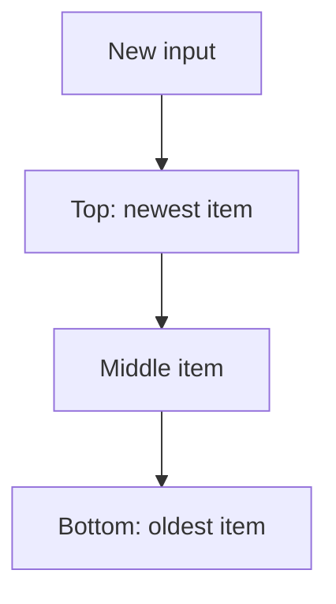

# Stack

## What You Will Learn

You will learn what stack means, when it is useful, what operations it supports, and how it appears in coding interviews. By the end of this topic, you should be able to explain the core idea, select the right pattern, implement the usual template, and analyze time and space complexity.

## Why This Topic Matters

Stacks model last-in-first-out decisions. They are the natural fit for parsing, undo behavior, nested structures, and nearest-greater style questions.

Interview problems often hide the topic behind a story. Your job is to translate the story into operations: lookup, scan, traverse, split, merge, choose, or optimize.

## Real World Usage

Used in call stacks, browser history, expression evaluation, compilers, editors, parsers, and schedulers.

Real systems rarely announce the data structure by name. They expose constraints such as fast lookup, ordered traversal, prefix search, shortest route, or bounded memory. Those constraints point to the right tool.

## Intuition

When the most recent unresolved item should be resolved first, use a stack. Push unfinished work. Pop when the current value closes or improves it.

A beginner-friendly way to approach this topic is to ask: what information do I need to remember, and what information can I safely discard?

## Formal Definition

A stack is an abstract data type with push, pop, and peek operations where the newest element is removed first.

The formal definition matters because it tells you which operations are cheap, which operations are expensive, and which invariants cannot be broken.

## Core Data Structure Or Algorithm

Use a basic stack for nesting. Use a monotonic stack when elements should stay sorted by value so each element is pushed and popped at most once.

In interviews, the core algorithm is usually small. The difficulty is choosing it, naming the invariant, and handling edge cases cleanly.

## Time Complexity

| Operation or Pattern | Complexity |
|---|---:|
| Push | O(1) |
| Pop | O(1) |
| Peek | O(1) |
| Monotonic scan | O(n) total |

## Space Complexity

| Case | Complexity |
|---|---:|
| Simple stack | O(n) |
| Auxiliary min stack | O(n) |
| Expression stack | O(n) |

## Common Operations

| Operation | What It Means |
|---|---|
| Push | Save unresolved data. |
| Pop | Resolve the most recent item. |
| Peek | Inspect without removing. |
| Compress | Combine consecutive items into one stack frame. |

## Visual Explanation

## Mathematical Foundations

Amortized analysis matters for monotonic stacks. Even with an inner while loop, each element enters and leaves the stack once, so the full scan is linear.

## Common Interview Patterns

- **Balanced Delimiters**: see [stack/PATTERNS.md](PATTERNS.md) for recognition signals and templates.
- **Expression Evaluation**: see [stack/PATTERNS.md](PATTERNS.md) for recognition signals and templates.
- **Monotonic Increasing Stack**: see [stack/PATTERNS.md](PATTERNS.md) for recognition signals and templates.
- **Monotonic Decreasing Stack**: see [stack/PATTERNS.md](PATTERNS.md) for recognition signals and templates.
- **Simulation Stack**: see [stack/PATTERNS.md](PATTERNS.md) for recognition signals and templates.
- **Auxiliary Stack**: see [stack/PATTERNS.md](PATTERNS.md) for recognition signals and templates.

## Pattern Recognition

Look for nested parentheses, next greater or previous smaller values, reversible operations, path simplification, or resolving recent items first.

When you read a problem, underline the constraint words first. Words like "sorted", "contiguous", "prefix", "shortest", "k", "all possible", "minimum", or "dependencies" usually reveal the intended pattern.

## Common Mistakes

- Not checking empty stack before peek.
- Using stack order when queue order is required.
- Forgetting that monotonic stacks are amortized linear.

## Interview Tips

- Start with brute force and name the repeated work.
- State the invariant before coding.
- Keep edge cases visible: empty input, one item, duplicates, negative values, and boundary indices.
- Explain why your data structure supports the needed operation efficiently.
- Give time and space complexity after testing the code mentally.

## Mini Exercises

- Implement and explain balanced delimiters without looking at notes.
- Implement and explain expression evaluation without looking at notes.
- Implement and explain monotonic increasing stack without looking at notes.
- Implement and explain monotonic decreasing stack without looking at notes.
- Pick two Easy problems from [easy.md](easy.md) and explain the pattern before coding.
- Pick one Medium problem from [medium.md](medium.md) and write only pseudocode first.

## Recommended Learning Order

1. Read the section on Balanced Delimiters in [PATTERNS.md](PATTERNS.md).
2. Read the section on Expression Evaluation in [PATTERNS.md](PATTERNS.md).
3. Read the section on Monotonic Increasing Stack in [PATTERNS.md](PATTERNS.md).
4. Read the section on Monotonic Decreasing Stack in [PATTERNS.md](PATTERNS.md).
5. Read the section on Simulation Stack in [PATTERNS.md](PATTERNS.md).
6. Read the section on Auxiliary Stack in [PATTERNS.md](PATTERNS.md).
7. Review [CHEATSHEET.md](CHEATSHEET.md) before timed practice.
8. Solve Easy, then Medium, then selected Hard problems.

## Practice Sets

- [Easy problems](easy.md)
- [Medium problems](medium.md)
- [Hard problems](hard.md)

---

## Navigation

[Previous](../two-pointers/README.md) | [Home](../README.md) | [Next](../stack/CHEATSHEET.md)
