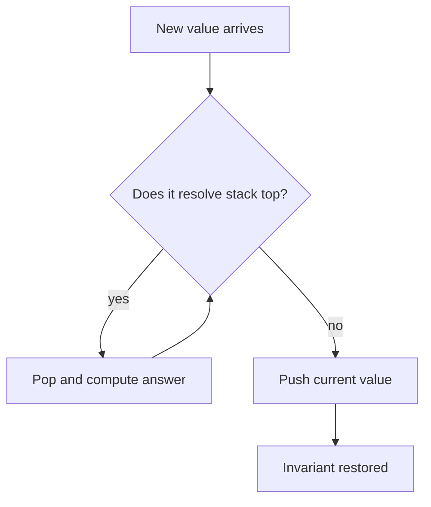
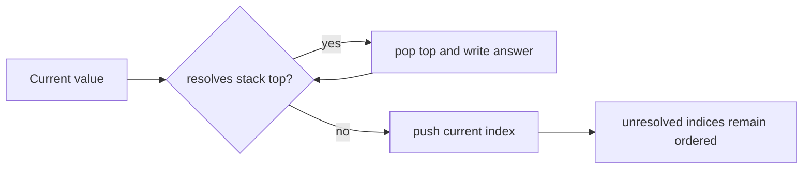
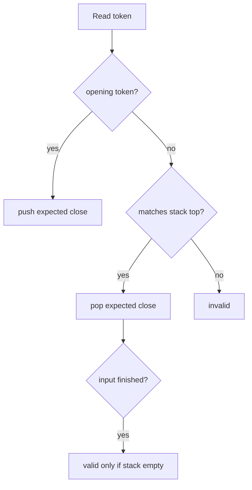

# Stack

## What This Topic Is

Use last-in-first-out state to model nested structure, undo decisions, and nearest greater or smaller elements.

This topic is a reusable mental model, not a bag of isolated tricks. You should finish it able to identify the problem shape, state the invariant, choose the right pattern, and explain the complexity without guessing.

## Why It Matters

Stacks make hidden order explicit. They are the natural tool for parsing, backtracking state, and problems where the most recent unresolved item should be resolved first.

In interviews, the story usually hides the structure. Translate the story into operations: lookup, move a boundary, traverse, choose, relax, split, merge, or remember a state.

## Interviewer Lens

- Google: state the exact meaning of each item kept on the stack.
- Meta: code monotonic stack loops with correct comparison direction under time pressure.
- Amazon: explain empty-stack behavior, invalid tokens, and malformed input.
- Beginner: decide whether the top stores a value, index, pair, or partial expression.

## Real-World Use

Used in call stacks, expression parsing, undo systems, browser history, compiler syntax checks, monotonic queues, and event processing.

The same ideas show up in production systems when constraints demand predictable lookup, bounded memory, fast traversal, or correct ordering.

## Beginner Intuition

A stack is a pile. You only touch the top. That limitation is useful when the newest open item is exactly the one that must close or be resolved next.

Beginner rule: before coding, write one sentence that says what information your algorithm keeps and why that information is enough for the next decision.

## Formal Explanation

A stack supports push, pop, and top in O(1). Monotonic stacks add an invariant that values are ordered from bottom to top.

The formal model matters because it tells you which operations are cheap, which are expensive, and which assumptions are required for correctness.

## Core Operations

| Operation | Meaning |
|---|---|
| Push | Add an unresolved item. |
| Pop | Resolve the most recent item. |
| Peek | Inspect without removing. |
| Maintain monotonicity | Pop values that can no longer be answers. |

## Time Complexity

| Operation or Pattern | Complexity |
|---|---:|
| Push or pop | O(1) |
| Full monotonic scan | O(n) amortized |
| Expression parse | O(n) |

## Space Complexity

| Case | Complexity |
|---|---:|
| Balanced delimiter stack | O(depth) |
| Monotonic stack | O(n) worst case |
| Expression stack | O(n) |

## Visual Explanation

## Additional Visuals

### Monotonic Stack Resolution

### Balanced Delimiters

## Foundations And Invariants

Amortized analysis matters: in a monotonic stack each item is pushed once and popped once, so repeated inner pops still sum to O(n).

When explaining a solution, name the invariant before writing code. A good invariant is short enough to repeat while coding and precise enough to catch edge cases.

## Pattern Recognition

Look for nested delimiters, next greater, previous smaller, stock spans, histogram areas, collision simulation, or the phrase most recent unresolved item.

Ask these questions:

- Does the newest unresolved item have to be resolved before older items?
- Is the structure nested, reversible, or based on nearest greater or smaller values?
- Do indices matter for distance or width, or are values enough?
- Can one incoming item resolve multiple previous items?

## Common Interview Patterns

- **LIFO Simulation**: recognition signals, mistakes, and templates in [PATTERNS.md](PATTERNS.md).
- **Balanced Delimiters**: recognition signals, mistakes, and templates in [PATTERNS.md](PATTERNS.md).
- **Monotonic Increasing Stack**: recognition signals, mistakes, and templates in [PATTERNS.md](PATTERNS.md).
- **Monotonic Decreasing Stack**: recognition signals, mistakes, and templates in [PATTERNS.md](PATTERNS.md).
- **Expression Stack**: recognition signals, mistakes, and templates in [PATTERNS.md](PATTERNS.md).

## Common Mistakes

- Forgetting to process values left in the stack.
- Using a stack when a queue is required by order.
- Losing indices when distances or widths are needed.
- Breaking monotonic order after equal values.

## Interview Tips

- Define what the stack top represents at every iteration.
- Say whether equal values should stay or be popped in monotonic problems.
- Use indices when the answer asks for distance, width, or expiration.
- Dry run the case where one item pops many previous items.
- Separate parsing, precedence, and evaluation when expressions are involved.

## Mini Exercises

- Explain `LIFO Simulation` aloud, then write its invariant and template from memory.
- Explain `Balanced Delimiters` aloud, then write its invariant and template from memory.
- Explain `Monotonic Increasing Stack` aloud, then write its invariant and template from memory.
- Explain `Monotonic Decreasing Stack` aloud, then write its invariant and template from memory.
- Pick two Easy problems from [easy.md](easy.md) and identify the pattern before coding.
- Pick one Medium problem from [medium.md](medium.md) and write pseudocode before implementation.
- For one missed problem, write the failed invariant and the corrected invariant.

## Recommended Learning Order

1. Read `LIFO Simulation` in [PATTERNS.md](PATTERNS.md).
2. Read `Balanced Delimiters` in [PATTERNS.md](PATTERNS.md).
3. Read `Monotonic Increasing Stack` in [PATTERNS.md](PATTERNS.md).
4. Read `Monotonic Decreasing Stack` in [PATTERNS.md](PATTERNS.md).
5. Read `Expression Stack` in [PATTERNS.md](PATTERNS.md).
6. Review [CHEATSHEET.md](CHEATSHEET.md) before timed practice.
7. Solve [easy.md](easy.md), then [medium.md](medium.md), then selected [hard.md](hard.md).

## Practice Navigation

- [Easy problems](easy.md): build fundamentals.
- [Medium problems](medium.md): build interview fluency.
- [Hard problems](hard.md): build advanced pattern recognition.

---

## Navigation

[Previous](../two-pointers/README.md) | [Home](../README.md) | [Next](CHEATSHEET.md)
