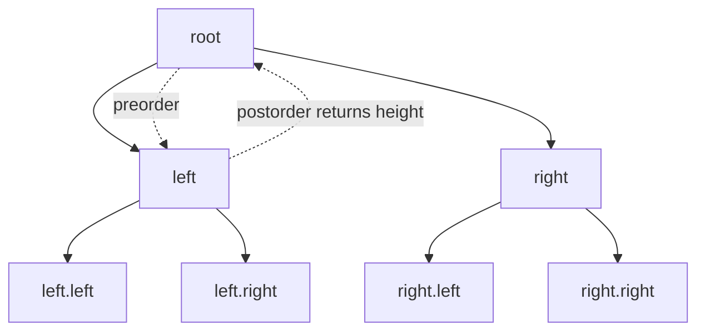

# Trees

## What This Topic Is

Reason over hierarchical structures with recursion, traversal order, and subtree return values.

This topic is a reusable mental model, not a bag of isolated tricks. You should finish it able to identify the problem shape, state the invariant, choose the right pattern, and explain the complexity without guessing.

## Why It Matters

Tree problems test whether you can define a local contract for each subtree and combine results without global confusion.

In interviews, the story usually hides the structure. Translate the story into operations: lookup, move a boundary, traverse, choose, relax, split, merge, or remember a state.

## Real-World Use

Used in file systems, DOM trees, ASTs, indexes, decision trees, routing hierarchies, and permission inheritance.

The same ideas show up in production systems when constraints demand predictable lookup, bounded memory, fast traversal, or correct ordering.

## Beginner Intuition

A tree problem becomes manageable when each node asks its children for a small piece of information, then returns a small piece of information to its parent.

Beginner rule: before coding, write one sentence that says what information your algorithm keeps and why that information is enough for the next decision.

## Formal Explanation

A tree is an acyclic connected graph with a root in rooted tree problems. Each node can have children, and a binary tree has at most two children.

The formal model matters because it tells you which operations are cheap, which are expensive, and which assumptions are required for correctness.

## Core Operations

| Operation | Meaning |
|---|---|
| DFS preorder | Process node before children. |
| DFS inorder | Process left, node, right, useful for BSTs. |
| DFS postorder | Process children before node, useful for heights and DP. |
| BFS level order | Process by distance from root. |
| BST search | Use ordering constraints to discard a subtree. |

## Time Complexity

| Operation or Pattern | Complexity |
|---|---:|
| Traversal | O(n) |
| Balanced BST search | O(log n) |
| Skewed BST search | O(n) |
| LCA general tree | O(n) |

## Space Complexity

| Case | Complexity |
|---|---:|
| Balanced recursive DFS | O(log n) stack |
| Skewed recursive DFS | O(n) stack |
| BFS queue | O(width) |

## Visual Explanation

## Foundations And Invariants

The recursive contract is the proof. For example, height(node) returns the height of this subtree, so diameter can combine left height, right height, and child diameters.

When explaining a solution, name the invariant before writing code. A good invariant is short enough to repeat while coding and precise enough to catch edge cases.

## Pattern Recognition

Look for subtree, ancestor, descendant, path sum, balanced, diameter, serialize, kth in BST, level order, or lowest common ancestor.

Ask these questions:

- What is the smallest state that makes the next decision easy?
- Does the problem require order, membership, connectivity, optimal choice, or all possibilities?
- Does any boundary move monotonically?
- Are constraints small enough for exponential search or DP state?

## Common Interview Patterns

- **Recursive DFS**: recognition signals, mistakes, and templates in [PATTERNS.md](PATTERNS.md).
- **Iterative DFS**: recognition signals, mistakes, and templates in [PATTERNS.md](PATTERNS.md).
- **BFS Level Order**: recognition signals, mistakes, and templates in [PATTERNS.md](PATTERNS.md).
- **Path Problems**: recognition signals, mistakes, and templates in [PATTERNS.md](PATTERNS.md).
- **Tree DP**: recognition signals, mistakes, and templates in [PATTERNS.md](PATTERNS.md).
- **Lowest Common Ancestor**: recognition signals, mistakes, and templates in [PATTERNS.md](PATTERNS.md).
- **BST Bounds**: recognition signals, mistakes, and templates in [PATTERNS.md](PATTERNS.md).

## Common Mistakes

- Using global state without defining when it updates.
- Returning the wrong value from recursive helpers.
- Forgetting null base cases.
- Assuming a binary tree is a BST.

## Interview Tips

- Start with brute force and name the repeated work or missing invariant.
- State why the chosen pattern removes that waste.
- Keep edge cases visible while coding.
- Give both time and auxiliary space complexity.
- If the interviewer changes constraints, re-check the pattern assumptions before modifying code.

## Mini Exercises

- Explain `Recursive DFS` aloud, then write its invariant and template from memory.
- Explain `Iterative DFS` aloud, then write its invariant and template from memory.
- Explain `BFS Level Order` aloud, then write its invariant and template from memory.
- Explain `Path Problems` aloud, then write its invariant and template from memory.
- Pick two Easy problems from [easy.md](easy.md) and identify the pattern before coding.
- Pick one Medium problem from [medium.md](medium.md) and write pseudocode before implementation.
- For one missed problem, write the failed invariant and the corrected invariant.

## Recommended Learning Order

1. Read `Recursive DFS` in [PATTERNS.md](PATTERNS.md).
2. Read `Iterative DFS` in [PATTERNS.md](PATTERNS.md).
3. Read `BFS Level Order` in [PATTERNS.md](PATTERNS.md).
4. Read `Path Problems` in [PATTERNS.md](PATTERNS.md).
5. Read `Tree DP` in [PATTERNS.md](PATTERNS.md).
6. Read `Lowest Common Ancestor` in [PATTERNS.md](PATTERNS.md).
7. Read `BST Bounds` in [PATTERNS.md](PATTERNS.md).
8. Review [CHEATSHEET.md](CHEATSHEET.md) before timed practice.
9. Solve [easy.md](easy.md), then [medium.md](medium.md), then selected [hard.md](hard.md).

## Practice Navigation

- [Easy problems](easy.md): build fundamentals.
- [Medium problems](medium.md): build interview fluency.
- [Hard problems](hard.md): build advanced pattern recognition.

---

## Navigation

[Previous](../linked-list/README.md) | [Home](../README.md) | [Next](CHEATSHEET.md)
