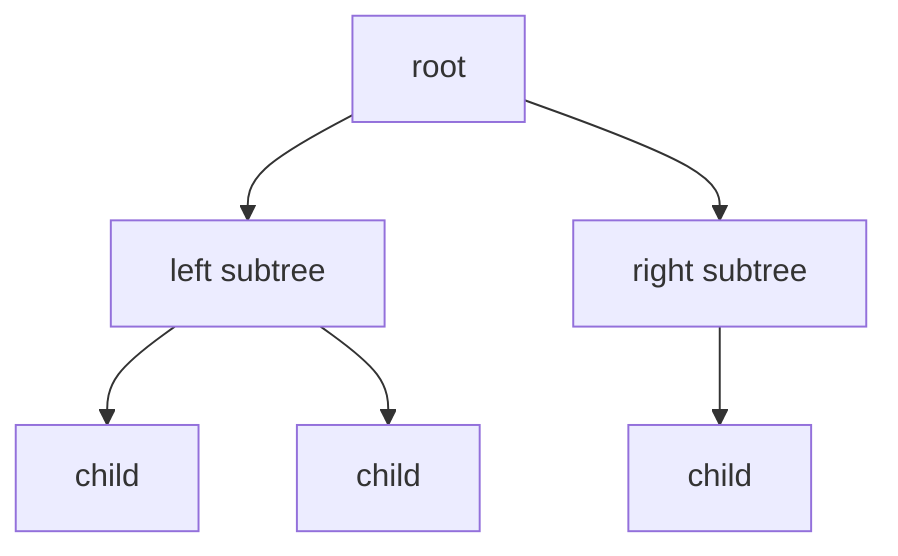

# Trees

## What You Will Learn

You will learn the core model behind trees, the operations it supports, the patterns that interviewers commonly test, and the recognition signals that tell you this topic is being tested.

## Why This Topic Matters

Trees problems test whether you can turn a prompt into a precise state model. The best solutions are usually short once the invariant is clear.

## Real World Usage

Used in filesystems, database indexes, syntax trees, DOM trees, routing tables, organization charts, and decision trees.

## Intuition

Ask what information must be remembered after each step. If you can name that state and explain why it is enough, the implementation becomes much safer.

## Formal Definition

A tree is an acyclic connected structure with parent-child relationships. A rooted tree has one root, and every child subtree is itself a tree.

## Core Data Structure Or Algorithm

Master DFS, BFS, binary search tree bounds, lowest common ancestor, and postorder state aggregation.

## Time Complexity

| Operation or Pattern | Complexity |
|---|---:|
| Visit every node | O(n) |
| Balanced BST search | O(log n) |
| Skewed BST search | O(n) |
| Level order traversal | O(n) |

## Space Complexity

| Case | Complexity |
|---|---:|
| Balanced recursion | O(log n) |
| Skewed recursion | O(n) |
| BFS queue | O(width) |

## Common Operations

| Operation | What It Means |
|---|---|
| Preorder | Process node before children. |
| Inorder | Process left, node, right, especially for BST sorted order. |
| Postorder | Process children before combining at parent. |
| Level order | Process nodes by distance from root. |

## Visual Explanation

## Mathematical Foundations

Tree proofs often use induction. If the result is correct for the left and right subtrees, the combine step must make it correct for the current root.

## Common Interview Patterns

- **Recursive DFS**: Let each recursive call solve one subtree and return exactly the fact the parent needs.
- **Iterative DFS**: Use an explicit stack to control depth-first traversal and avoid recursive stack limits.
- **Level Order BFS**: Use a queue to process all nodes at the same depth before moving deeper.
- **BST Invariant**: Every node carries lower and upper bounds inherited from its ancestors.
- **Lowest Common Ancestor**: The answer is where target paths split, or where one target is ancestor of the other.
- **Tree DP**: Return multiple states from each subtree so the parent can choose among them.

## Pattern Recognition

Look for the operation the prompt asks you to optimize. If brute force repeats the same lookup, traversal, choice, or state calculation, one of the patterns in this folder is probably intended.

## Common Mistakes

- Coding before defining what the state means.
- Forgetting edge cases such as empty input, one item, duplicates, and boundary endpoints.
- Choosing a familiar pattern even when the constraints do not support its invariant.
- Reporting time complexity without auxiliary memory.

## Interview Tips

- Start with brute force and name the repeated work.
- State the invariant before coding.
- Keep the implementation small and testable.
- Explain why the pattern is correct, not only why it is fast.
- Test one normal case, one edge case, and one adversarial case.

## Mini Exercises

- Write the template for each pattern from memory.
- Solve two Easy problems and explain the invariant aloud.
- Solve one Medium problem with pseudocode before coding.
- Re-solve one missed problem after 24 hours.

## Recommended Learning Order

1. Study Recursive DFS in [PATTERNS.md](PATTERNS.md).
2. Study Iterative DFS in [PATTERNS.md](PATTERNS.md).
3. Study Level Order BFS in [PATTERNS.md](PATTERNS.md).
4. Study BST Invariant in [PATTERNS.md](PATTERNS.md).
5. Study Lowest Common Ancestor in [PATTERNS.md](PATTERNS.md).
6. Study Tree DP in [PATTERNS.md](PATTERNS.md).
7. Review [CHEATSHEET.md](CHEATSHEET.md).
8. Solve [easy.md](easy.md), then [medium.md](medium.md), then selected [hard.md](hard.md).

## Practice Sets

[Cheatsheet](CHEATSHEET.md) | [Patterns](PATTERNS.md) | [Easy](easy.md) | [Medium](medium.md) | [Hard](hard.md)

---

## Navigation

[Previous](../linked-list/README.md) | [Home](../README.md) | [Next](../trees/CHEATSHEET.md)
