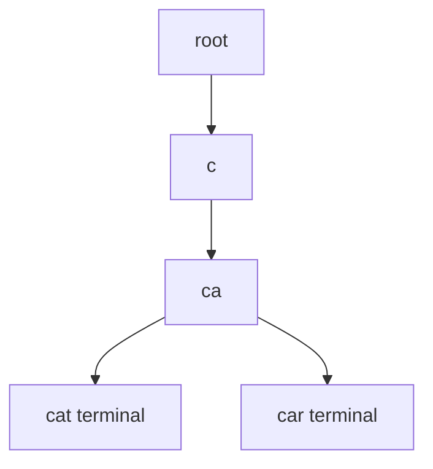

# Tries

## What You Will Learn

You will learn the core model behind tries, the operations it supports, the patterns that interviewers commonly test, and the recognition signals that tell you this topic is being tested.

## Why This Topic Matters

Tries problems test whether you can turn a prompt into a precise state model. The best solutions are usually short once the invariant is clear.

## Real World Usage

Used in autocomplete, spell check, search suggestions, IP prefix matching, command lookup, and dictionary compression.

## Intuition

Ask what information must be remembered after each step. If you can name that state and explain why it is enough, the implementation becomes much safer.

## Formal Definition

A trie is a rooted tree where each edge represents a character or bit and each path from the root represents a prefix.

## Core Data Structure Or Algorithm

Insert keys one symbol at a time, mark terminal nodes, and prune searches as soon as a prefix path is absent.

## Time Complexity

| Operation or Pattern | Complexity |
|---|---:|
| Insert word length L | O(L) |
| Search word length L | O(L) |
| Prefix query length P | O(P) |
| Collect suggestions | O(P + output) |

## Space Complexity

| Case | Complexity |
|---|---:|
| Raw trie | O(total characters) |
| Sparse child maps | O(edges) |
| Fixed child arrays | O(nodes times alphabet) |

## Common Operations

| Operation | What It Means |
|---|---|
| Insert | Create missing child links. |
| Search | Follow every symbol and require a terminal marker. |
| Prefix query | Follow the prefix without requiring terminal marker. |
| Wildcard DFS | Branch through children for wildcard symbols. |

## Visual Explanation

## Mathematical Foundations

Trie complexity depends on key length instead of number of stored keys. Bitwise tries rely on binary place value and greedy opposite-bit choices.

## Common Interview Patterns

- **Prefix Tree**: Share common prefixes so word and prefix queries walk one character at a time.
- **Wildcard Trie DFS**: Branch through children only where the pattern contains a wildcard.
- **Autocomplete Suggestions**: Walk to the prefix node, then collect a bounded number of ordered completions.
- **Word Search Trie Pruning**: Combine grid DFS with trie prefixes so impossible word paths stop early.
- **Bitwise Trie**: Store numbers by bits and greedily follow opposite bits to maximize XOR.
- **Compressed Trie Awareness**: Compress chains of single-child nodes to reduce memory in large static prefix structures.

## Pattern Recognition

Look for the operation the prompt asks you to optimize. If brute force repeats the same lookup, traversal, choice, or state calculation, one of the patterns in this folder is probably intended.

## Common Mistakes

- Coding before defining what the state means.
- Forgetting edge cases such as empty input, one item, duplicates, and boundary endpoints.
- Choosing a familiar pattern even when the constraints do not support its invariant.
- Reporting time complexity without auxiliary memory.

## Interview Tips

- Start with brute force and name the repeated work.
- State the invariant before coding.
- Keep the implementation small and testable.
- Explain why the pattern is correct, not only why it is fast.
- Test one normal case, one edge case, and one adversarial case.

## Mini Exercises

- Write the template for each pattern from memory.
- Solve two Easy problems and explain the invariant aloud.
- Solve one Medium problem with pseudocode before coding.
- Re-solve one missed problem after 24 hours.

## Recommended Learning Order

1. Study Prefix Tree in [PATTERNS.md](PATTERNS.md).
2. Study Wildcard Trie DFS in [PATTERNS.md](PATTERNS.md).
3. Study Autocomplete Suggestions in [PATTERNS.md](PATTERNS.md).
4. Study Word Search Trie Pruning in [PATTERNS.md](PATTERNS.md).
5. Study Bitwise Trie in [PATTERNS.md](PATTERNS.md).
6. Study Compressed Trie Awareness in [PATTERNS.md](PATTERNS.md).
7. Review [CHEATSHEET.md](CHEATSHEET.md).
8. Solve [easy.md](easy.md), then [medium.md](medium.md), then selected [hard.md](hard.md).

## Practice Sets

[Cheatsheet](CHEATSHEET.md) | [Patterns](PATTERNS.md) | [Easy](easy.md) | [Medium](medium.md) | [Hard](hard.md)

---

## Navigation

[Previous](../trees/README.md) | [Home](../README.md) | [Next](../tries/CHEATSHEET.md)
