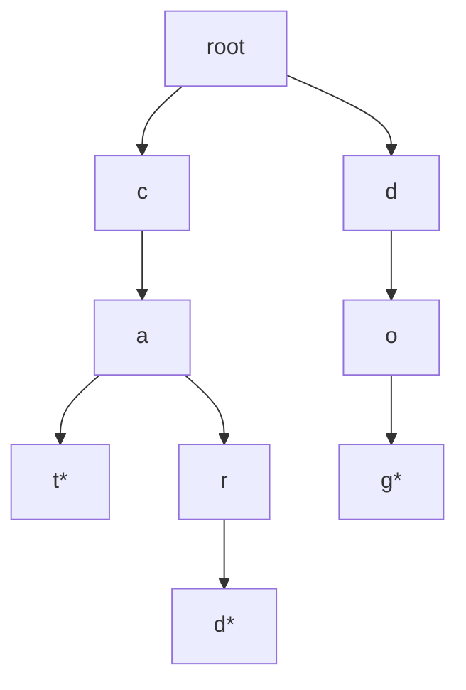

# Tries

## What This Topic Is

Store strings by shared prefixes so prefix queries and dictionary pruning become efficient.

This topic is a reusable mental model, not a bag of isolated tricks. You should finish it able to identify the problem shape, state the invariant, choose the right pattern, and explain the complexity without guessing.

## Why It Matters

Tries matter when repeated prefix checks dominate runtime, especially word search, autocomplete, and wildcard matching.

In interviews, the story usually hides the structure. Translate the story into operations: lookup, move a boundary, traverse, choose, relax, split, merge, or remember a state.

## Real-World Use

Used in autocomplete, spell check, routing tables, IP prefixes, dictionaries, search suggestions, and token matching.

The same ideas show up in production systems when constraints demand predictable lookup, bounded memory, fast traversal, or correct ordering.

## Beginner Intuition

A trie turns many strings into a tree of characters. Common prefixes are stored once, so the search follows characters rather than comparing whole words repeatedly.

Beginner rule: before coding, write one sentence that says what information your algorithm keeps and why that information is enough for the next decision.

## Formal Explanation

A trie is a rooted tree where each edge represents a character or token and terminal markers indicate complete keys.

The formal model matters because it tells you which operations are cheap, which are expensive, and which assumptions are required for correctness.

## Core Operations

| Operation | Meaning |
|---|---|
| Insert | Create missing child edges for each character. |
| Search word | Follow all characters and require a terminal marker. |
| Search prefix | Follow characters without requiring terminal marker. |
| Wildcard DFS | Branch over children only when a wildcard appears. |
| Prune | Stop exploring as soon as no child edge exists. |

## Time Complexity

| Operation or Pattern | Complexity |
|---|---:|
| Insert word length L | O(L) |
| Search word length L | O(L) |
| Wildcard search | O(branches explored) |
| Board search with trie | O(cells * branching) with pruning |

## Space Complexity

| Case | Complexity |
|---|---:|
| Trie nodes | O(total characters) |
| DFS stack | O(max word length) |
| Compressed trie | Less space when long single-child paths exist |

## Visual Explanation

## Foundations And Invariants

A terminal marker is separate from the existence of a prefix. `app` and `apple` share nodes, but only marked nodes are complete words.

When explaining a solution, name the invariant before writing code. A good invariant is short enough to repeat while coding and precise enough to catch edge cases.

## Pattern Recognition

Look for prefix, dictionary, wildcard, autocomplete, word board, starts with, maximum XOR bit trie, or repeated string membership queries.

Ask these questions:

- What is the smallest state that makes the next decision easy?
- Does the problem require order, membership, connectivity, optimal choice, or all possibilities?
- Does any boundary move monotonically?
- Are constraints small enough for exponential search or DP state?

## Common Interview Patterns

- **Prefix Insert And Search**: recognition signals, mistakes, and templates in [PATTERNS.md](PATTERNS.md).
- **Wildcard Trie DFS**: recognition signals, mistakes, and templates in [PATTERNS.md](PATTERNS.md).
- **Board Search Trie Pruning**: recognition signals, mistakes, and templates in [PATTERNS.md](PATTERNS.md).
- **Autocomplete Suggestions**: recognition signals, mistakes, and templates in [PATTERNS.md](PATTERNS.md).
- **Bit Trie**: recognition signals, mistakes, and templates in [PATTERNS.md](PATTERNS.md).

## Common Mistakes

- Treating every prefix as a complete word.
- Building a trie when a single hash set lookup is enough.
- Forgetting to prune found words on boards.
- Ignoring memory cost for large alphabets.

## Interview Tips

- Start with brute force and name the repeated work or missing invariant.
- State why the chosen pattern removes that waste.
- Keep edge cases visible while coding.
- Give both time and auxiliary space complexity.
- If the interviewer changes constraints, re-check the pattern assumptions before modifying code.

## Mini Exercises

- Explain `Prefix Insert And Search` aloud, then write its invariant and template from memory.
- Explain `Wildcard Trie DFS` aloud, then write its invariant and template from memory.
- Explain `Board Search Trie Pruning` aloud, then write its invariant and template from memory.
- Explain `Autocomplete Suggestions` aloud, then write its invariant and template from memory.
- Pick two Easy problems from [easy.md](easy.md) and identify the pattern before coding.
- Pick one Medium problem from [medium.md](medium.md) and write pseudocode before implementation.
- For one missed problem, write the failed invariant and the corrected invariant.

## Recommended Learning Order

1. Read `Prefix Insert And Search` in [PATTERNS.md](PATTERNS.md).
2. Read `Wildcard Trie DFS` in [PATTERNS.md](PATTERNS.md).
3. Read `Board Search Trie Pruning` in [PATTERNS.md](PATTERNS.md).
4. Read `Autocomplete Suggestions` in [PATTERNS.md](PATTERNS.md).
5. Read `Bit Trie` in [PATTERNS.md](PATTERNS.md).
6. Review [CHEATSHEET.md](CHEATSHEET.md) before timed practice.
7. Solve [easy.md](easy.md), then [medium.md](medium.md), then selected [hard.md](hard.md).

## Practice Navigation

- [Easy problems](easy.md): build fundamentals.
- [Medium problems](medium.md): build interview fluency.
- [Hard problems](hard.md): build advanced pattern recognition.

---

## Navigation

[Previous](../trees/README.md) | [Home](../README.md) | [Next](CHEATSHEET.md)
