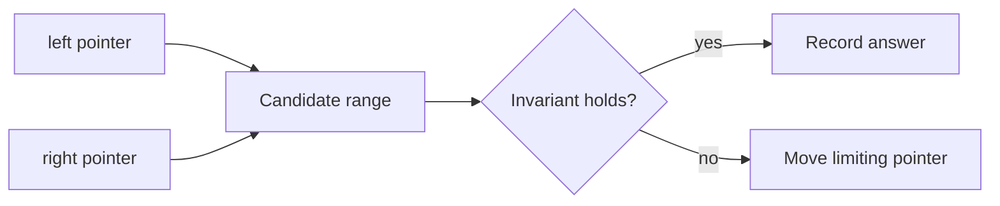

# Two Pointers

## What You Will Learn

You will learn what two pointers means, when it is useful, what operations it supports, and how it appears in coding interviews. By the end of this topic, you should be able to explain the core idea, select the right pattern, implement the usual template, and analyze time and space complexity.

## Why This Topic Matters

Two pointers reduce many pair, palindrome, sorted-array, and partition problems from quadratic time to linear time.

Interview problems often hide the topic behind a story. Your job is to translate the story into operations: lookup, scan, traverse, split, merge, choose, or optimize.

## Real World Usage

Used in merging logs, comparing sorted streams, parsing text from both ends, compaction, deduplication, and media processing pipelines.

Real systems rarely announce the data structure by name. They expose constraints such as fast lookup, ordered traversal, prefix search, shortest route, or bounded memory. Those constraints point to the right tool.

## Intuition

Instead of trying every pair, keep two meaningful positions. Move the pointer that can still improve the answer while preserving an invariant.

A beginner-friendly way to approach this topic is to ask: what information do I need to remember, and what information can I safely discard?

## Formal Definition

A two-pointer algorithm maintains two indices or references over one or more sequences and advances them according to monotonic progress rules.

The formal definition matters because it tells you which operations are cheap, which operations are expensive, and which invariants cannot be broken.

## Core Data Structure Or Algorithm

Common forms are left-right convergence, fast-slow traversal, same-direction windows, and merge pointers over sorted inputs.

In interviews, the core algorithm is usually small. The difficulty is choosing it, naming the invariant, and handling edge cases cleanly.

## Time Complexity

| Operation or Pattern | Complexity |
|---|---:|
| Single pass | O(n) |
| Merge two sorted arrays | O(n + m) |
| Sort plus two pointers | O(n log n) |
| Nested pointer reset | Often O(n^2), avoid unless intended |

## Space Complexity

| Case | Complexity |
|---|---:|
| Index-only scan | O(1) |
| Output list | O(k) |
| Sorted copy | O(n) |

## Common Operations

| Operation | What It Means |
|---|---|
| Converge | Move left and right toward each other. |
| Advance fast | Move one pointer faster to detect cycles or gaps. |
| Merge | Advance the pointer with the smaller next value. |
| Partition | Keep regions for processed and unprocessed values. |

## Visual Explanation

## Mathematical Foundations

The proof is usually monotonicity. If moving one pointer can only make one side larger or smaller, discarded states cannot contain a better answer.

## Common Interview Patterns

- **Opposite Ends**: see [two-pointers/PATTERNS.md](PATTERNS.md) for recognition signals and templates.
- **Fast and Slow**: see [two-pointers/PATTERNS.md](PATTERNS.md) for recognition signals and templates.
- **Sorted Pair Search**: see [two-pointers/PATTERNS.md](PATTERNS.md) for recognition signals and templates.
- **Merge Pointers**: see [two-pointers/PATTERNS.md](PATTERNS.md) for recognition signals and templates.
- **Partition Pointers**: see [two-pointers/PATTERNS.md](PATTERNS.md) for recognition signals and templates.
- **Cycle Detection**: see [two-pointers/PATTERNS.md](PATTERNS.md) for recognition signals and templates.

## Pattern Recognition

Look for sorted inputs, palindromes, pair sums, removing duplicates, linked-list cycle checks, or a need to compare both ends.

When you read a problem, underline the constraint words first. Words like "sorted", "contiguous", "prefix", "shortest", "k", "all possible", "minimum", or "dependencies" usually reveal the intended pattern.

## Common Mistakes

- Moving both pointers when only one side is justified.
- Using two pointers before sorting when order is required.
- Forgetting duplicate handling after finding a valid pair.

## Interview Tips

- Start with brute force and name the repeated work.
- State the invariant before coding.
- Keep edge cases visible: empty input, one item, duplicates, negative values, and boundary indices.
- Explain why your data structure supports the needed operation efficiently.
- Give time and space complexity after testing the code mentally.

## Mini Exercises

- Implement and explain opposite ends without looking at notes.
- Implement and explain fast and slow without looking at notes.
- Implement and explain sorted pair search without looking at notes.
- Implement and explain merge pointers without looking at notes.
- Pick two Easy problems from [easy.md](easy.md) and explain the pattern before coding.
- Pick one Medium problem from [medium.md](medium.md) and write only pseudocode first.

## Recommended Learning Order

1. Read the section on Opposite Ends in [PATTERNS.md](PATTERNS.md).
2. Read the section on Fast and Slow in [PATTERNS.md](PATTERNS.md).
3. Read the section on Sorted Pair Search in [PATTERNS.md](PATTERNS.md).
4. Read the section on Merge Pointers in [PATTERNS.md](PATTERNS.md).
5. Read the section on Partition Pointers in [PATTERNS.md](PATTERNS.md).
6. Read the section on Cycle Detection in [PATTERNS.md](PATTERNS.md).
7. Review [CHEATSHEET.md](CHEATSHEET.md) before timed practice.
8. Solve Easy, then Medium, then selected Hard problems.

## Practice Sets

- [Easy problems](easy.md)
- [Medium problems](medium.md)
- [Hard problems](hard.md)

---

## Navigation

[Previous](../arrays-hashing/README.md) | [Home](../README.md) | [Next](../two-pointers/CHEATSHEET.md)
