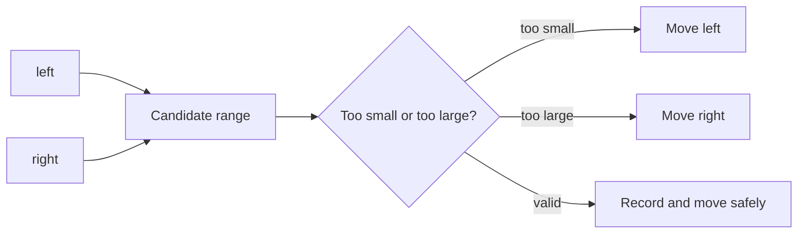
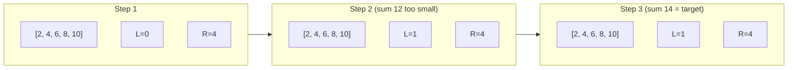

# Two Pointers

## What This Topic Is

Move one or two indices through linear data while preserving a clear relationship between them.

This topic is a reusable mental model, not a bag of isolated tricks. You should finish it able to identify the problem shape, state the invariant, choose the right pattern, and explain the complexity without guessing.

## Why It Matters

Two pointers turn many O(n^2) pair checks into O(n) scans when order, sortedness, or a stable partition invariant exists.

In interviews, the story usually hides the structure. Translate the story into operations: lookup, move a boundary, traverse, choose, relax, split, merge, or remember a state.

## Interviewer Lens

- Google: prove that every discarded pair or segment is impossible.
- Meta: implement duplicate skipping and pointer moves without extra passes.
- Amazon: state mutation and sorting tradeoffs before changing the input.
- Beginner: write the rule for moving left, right, slow, or fast before coding.

## Real-World Use

Used in merge operations, stream compaction, partitioning, text processing, file diffing, deduplication, and sorted index joins.

The same ideas show up in production systems when constraints demand predictable lookup, bounded memory, fast traversal, or correct ordering.

## Beginner Intuition

Think of two fingers on the data. Each movement must be justified: one side is too small, too large, already matched, or no longer useful.

Beginner rule: before coding, write one sentence that says what information your algorithm keeps and why that information is enough for the next decision.

## Formal Explanation

Two-pointer algorithms maintain one or more indices whose movement is monotonic. Because each pointer advances a bounded number of times, the scan is usually linear.

The formal model matters because it tells you which operations are cheap, which are expensive, and which assumptions are required for correctness.

## Core Operations

| Operation | Meaning |
|---|---|
| Opposite ends | Move left and right inward. |
| Same direction | Maintain a read pointer and a write or slow pointer. |
| Fast and slow | Move pointers at different speeds to detect distance, middle, or cycles. |
| Partition | Place values into regions without extra arrays. |

## Time Complexity

| Operation or Pattern | Complexity |
|---|---:|
| Linear pointer scan | O(n) |
| Sorted pair search | O(n) after sort |
| Sort plus pointers | O(n log n) |
| Nested pointer reset | Usually O(n^2), avoid unless intended |

## Space Complexity

| Case | Complexity |
|---|---:|
| In-place pointer scan | O(1) |
| Output list | O(result size) |
| Sort copy | O(n) if input cannot be mutated |

## Visual Explanation

## Pattern Walkthrough

Two pointers from opposite ends converge on a sorted array; advancing `left` when the pair sum is too small never skips a valid answer because every pair using `nums[left]` with a smaller right value would be even smaller.

## Foundations And Invariants

Correctness comes from monotonic elimination. When a sorted pair sum is too small, every pair using the smaller left value with an even smaller right side is also too small.

When explaining a solution, name the invariant before writing code. A good invariant is short enough to repeat while coding and precise enough to catch edge cases.

## Pattern Recognition

Look for sorted input, palindromes, pairs, triplets, in-place removal, merging, cycle detection, or language that says use constant extra space.

Ask these questions:

- Is the input sorted, partially ordered, or safely sortable without losing required positions?
- Can moving one boundary only forward preserve all candidates?
- Are duplicates supposed to be skipped, counted once, or kept as distinct answers?
- Does the problem need a pair, a partition, a compaction, or a cycle relation?

## Common Interview Patterns

- **Opposite Direction Pointers**: recognition signals, mistakes, and templates in [PATTERNS.md](PATTERNS.md).
- **Same Direction Pointers**: recognition signals, mistakes, and templates in [PATTERNS.md](PATTERNS.md).
- **Fast And Slow Pointers**: recognition signals, mistakes, and templates in [PATTERNS.md](PATTERNS.md).
- **Partitioning**: recognition signals, mistakes, and templates in [PATTERNS.md](PATTERNS.md).
- **Merge From End**: recognition signals, mistakes, and templates in [PATTERNS.md](PATTERNS.md).

## Common Mistakes

- Moving both pointers without proving it is safe.
- Skipping duplicate handling in 3Sum-style problems.
- Resetting a pointer in a way that restores O(n^2).
- Forgetting that sorting changes original indices.

## Interview Tips

- State whether sorting is allowed and whether original indices matter.
- Tie each pointer move to a proof that no valid answer was skipped.
- Dry run duplicates because they are the most common source of wrong answers.
- For linked-style fast and slow problems, explain why meeting or gap length proves correctness.
- Give space complexity honestly when sorting creates a copy.

## Mini Exercises

- Explain `Opposite Direction Pointers` aloud, then write its invariant and template from memory.
- Explain `Same Direction Pointers` aloud, then write its invariant and template from memory.
- Explain `Fast And Slow Pointers` aloud, then write its invariant and template from memory.
- Explain `Partitioning` aloud, then write its invariant and template from memory.
- Pick two Easy problems from [easy.md](easy.md) and identify the pattern before coding.
- Pick one Medium problem from [medium.md](medium.md) and write pseudocode before implementation.
- For one missed problem, write the failed invariant and the corrected invariant.

## Recommended Learning Order

1. Read `Opposite Direction Pointers` in [PATTERNS.md](PATTERNS.md).
2. Read `Same Direction Pointers` in [PATTERNS.md](PATTERNS.md).
3. Read `Fast And Slow Pointers` in [PATTERNS.md](PATTERNS.md).
4. Read `Partitioning` in [PATTERNS.md](PATTERNS.md).
5. Read `Merge From End` in [PATTERNS.md](PATTERNS.md).
6. Review [CHEATSHEET.md](CHEATSHEET.md) before timed practice.
7. Solve [easy.md](easy.md), then [medium.md](medium.md), then selected [hard.md](hard.md).

## Practice Navigation

- [Easy problems](easy.md): build fundamentals.
- [Medium problems](medium.md): build interview fluency.
- [Hard problems](hard.md): build advanced pattern recognition.

---

## Navigation

[Previous](../arrays-hashing/README.md) | [Home](../README.md) | [Next](CHEATSHEET.md)
